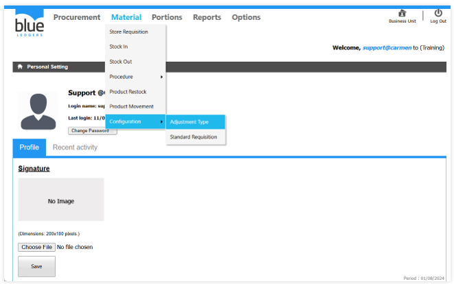
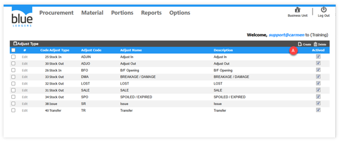
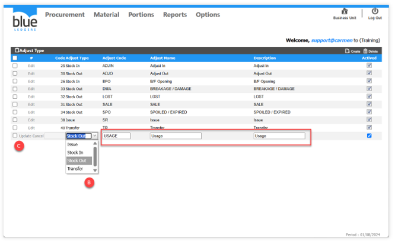

# Adjustment Type

Inventory Configuration คือ การกำหนดค่าการใช้งานของระบบสินค้าคงคลัง โดยมีส่วนประกอบดังต่อไปนี้

 
1. Adjustment Type คือ การสร้างประเภทเอกสารเพื่อใช้ในการปรับปรุง Stock ทั้งในกรณีเพิ่มยอด และลดยอดใน Stock

1.1 ขั้นตอนในการสร้าง Adjustment Type

A. Click ปุ่ม Create เพื่อเข้าสู่หน้าต่างการสร้างเอกสาร 

 
B. Click เลือก Cost Adjust Type ประเภทเอกสาร และระบุข้อมูลในช่องว่างที่อยู่ในกรอบสี่เหลี่ยมสีแดง
C. Click Update เพื่อบันทึกข้อมูล

 

 
