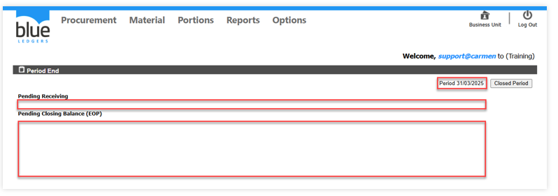

# Close Period
**Close Period** คือการปิดรอบบัญชีในระบบสินค้าคงคลัง 
ขั้นตอนการ Close Period มีส่วนประกอบอยู่ 2 ส่วน คือ
1.	Pending Receiving จะต้องไม่มีรายการรับสินค้าที่อยู่ในสถานะ Pending หรือสถานะ Saved ในระบบ Receiving หากมีรายการ Receiving ค้างอยู่ ระบบจะแสดงเลขที่เอกสารให้ทราบ และจะต้องทำการ Commit เอกสารดังกล่าวให้เรียบร้อยก่อน close period
2.	Pending Closing Balance (EOP) การตรวจนับของ Location ประเภท Enter counted Stock จะต้องทำการ commit ให้เสร็จสิ้นก่อนจึงจะสามารถ Close Period ได้

 
3.	เมื่อไม่มีข้อมูล Pending ค้างทั้งใน Receiving และ Closing Balance (EOP) ให้ Click ปุ่ม Close Period และให้สังเกต รอบบัญชี (Period) ในกรอบสีแดงว่ารอบบัญชีที่ถูกต้องหรือไม่