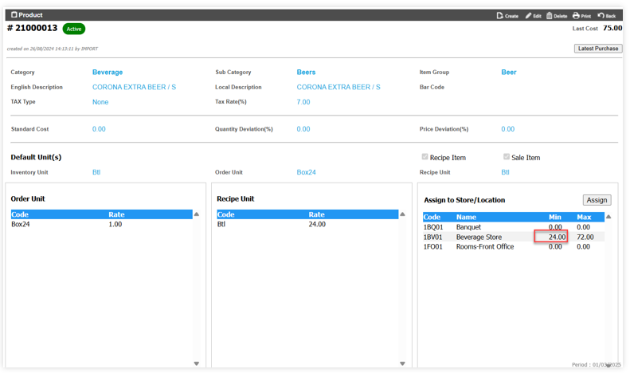
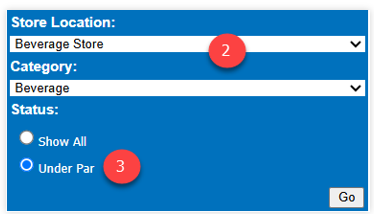
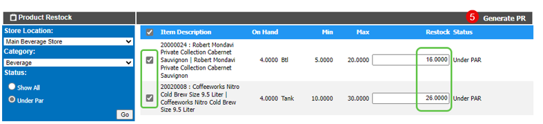
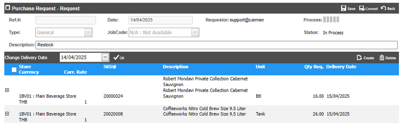

# Product Restock

**Product Restock** คือ การตรวจสอบรายการสินค้า ใน Location ที่กำหนด เพื่อดูสินค้าที่มี On hand น้อยกว่า หรือเท่ากับ Minimum stock ที่ตั้งค่าเอาไว้  และสามารถเลือกสินค้าเพื่อสร้าง PR เพื่อเติมให้ครบ Maximum stock

**Remark**: การตรวจสอบ Minimum และ Maximum Stock ดูได้จาก Product >Assign Store/Location 

**ขั้นตอนในการใช้งานระบบ Restock**
1.	เอา cursor ไปวางที่ “Material” และเลือก “Product Restock”

2.	“Store Location” ระบุ Location ที่ต้องการ 

“Category” เลือก Product Category ที่ต้องการตรวจสอบ

3.	Click เลือก “Under Par” เพื่อแสดงรายการสินค้า ที่ On hand น้อยกว่าหรือเท่ากับ Minimum Stock จากนั้น Click ปุ่ม “Go”

“Show All” จะแสดงรายการสินค้าทั้งหมดใน Location ที่เลือก
 

4.	ระบบจะแสดงรายการสินค้าที่มีจำนวน On hand น้อยกว่าหรือเท่ากับ Minimum Stock ที่ได้กำหนดไว้ 
-	“Restock” ระบบจะคำนวณ Qty ในช่อง Restock ให้อัตโนมัติ โดยคำนวณจากช่อง Max – On hand แต่สามารถแก้ไขเพิ่มเติมได้อีกครั้ง
-	Click เครื่องหมายถูกในช่องสี่เหลี่ยมเพื่อเลือกสินค้าที่ต้องการสร้าง PR
5.	จากนั้น Click ปุ่ม “Generate PR” เพื่อให้ระบบสร้าง PR ตามจำนวนสินค้าที่ระบุในช่อง “Restock”

 
6.	ระบบจะทำการสร้าง PR ให้ตามรายการสินค้าที่ถูกเลือกโดยอัตโนมัติ
 
