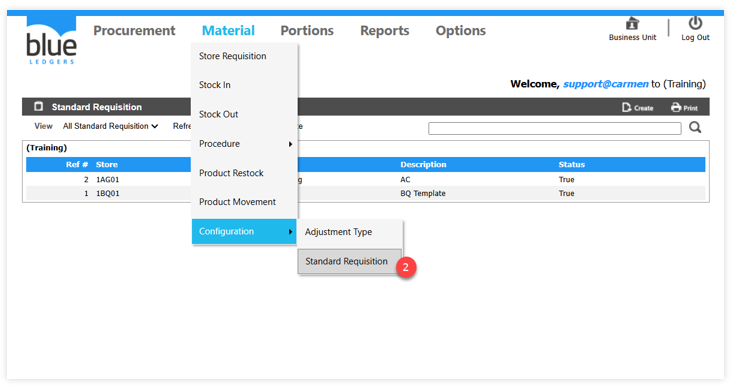
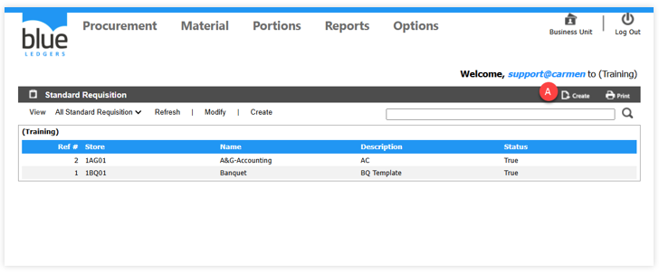
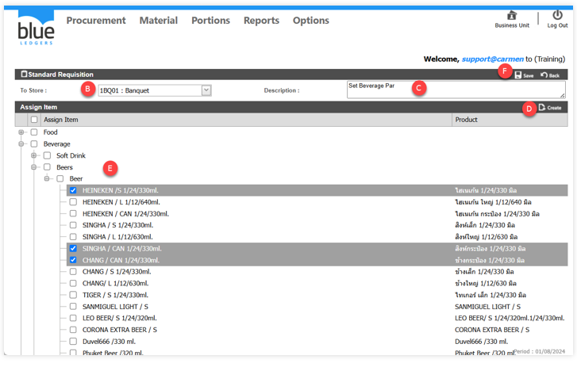

# Standard Requisition
Standard Requisition คือ การสร้างเอกสารแม่แบบ (Template) ให้กับการทำขอเบิก (Store Requisition)

A.	Click ปุ่ม Create เพื่อสร้างเอกสารแม่แบบ (Template) 

B.ระบุ Location ปลายทาง (Location ของผู้ใช้ระบบ)

C.Description ระบุรายละเอียด หรือชื่อ Template

D.Click ปุ่ม Create เพื่อ Assign Item ให้กับ Template

E.Click เครื่องบวก และ Click เครื่องหมายถูกในช่องสี่เหลี่อมหน้ารายการสินค้าที่ต้องการ

F.Click เมนูคำสั่ง Save เพื่อบันทึกข้อมูล
