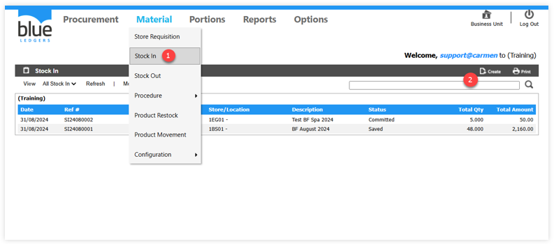
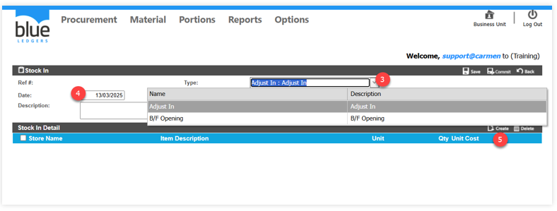
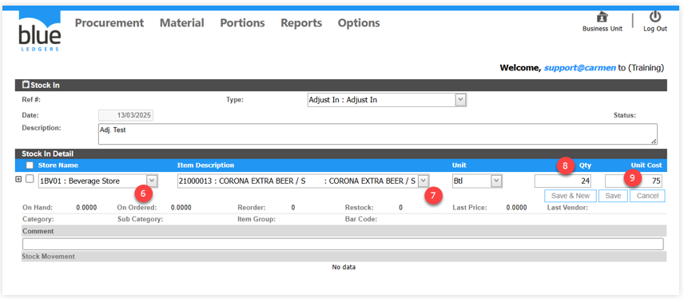
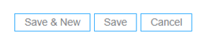
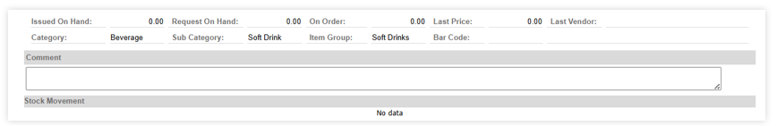
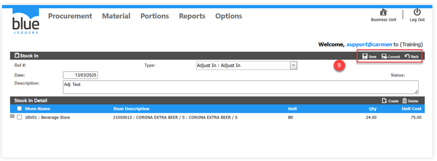
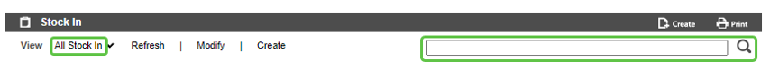
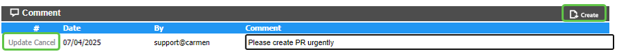
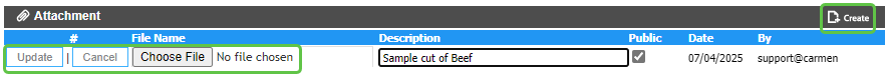

# Stock In

**Stock In** คือ การปรับปรุงยอดเพิ่มของจำนวนสินค้าและราคาในคลังสินค้า ซึ่งการทำ Stock In สามารถแยกเป็นหลายประเภทตาม “Adjust Type” โดย “Adjust Type” จะช่วยให้สามารถบันทึกบัญชีด้วย Account code ที่ต่างกันได้ เช่น
1.	BF (Balance Forward)	หมายถึง การยกยอดสินค้าคงคลัง
2.	Adjust หมายถึง การปรับเพิ่ม Stock ในสินค้าคงคลัง

**A.	ขั้นตอนในการทำงานของระบบ Stock In ดังนี้**
1.	เอา cursor ไปวางที่ “Material” และ เลือก ”Stock In”
2.	Click ปุ่ม “Create” เพื่อสร้างรายการเพิ่ม Stock

3.	”Type” เลือกประเภทการทำ Stock In 
4.	“Date” ระบุวันที่สำหรับการบันทึกข้อมูลเข้าคลังสินค้า
“Description” ระบุคำอธิบายการปรับปรุง stock
5.	Click ปุ่ม ”Create” เพื่อเลือกรายการสินค้า

 
6.	“Store Name“ เลือก Location ที่ต้องการปรับปรุง stock
7.	“Item Description“ เลือกรายการสินค้า
8.	“Qty. “ ระบุจำนวนสินค้า
9.	“Unit Cost“ ระบุราคาต่อหน่วย

**อธิบายเพิ่มเติมสำหรับการบันทึกข้อมูล และยกเลิกรายการ**

 

-	“Save & New“	เมื่อมีการ Click Save & New ระบบจะบันทึกการเปลี่ยนในรายการสินค้านั้น และเพิ่มบรรทัดใหม่เพื่อให้เพิ่มรายการสินค้าในลำดับถัดไป
-	“Save“ 	เมื่อมีการ Click Save ระบบจะทำการบันทึกการเปลี่ยนแปลงในรายการสินค้าในบรรทัดปัจจุบันเท่านั้น
-	“Cancel“	เมื่อ Click Cancel ระบบจะทำการยกเลิกการเปลี่ยนแปลงรายการสินค้าในบรรทัดนั้นทันที

-	“Issued on Hand“ 	หมายถึง จำนวนสินค้าที่มีการตัดเบิกไปแล้ว
-	“Request on Hand“	หมายถึง จำนวนขอเบิกในสินค้าเดียวกันจากเอกสารขอเบิกใบอื่น
-	“Last Price	“	หมายถึง ราคาที่รับเข้าระบบล่าสุด
-	“Last Vendor“	หมายถึง ร้านค้าที่ซื้อเข้ามาล่าสุด
-	“Comment	“	หมายถึง เมื่อระบุรายละเอียดในช่อง Comment รายละเอียดจะแสดงอยู่ในส่วนของรายการสินค้า
10.	เมื่อบันทึกข้อมูลรายการสินค้าเรียบร้อยแล้ว ให้ดำเนินการดังนี้
-	Click ปุ่ม “Save“ เมื่อต้องการบันทึกเอกสาร Stock In
-	Click ปุ่ม “Commit“ เมื่อต้องการอนุมัติเอกสาร Stock In
-	Click ปุ่ม “Back“ เมื่อต้องการยกเลิก
 
B.	การค้นหา และ View เอกสาร Stock In
-	หลังจากที่เข้ามาในหน้า Stock In แล้วสามารถ เลือก View เอกสารได้ตาม Status ต่างๆ
-	สามารถค้นหา เอกสารใบรับสินค้า ที่ต้องการ โดย พิมพ์ค้นหา ในช่อง Search
-	การ View เอกสารทำได้โดยการเลือก เอกสารที่ต้องการ เพื่อ แสดงรายละเอียดของเอกสารใบนั้น
 

C.	การ Comment หรือ แนบไฟล์ Attachment ในเอกสาร Receiving

- การเพิ่ม Comment ในเอกสาร ใบขอซื้อเพื่อเป็นการสื่อสารภายใน

• Click “Create” ที่หัวข้อ “Comment”

• ใส่ “Comment” ที่ต้องการ

• Click “Update” เพื่อ บันทึก หรือ “Cancel” เพื่อ ยกเลิก

-	การแนบไฟล์ Attachment ในเอกสาร ใบขอซื้อ เพื่อแนบเอกสารประกอบการขอซื้อ

•	“Create” ที่หัวข้อ “Attachment”

•	ใส่ “Description” ที่ต้องการ

•	เลือก “Choose File” เพื่อเลือก File ที่ต้องการแนบ

•	Click “Update” เพื่อ บันทึก หรือ “Cancel” เพื่อ ยกเลิก

