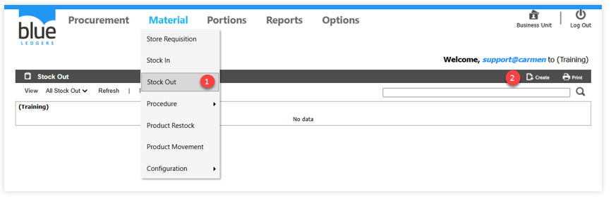
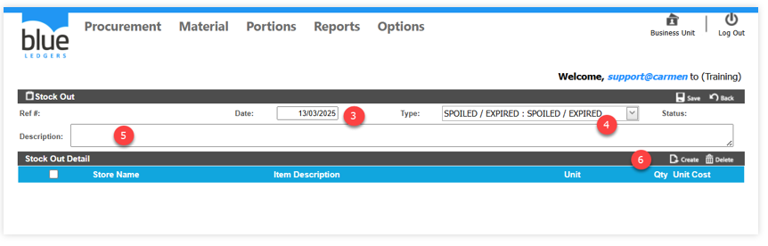
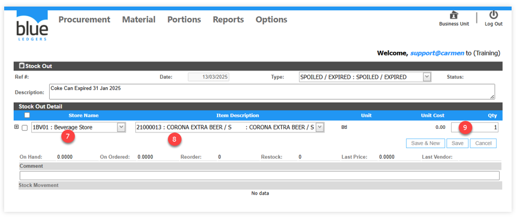
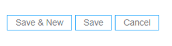
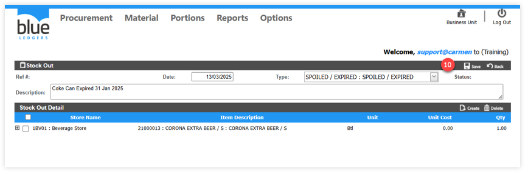
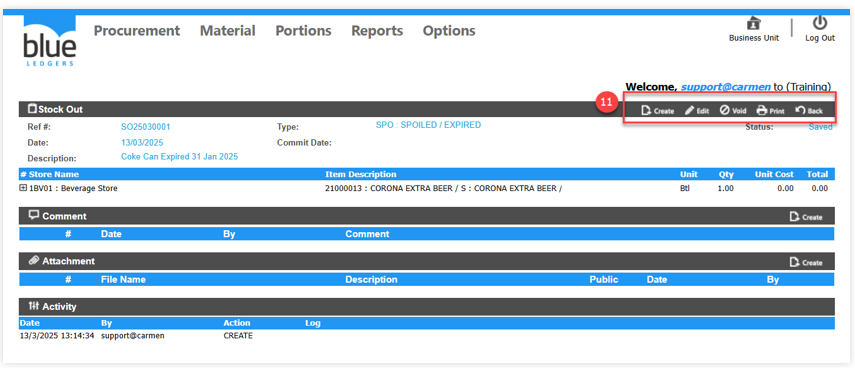
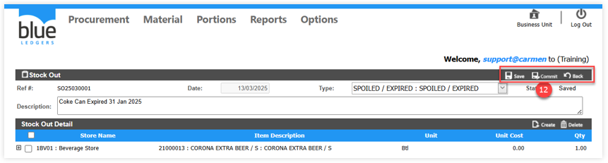
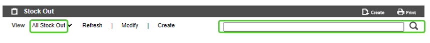
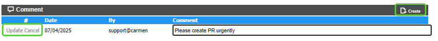
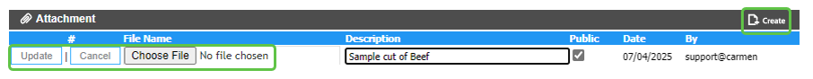

# Stock Out

Stock Out คือ การปรับปรุงเพื่อลดยอดจำนวนสินค้าในคลังสินค้า ซึ่งการทำ Stock Out สามารถแยกเป็นหลายประเภทตาม “Adjust Type” โดย “Adjust Type” จะช่วยให้สามารถบันทึกบัญชีด้วย Account code ที่ต่างกันได้ เช่น
1.	Adjust Out คือ การปรับปรุงเพื่อลดยอดในคลังสินค้า
2.	Sale คือ การตัดยอดขายโดยการ Manual Key โดยตรงในระบบ Inventory
3.	Lost คือ การปรับปรุงเพื่อลดยอดlbo8hkใน Stock ในกรณีมีสินค้าสูญหาย
4.	Breakage / Damage คือ การปรับปรุงเพื่อลดยอดสินค้าใน Stock ในกรณีสินค้าแตกหักเสียหาย
5.	Spoiled / Expired คือ การปรับปรุงเพื่อลดยอดสินค้าใน Stock ในกรณีสินค้าหมดอายุ หรือทำลายสินค้า

**A. ขั้นตอนในการทำงานของระบบ Stock Out ดังนี้**
1.	เอา cursor ไปวางที่ “Material” และ เลือก Stock Out
2.	Click ปุ่ม Create เพื่อสร้างรายการลด Stock

3.	“Date” ระบุวันที่สำหรับการบันทึกข้อมูลเข้าคลังสินค้า
4.	“Type” เลือกประเภทการทำ Stock Out
5.	“Description” ระบุคำอธิบายการปรับปรุง stock
6.	Click ปุ่ม Create เพื่อเลือกรายการสินค้า

7.	“Store Name“ เลือก Location ที่ต้องการปรับปรุง stock
8.	“Item Description” เลือกรายการสินค้า
9.	“Qty.” ระบุจำนวนสินค้า (ระบบจะใช้ราคาต่อหน่วยตามวิธีคำนวณ cost ของระบบเท่านั้น)

**อธิบายเพิ่มเติมสำหรับการบันทึกข้อมูล และยกเลิกรายการ**

 

•	“Save & New“	เมื่อมีการ Click Save & New ระบบจะบันทึกการเปลี่ยนในรายการสินค้านั้น และเพิ่มบรรทัดใหม่เพื่อให้เพิ่มรายการสินค้าในลำดับถัดไป

•	“Save“ 	เมื่อมีการ Click Save ระบบจะทำการบันทึกการเปลี่ยนแปลงในรายการสินค้าในบรรทัดปัจจุบันเท่านั้น

•	“Cancel“	เมื่อ Click Cancel ระบบจะทำการยกเลิกการเปลี่ยนแปลงรายการสินค้าในบรรทัดนั้นทันที
 

•	“Issued on Hand“ 	หมายถึง จำนวนสินค้าที่มีการตัดเบิกไปแล้ว

•	“Request on Hand“	หมายถึง จำนวนขอเบิกในสินค้าเดียวกันจากเอกสารขอเบิกใบอื่น

•	“Last Price	“	หมายถึง ราคาที่รับเข้าระบบล่าสุด

•	“Last Vendor“	หมายถึง ร้านค้าที่ซื้อเข้ามาล่าสุด

•	“Comment	“	หมายถึง เมื่อระบุรายละเอียดในช่อง Comment รายละเอียดจะแสดงอยู่ในส่วนของรายการสินค้า

10.	เมื่อบันทึกข้อมูลรายการสินค้าเรียบร้อยแล้ว ให้ทำการ Click ปุ่ม Save เอกสารอีกครั้ง

11.	หลังจากตรวจสอบเอกสารเรียบร้อยแล้ว ให้ทำการ Click ปุ่ม “Edit“ เพื่อดำเนิน Commit เอกสาร (หากไม่ Commit เอกสาร Stock Out จะไม่ส่งข้อมูลตัด Stock)

12.	การทำ “Commit“ เพื่อยืนยันการปรับปรุง stock

•	Click ปุ่ม “Save“ เมื่อต้องการบันทึกเอกสาร Stock Out

•	Click ปุ่ม “Commit“ เพื่อยืนยันการทำ Stock Out

•	Click ปุ่ม “Back“ เมื่อต้องการย้อนกลับ 
 
B. การค้นหา และ View เอกสาร Stock Out
-	หลังจากที่เข้ามาในหน้า Stock Out แล้วสามารถ เลือก View เอกสารได้ตาม Status ต่างๆ
-	สามารถค้นหา เอกสารใบรับสินค้า ที่ต้องการ โดย พิมพ์ค้นหา ในช่อง Search
-	การ View เอกสารทำได้โดยการเลือก เอกสารที่ต้องการ เพื่อ แสดงรายละเอียดของเอกสารใบนั้น
 
C. การ Comment หรือ แนบไฟล์ Attachment ในเอกสาร Receiving

-	การเพิ่ม Comment ในเอกสาร ใบขอซื้อเพื่อเป็นการสื่อสารภายใน

•	Click “Create” ที่หัวข้อ “Comment”

•	ใส่ “Comment” ที่ต้องการ

•	Click “Update” เพื่อ บันทึก หรือ “Cancel” เพื่อ ยกเลิก

-	การแนบไฟล์ Attachment ในเอกสาร ใบขอซื้อ เพื่อแนบเอกสารประกอบการขอซื้อ

•	“Create” ที่หัวข้อ “Attachment”

•	ใส่ “Description” ที่ต้องการ

•	เลือก “Choose File” เพื่อเลือก File ที่ต้องการแนบ

•	Click “Update” เพื่อ บันทึก หรือ “Cancel” เพื่อ ยกเลิก

