# Store Requisition

**Store Requisition** คือ การสร้างเอกสารขอเบิกสินค้าจาก Store โดยมีขั้นตอนดังต่อไปนี้
1.	เอา cursor ไปวางที่ “Material” และเลือก “Store Requisition“
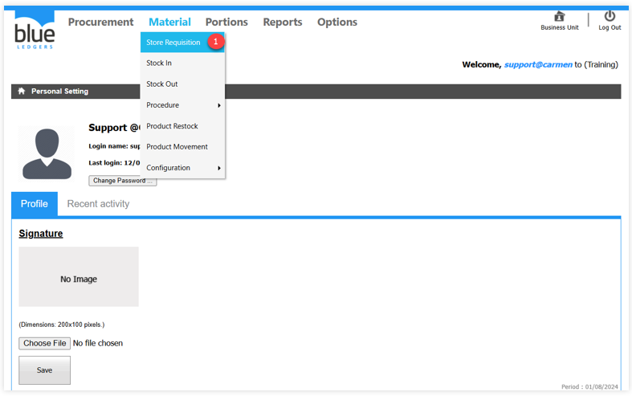

1.1	View Status คือ มุมมองของสถานะเอกสาร โดยจะมีสถานะดังนี้

1.1.1 Status: **“View All“** หมายถึง มุมมองเอกสารที่มีไว้ติดตามสถานะของเอกสารใบขอเบิก โดยมีความหมายของสัญลักษณ์เพื่อใช้ในการตรวจเช็คสถานะเอกสาร ประกอบด้วย
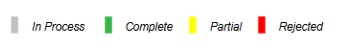
A.	In process (สีเทา) 	หมายถึง เอกสารอยู่ระหว่างการจัดตรวจสอบ

B.	Complete (สีเขียว) 	หมายถึง เอกสารได้รับการอนุมัติเรียบร้อยแล้ว

C.	Partial (สีเหลือง) 	หมายถึง เอกสารได้รับการอนุมัติในบางรายการ

D.	Rejected (สีแดง) 	หมายถึง การยกเลิกเอกสาร และไม่สามารถนำกลับมาดำเนินการต่อได้
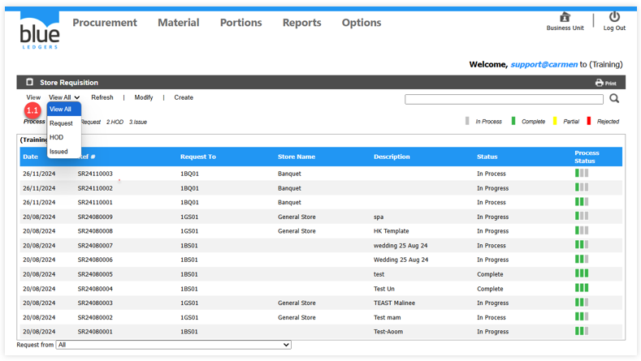
1.1.2	Status: “Request“ หมายถึง สถานะบันทึกเอกสารขอเบิก (Store Requisition) หากต้องการจะทำเอกสารขอเบิกจะต้องเริ่มต้นที่ Status นี้ 

**ขั้นตอนการสร้างเอกสารขอเบิก**

A.Click คำสั่ง Request จากนั้นนำเมาส์เคอร์เซอร์ไปชี้ที่ปุ่ม “Create“ เพื่อเข้าสู่ขั้นตอนสร้างเอกสารใบขอเบิก
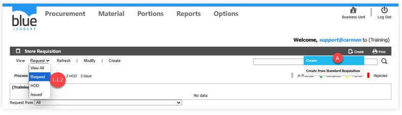
B.“Input date“ คือวันที่ทำเอกสาร

C.“Requested From“ คือ ระบุ Location ที่ต้องการจะขอเบิกสินค้า (Location ประเภท Store)

D.“Movement Type“ คือ ประเภทการขอเบิก ประกอบด้วย

• “Issue“ หมายถึง เบิกสินค้าและตัดเป็นค่าใช้จ่าย

• “Transfer“ หมายถึง การโอนย้ายสินค้าจากสถานที่หนึ่งไปยังอีกสถานที่หนึ่ง โดยยังคงสถานะเป็นสินค้าคงคลัง (Inventory)

E.	“Job Code“ คือ ระบบจะแสดงค่า N/A Not Available

F.	“Description“ คือ ช่องว่างสำหรับระบุรายละเอียดของใบขอเบิก เช่น ระบุถึงวัตถุประสงค์ในการขอเบิก

G.	จากนั้น Click ปุ่ม “Create“ เพื่อระบุสินค้า และจำนวนขอเบิก

H.	“Store Name“ ให้ระบุสถานที่ปลาย หรือ Location ของผู้ทำการขอเบิก

I.	“Item Description“ ระบุสินค้าที่ต้องการขอเบิก

J.	“Qty. “ ระบุจำนวนที่ต้องการขอเบิก และในช่อง “Request Date“ ให้ระบุวันที่รับสินค้า 
จากนั้นกด **Save** เพื่อบันทึกข้อมูล
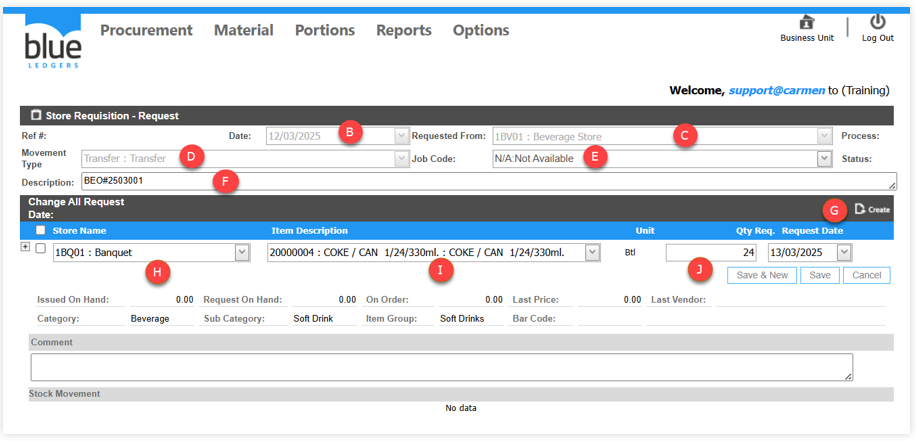 
อธิบายเพิ่มเติมสำหรับการบันทึกข้อมูล และยกเลิกรายการ
-	“Save & New“	เมื่อมีการ Click Save & New ระบบจะบันทึกการเปลี่ยนในรายการสินค้านั้น และเพิ่มบรรทัดใหม่เพื่อให้เพิ่มรายการสินค้าในลำดับถัดไป
-	“Save“ 	เมื่อมีการ Click Save ระบบจะทำการบันทึกการเปลี่ยนแปลงในรายการสินค้าในบรรทัดปัจจุบันเท่านั้น
-	“Cancel“	เมื่อ Click Cancel ระบบจะทำการยกเลิกการเปลี่ยนแปลงรายการสินค้าในบรรทัดนั้นทันที
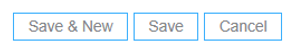
ข้อมูลเพิ่มเติมของสินค้าเพื่อใช้ประกอบการเบิก หรือ อนุมัติ ประกอบด้วย
-	“Issued on Hand“ 	หมายถึง จำนวนสินค้าที่มีการตัดเบิกไปแล้ว
-	“Request on Hand“	หมายถึง จำนวนขอเบิกในสินค้าเดียวกันจากเอกสารขอเบิกใบอื่น
-	“Last Price“	หมายถึง ราคาที่รับเข้าระบบล่าสุด
-	“Last Vendor“	หมายถึง ร้านค้าที่ซื้อเข้ามาล่าสุด
-	“Comment	“	หมายถึง เมื่อระบุรายละเอียดในช่อง Comment รายละเอียดจะแสดงอยู่ในส่วนของรายการสินค้า
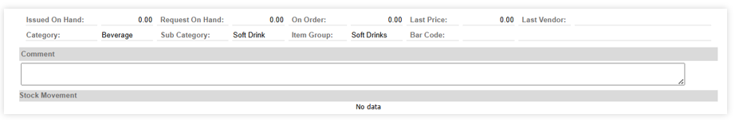
K.	Function อื่น ๆ เพิ่มเติม ที่แสดงเมื่อบันทึกข้อมูลรายการขอสั่งซื้อเรียบร้อยแล้ว 

•	‘Save” ให้ทำการ Click ปุ่ม Save เอกสารด้านบนอีกครั้งเพื่อเป็นการบันทึกข้อมูลเอกสารทั้งหมด

•	“Commit” คือ คำสั่งอนุมัติเอกสารใบขอเบิก และเมื่อ Click ปุ่ม “Commit“ ไปแล้วเอกสารจะไม่สามารถดึงกลับมาแก้ไขได้ ฉะนั้นก่อน Commit เอกสารต้องตรวจสอบข้อมูลให้ถูกต้องอย่างครบถ้วนเสียก่อน

•	“Back” คือ คือการยกเลิกเอสการดังกล่าว
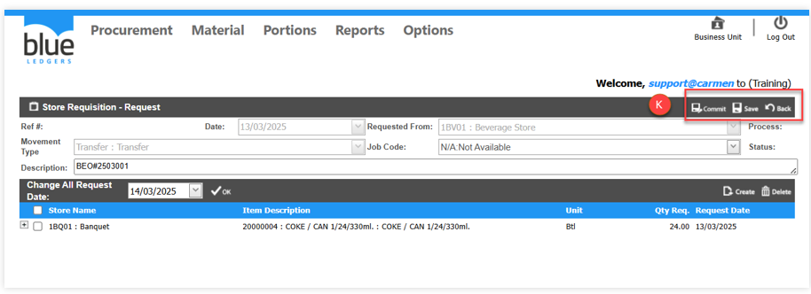
Function อื่น ๆ เพิ่มเติม หลังจากบันทึกข้อเอกสารแล้ว 

L.	“Edit” การแก้ไขอกสาร

•	Click ปุ่ม “Edit“ เพื่อแก้ไขเอกสาร
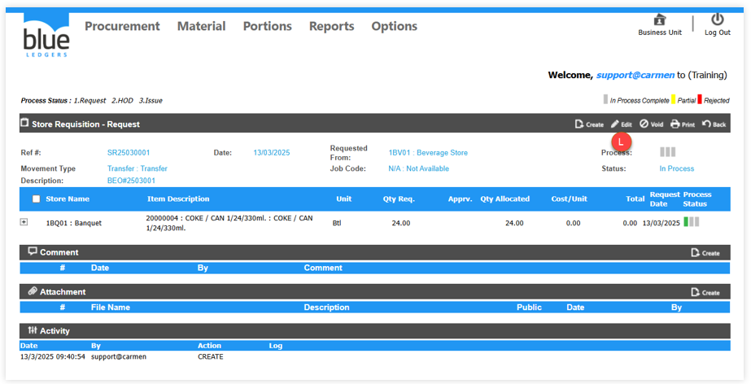
•	จากนั้น Click สัญลักษณ์เครื่องหมาย “+“ เพื่อแสดงรายละเอียดที่ต้องการแก้ไข

•	จากนั้น Click ปุ่ม “Edit“ ใน Detail อีกครั้งเพื่อเริ่มแก้ไขข้อมูล และเมื่อแก้ไขข้อมูลเรียบร้อยแล้วให้ทำการ Click ปุ่ม “Save“ ดังเดิมและกดปุ่ม “Commit“ เพื่อยืนยันการขอเบิกสินค้า
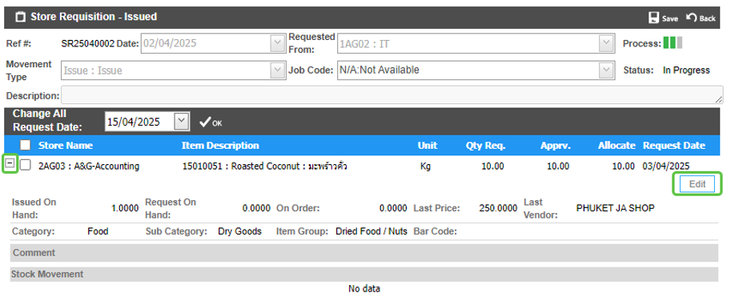
M.	Void ใช้ในการ “void“ เอกสาร ซึ่งจะใช้ได้ในขั้นตอนของผู้ Request เท่านั้น

**1.1.3**	Status: **“HOD”** หมายถึง การอนุมัติเอกสารใบขอเบิกในลำดับขั้นหัวหน้าแผนก
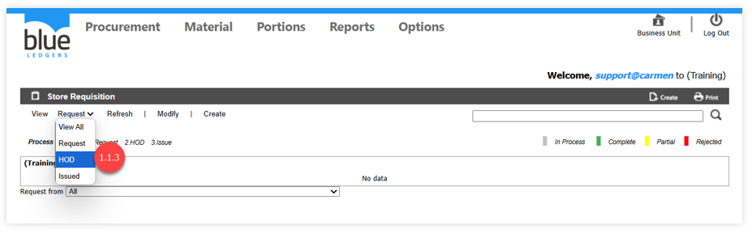

A.	ระบบจะแสดงเอกสารขอเบิกที่ถูกอนุมัติคำขอจาก Request จากนั้น Click ที่เอกสารที่เพื่ออนุมัติ
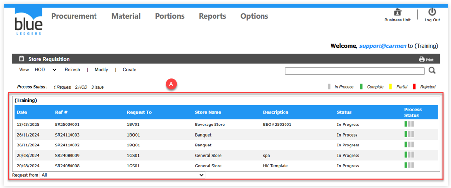

B.	ขั้นตอนการอนุมัติ และคำสั่งอื่นที่เกี่ยวข้อง สามารถดำเนินการบางรายการได้ แต่เอกสารจะส่งต่อไปลำดับถัดไปเมื่อ **“approve“** หรือ **“reject“** ทุก **item** เรียบร้อยแล้วเท่านั้น

• “Approve“ 	อนุมัติเอกสาร

• “Reject“ 	ยกเลิกเอกสาร

• “Send Back“	ตีกลับเอกสาร

C.Activity หมายถึง ระบบจะประวัติการเข้าถึงเอกสารของทุก User และแสดงรายละเอียดวันเวลาที่เข้าถึงเอกสารเมื่อทำการ “Create“, “Edit“ หรือ “Commit“

D.	Edit หมายถึง ทุกครั้งที่ต้องการแก้ไขเอกสารให้ทำการ Click ปุ่ม “Edit“ เสมอ
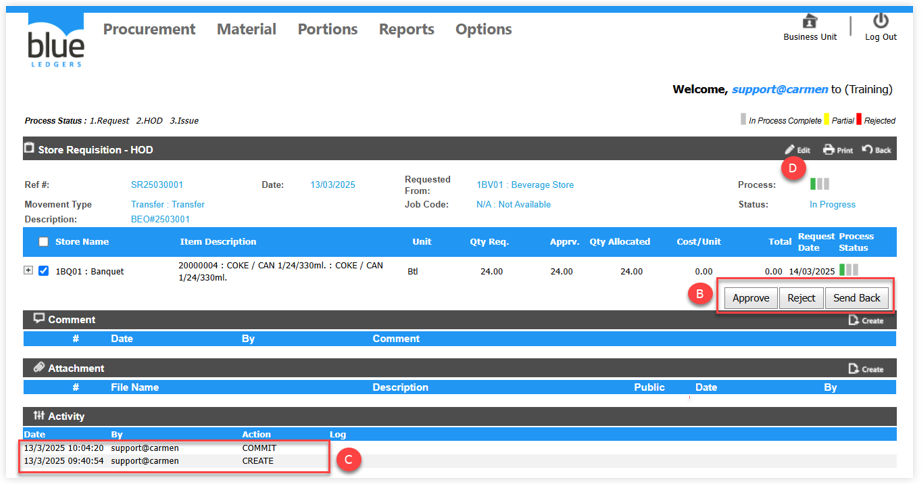
1.1.4	Status: **“Issue“** หมายถึง ขั้นตอนการอนุมัติตัดจ่ายสินค้าจากคลังสินค้า โดยจะมีเจ้าหน้าที่ดูแลคลังสินค้า หรือ Store Keeper คอยตรวจสอบเอกสารใบขอเบิกและอนุมัติเอกสาร

A.	ระบบจะแสดงเอกสารขอเบิกที่ถูกอนุมัติคำขอจาก **Request** จากนั้น **Click** ที่เอกสารที่เพื่ออนุมัติ
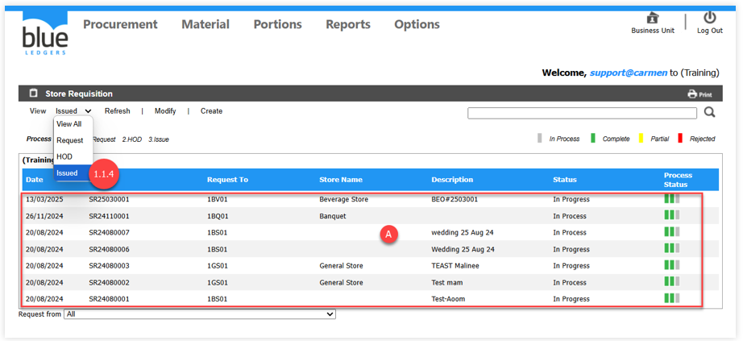
B.	เมื่อตรวจสอบเอกสารเรียบร้อยแล้ว หากมีสินค้าใน Stock เจ้าหน้าที่สามารถ Click ปุ่ม “Approve“ เพื่อทำการอนุมัติใบขอเบิกได้
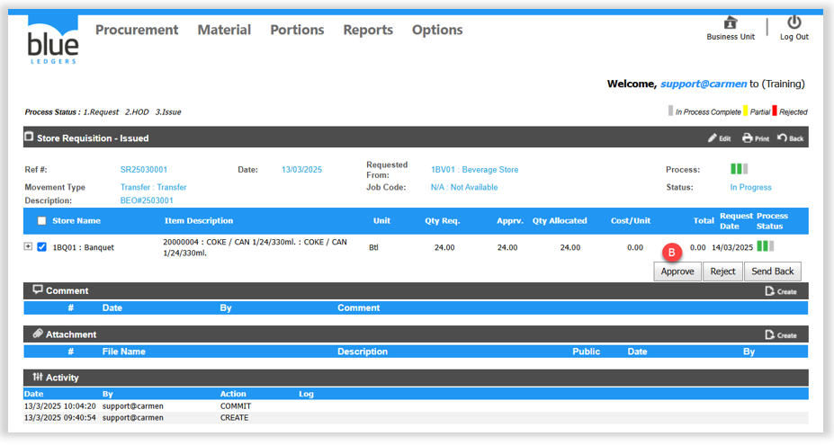

