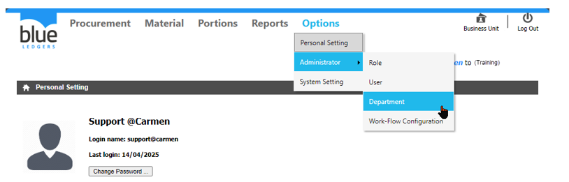
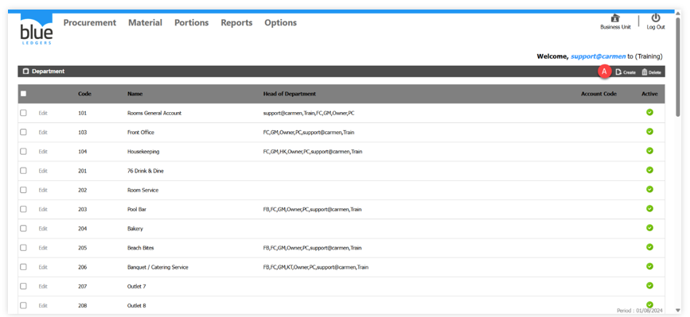
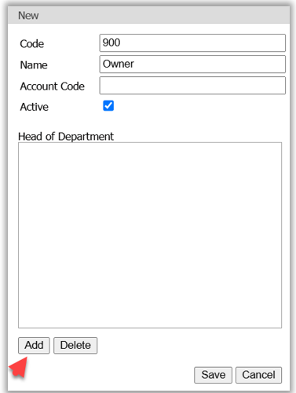
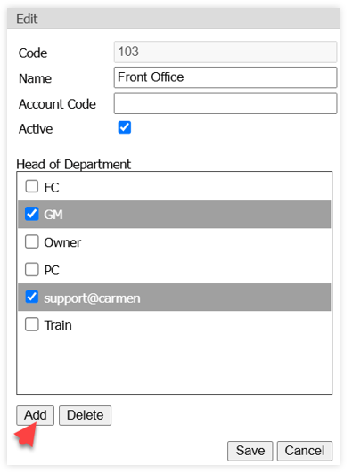

# Department
Department คือ การสร้างแผนกให้กับระบบ Inventory และเป็นการ Assign สิทธิ์การอนุมัติเอกสารให้กับหัวหน้าแผนก โดยสามารถระบุ User ที่เป็นหัวหน้าแผนกให้ตรงกับ Department ที่เกี่ยวข้อง ทั้งนี้ 1 User สามารถถูกกำหนดให้อยู่ในหลายแผนกได้ และ 1 แผนกสามารถกำหนดหัวหน้าแผนกหลายท่านได้

A.	Create Department การสร้างแผนก

•	Click ปุ่ม Create เพื่อสร้างแผนก

•	ระบบ Department Code และระบุชื่อแผนก 

•	จากนั้นClick ปุ่ม Add เพื่อเลือก HOD User (ผู้ใช้ที่เป็นหัวหน้าแผนก)

B.	เพิ่ม HOD User โดยที่ไม่สร้างแผนกเพิ่ม

•	Click ปุ่ม Edit และเข้าสู่หน้าต่างเพิ่ม HOD User 

•	Click ปุ่ม Add เพื่อเพิ่ม User

