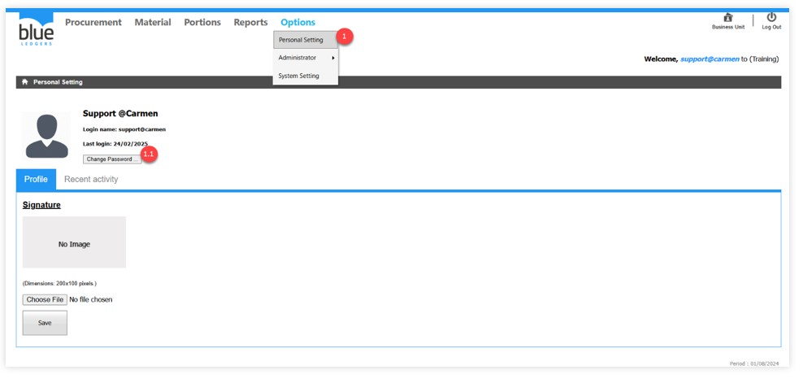
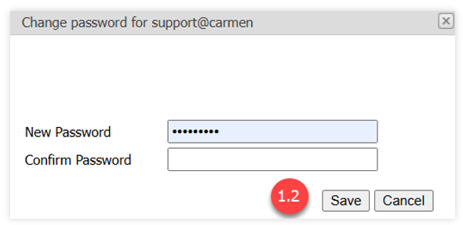
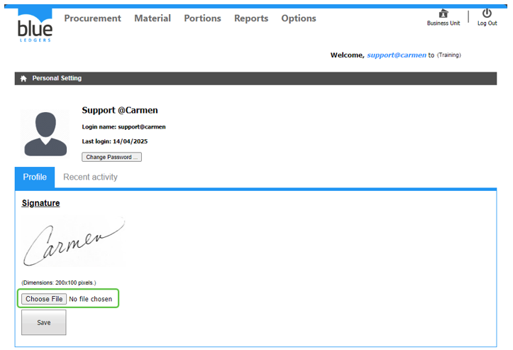
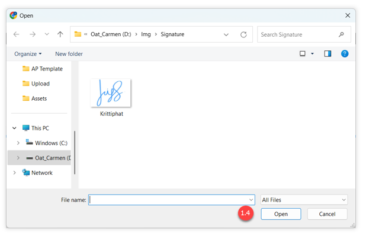

# Personal Setting
Personal Setting (กำหนดความเป็นส่วนตัว) คือ หน้าต่างสำหรับกำหนดความเป็นส่วนตัวของผู้ใช้งาน โดยมีตัวเลือกในกำหนดค่า ดังนี้
1.1.	Change Password คือ การเปลี่ยนรหัสผ่านสำหรับเข้าใช้งานในระบบ
-	Click คำสั่ง Change Password เพื่อเปลี่ยนรหัสผ่าน

1.2.	ระบุรหัสผ่านใหม่
-	ในช่อง New Password และใส่รหัสผ่านอีกครั้งในช่อง Confirm Password จากนั้นกดปุ่ม “Save”

1.3.	Signature คือ การระบุลายมือชื่อให้กับ User
-	Click เลือกคำสั่ง “Choose File” เพื่อแนบไฟล์รูปภาพลายมือชื่อ (สามารถแนบไฟล์นามสกุล JPEG, PNG, GIF)

1.4 เมื่อทำการเลือกรูปภาพเรียบร้อยแล้วให้Click คำสั่ง Open เพื่อแนบไฟล์รูปภาพ

