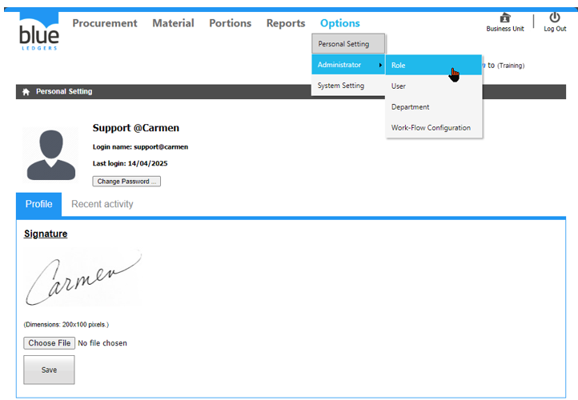
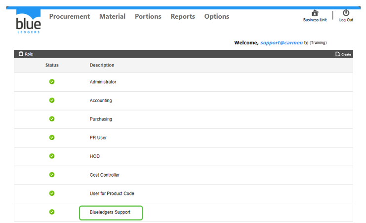
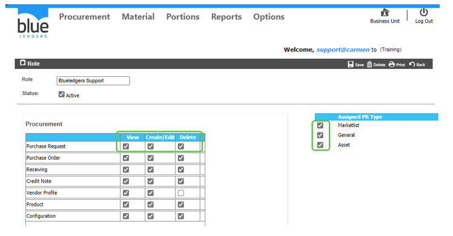

# Role
Administrator คือ ฟังก์ชันการกำหนดสิทธิ์การเข้าถึงระบบให้กับทุก User โดยจะมีส่วนประกอบดังนี้

2.1 Role คือ การสร้างสิทธิ์เข้าในงานให้กับ User แต่ละ User

A.	Click คำสั่ง Create เพื่อเข้าสู่ขั้นตอนการสร้างสิทธิ์การใช้งาน

B.	ระบุชื่อ Role (ชื่อตำแหน่งหรือขอบเขตงาน)

C.	ระบุเครื่องหมาย 	เพื่อกำหนดสิทธิ์การเข้าถึงเอกสาร โดยจะมีเงื่อนไขในการกำหนดสิทธิ์

	View หมายถึง ให้มองเห็นได้แต่แก้ไขเอกสารไม่ได้

	Create/Edit หมายถึง สามารถสร้างเอกสาร และสามารถแก้ไขเอกสารได้

	Delete หมายถึง สามารถลบเอกสารได้

D.	ระบุเครื่องหมาย 	ในหัวข้อ Assign PR Type เพื่อกำหนดสิทธิ์ในการสร้างใบขอซื้อในแต่ละประเภท

	Market List หมายถึง สามารถสร้างเอกสารใบขอซื้อประเภทของสดได้

	General หมายถึง สามารถสร้างเอกสารใบขอซื้อประเภททั่วไปได้

	Asset หมายถึง สามารถสร้างเอกสารใบขอซื้อประเภททรัพย์สินได้

