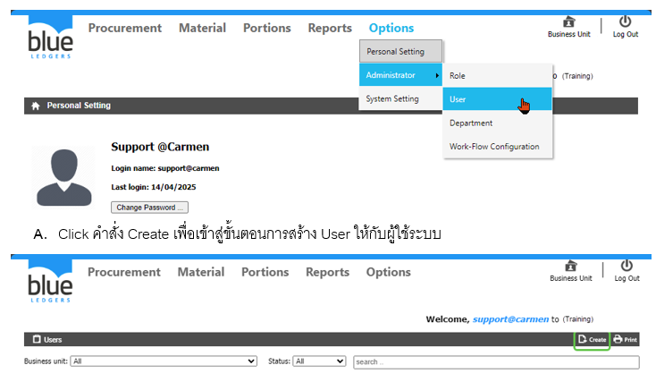
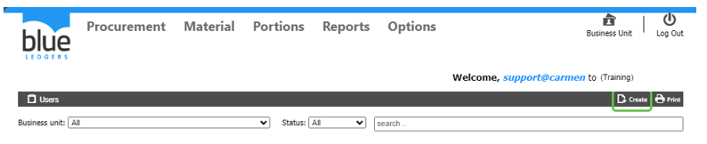
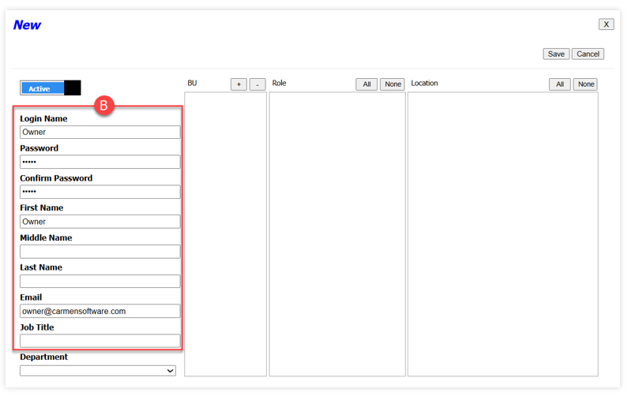
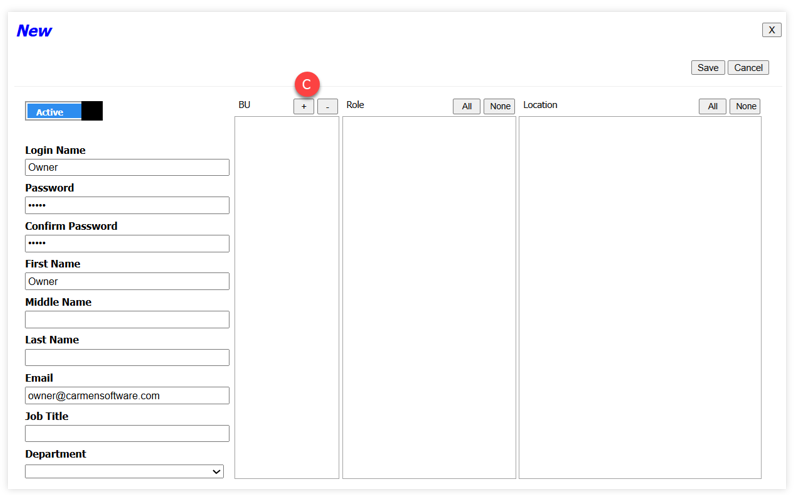
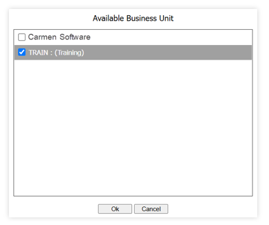
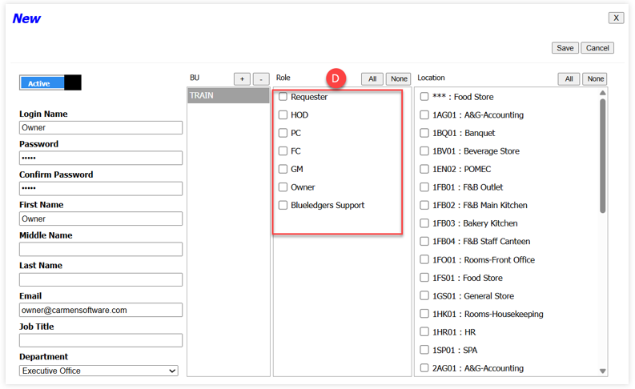
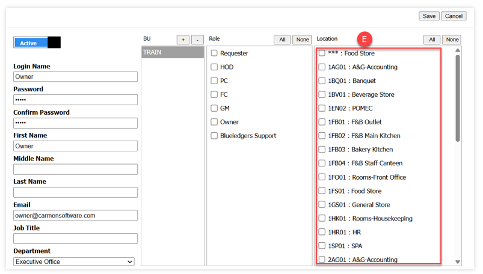

# User
User คือ การสร้าง User Name / Password ให้กับผู้ใช้ระบบ และการกำหนดสิทธิ์การมองเห็น Location ให้กับผู้ใช้ระบบ
 
A.	Click คำสั่ง Create เพื่อเข้าสู่ขั้นตอนการสร้าง User ให้กับผู้ใช้ระบบ

B.	ระบุข้อมูล Login Information (หากมีสัญลักษณ์ * หมายถึงเป็นหัวข้อที่ต้องระบุข้อมูล)

•	Login Name 	* ชื่อที่ใช้ในการเข้าใช้ระบบ

•	Password		* รหัสผ่านเพื่อเข้าใช้งานระบบ

•	Confirm Password	* ยืนยันรหัสผ่านเพื่อเข้าใช้งานระบบ

•	First Name		* ระบุชื่อผู้เข้าใช้ระบบ

•	Middle Name	ชื่อกลาง (ระบุหรือไม่ก็ได้)

•	Last Name		นางสกุล (ระบุหรือไม่ก็ได้)

•	Email		* ระบุอีเมล์

•	Job Title		หัวข้องาน (ระบุหรือไม่ก็ได้)

•	Department	* ระบุแผนก (ต้องสร้าง BU ก่อนถึงจะสามารถระบุแผนกได้)
 
C.	Create BU สร้างหน่วยธุรกิจโดยการ Click เครื่องหมายบวก   เพื่อเพิ่ม BU หรือClick เครื่องหมายลบเพื่อลบ BU ออก

D.	Role ให้ทำการกำหนดสิทธิ์การใช้งานโดย Click      เครื่องหมายเพื่อระบุขอบเขตงานให้กับ User ของผู้ใช้ระบบ

E.	Location การกำหนดสิทธิ์ในการมองเห็น Location กับ User ของผู้ใช้ระบบ (ให้ระบุ Location ที่สำพันธ์กับ User เช่น User Owner อนุมัติเอกสารให้กับทุกแผนก ดังนั้นจะต้องเลือกทุก Location แต่หากเป็นแผนก Front Office ให้เลือกเฉพาะ Location Front Office และ General Store เท่านั้น) จากนั้นกด Save
