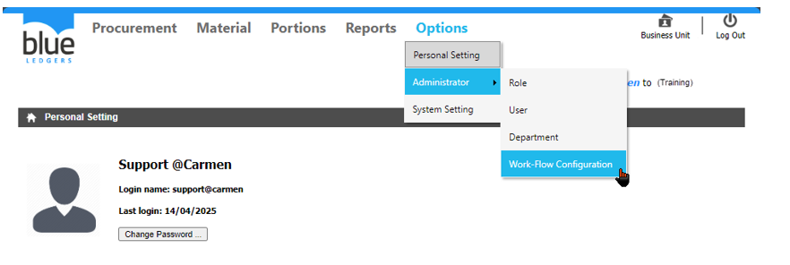
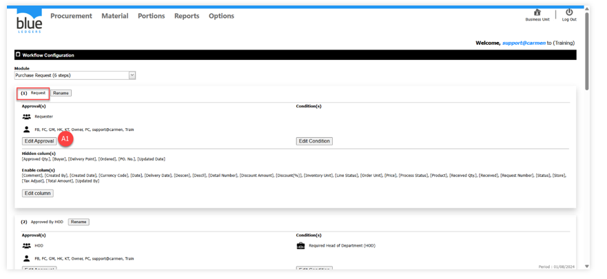
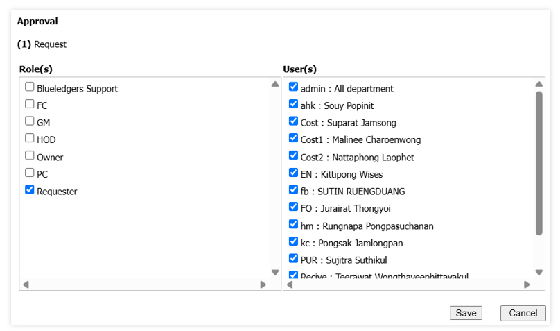

# Work – Flow Configurations    
Work – Flow Configurations คือ การกำหนดขอบเขตการมองเห็น และลำดับขั้นในการอนุมัติเอกสาร ซึ่งประกอบไปด้วย เอกสารใบขอซื้อ (Purchase Request) และเอกสารใบขอเบิก (Store Requisition)
 

A.Module ใช้ในการกำหนดว่าต้องการตั้งค่า workflow ของ เอกสารใด
      
"Purchase Request" หมายถึง ขั้นตอนการอนุมัติ สำหรับเอกสารใบขอซื้อ 

"Store Requisition" หมายถึง ขั้นตอนการอนุมัติ สำหรับเอกสารใบขอเบิก

A1.  ให้ตรวจสอบหัวข้อ Workflow ว่าอยู่ลำดับใด จากนั้นClick  Edit Approval เพื่อเพิ่ม User สำหรับให้สามารถใช้งานใน Workflow ได้

 	A2. เลือก User ที่อยู่ในลำดับของ Request จากนั้นกด Save
    
 หมายเหตุ ในกรณีที่ต้องการใช้ระบบ Email Sending ให้เอาเครื่องหมาย       ออกจาก Role

A3. จากนั้นใน Workflow Step ต่อๆ ไป ให้ทำตามขั้นตอนหัวข้อ A2 และให้ตรวจสอบ Workflow Step ว่าอยู่ในขอบเขต หรืออำนาจการอนุมัติเอกสารของ Role ใด
