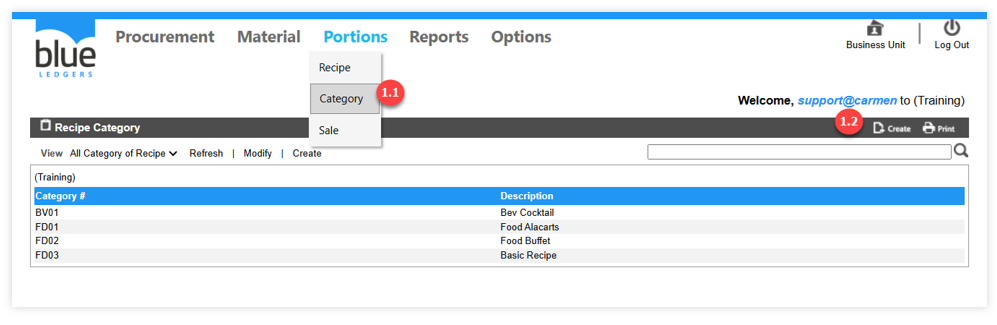
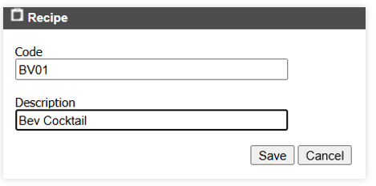

# Category 
คือ หมวดหมู่ของเมนูอาหารและเครื่องดื่ม

1.1.	เอา cursor ไปวางที่ “Portions” และเลือก “Category” เพื่อสร้างหมวดของเมนูอาหาร
 

1.2.	Click ปุ่ม Create จากนั้นระบุ 

“Code” เพื่อระบุ Category Code 

“Description” เพื่อกำหนดชื่อของหมวดหมู่ 
เสร็จแล้วกด “Save”
