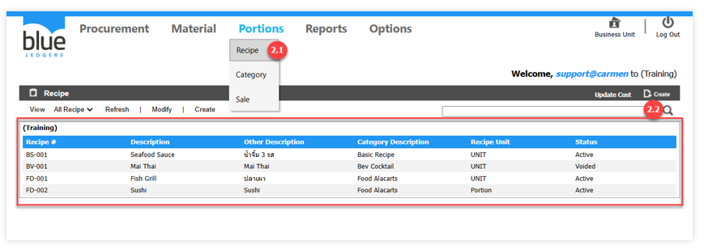
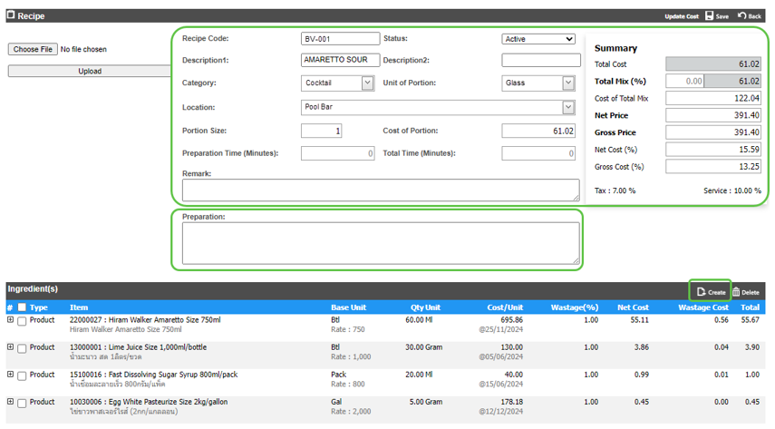
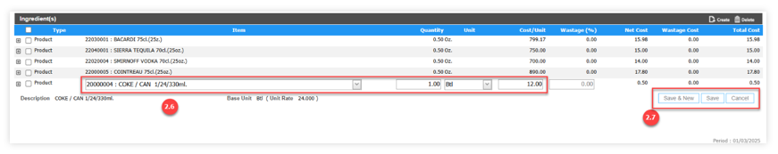
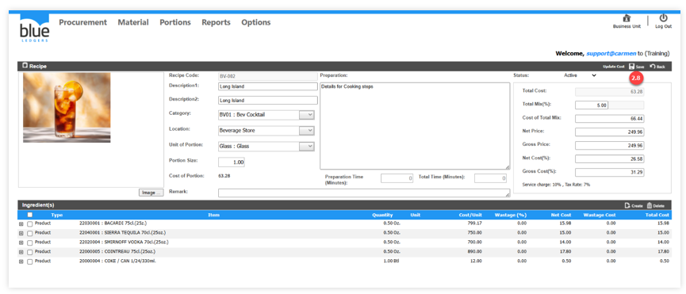
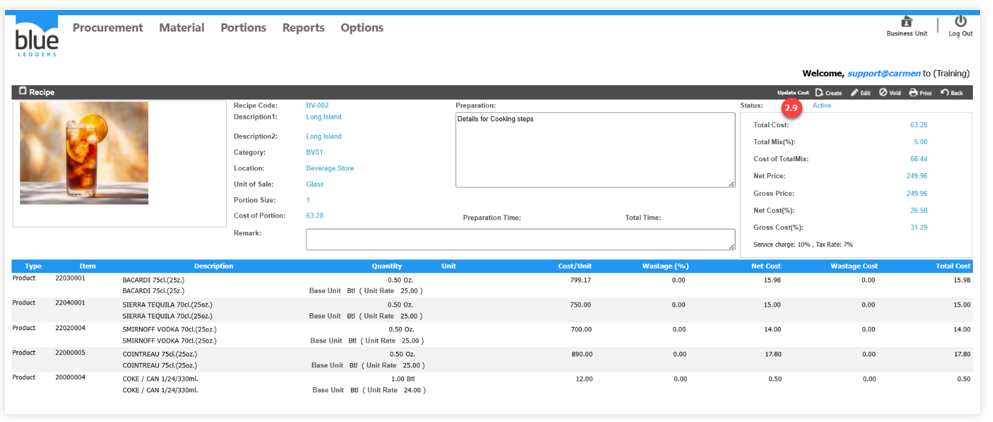

# Recipe 
คือ การบันทึกเมนูอาหารและเครื่องดื่ม พร้อมด้วยวัตถุดิบที่ใช้

2.1.	เอา cursor ไปวางที่ “Portions” และเลือก “Recipe” เพื่อสร้างเมนูอาหาร (ในกรอบสีแดงคือเมนูอาหารที่ได้สร้างสูตรไว้เรียบร้อยแล้ว)

2.2.	Click ปุ่ม “Create” เพื่อสร้างสูตรอาหาร

2.3.	การบันทึกข้อมูลในส่วนของ Recipe Header 

ข้อมูลของ Recipe

2.3.1.“Recipe Code“	ระบุ Category Code (BV) + Run No. (001) = BV-001

2.3.2.“Description 1“ ระบุชื่อสูตรอาหารเป็นภาษาอังกฤษ

2.3.3.“Description 2“ ระบุชื่อสูตรอาหารเป็นภาษาไทย

2.3.4.“Category“	ระบุหมวดหมู่ Recipe (Recipe Category)

2.3.5.“Location“ 	ระบุสถานที่ หรือ Outlet ที่ใช้เมนู

2.3.6.“Unit of Portions“ ระบุหน่วยของเมนูเช่นทำเค้ก เป็นชิ้น

2.3.7.“Portions Size“ 	ระบุปริมาณจากสัดส่วนของสูตรอาหารเช่น เค้กแบ่งเป็น 6 ชิ้น

2.3.8.“Cost of Portion” ระบบจะคำนวณต้นทุนต่อ Portion

2.3.9.“Preparation Time (Minutes) เวลาในการเตรียมอาหาร

2.3.10.“Total Time (Minutes) เวลาในการปรุงอาหาร

**ข้อมูลของ Cost และ ราคาขาย**

ระบบจะคำนวณ Cost ให้ตาม Receiving ล่าสุดที่รับมา

•	“Total Cost“	ราคาต้นทุนรวมของ Recipe โดยคำนวณจากวัตถุดิบทั้งหมดที่ใช้

•	“Total Mix (%)“	หากเมนูมีต้นทุนแฝงเช่นเครื่องปรุงและผักตกแต่ง สามารถบันทึกเป็นเปอร์เซ็นต์ได้ เช่น 5 หมายถึง 5%

•	“Cost of Total Mix“ คือต้นทุนอาหารรวมต้นทุนแฝง ซึ่งคำนวณโดย Total Cost + (Total Cost x Total Mix (%))

•	“Net Price“	ราคาขาย ไม่รวม Service charge และ Vat ให้กรอกราคาขายด้วยตนเอง

•	“Gross Price“	ราคาขาย รวม Service Charge และ Vat โดยระบบจะคำนวณให้ (Net Price x 1.177)

•	“Net Cost (%)“	ต้นทุนขาย (%) เมื่อเปรียบเทียบกับ Net Price โดยคำนวณจาก Cost of Total Mix ÷ Net Price

•	“Gross Cost (%)“ ต้นทุนขาย (%) เมื่อเปรียบเทียบกับ Gross Price โดยคำนวณ จาก Cost of Total Mix ÷ Gross Price

2.4.	“Preparation” ระบุรายละเอียด หรือขั้นตอนการปรุงอาหาร

2.5.	Click ปุ่ม Create เพื่อเพิ่มรายการสินค้าสำหรับสูตร Recipe
 
2.6.	ระบุรายการสินค้าเพื่อใช้เป็นวัตถุดิบของเมนูอาหารและเครื่องดื่ม

2.6.1.	“Item“ 	เลือกรายการสินค้าที่ต้องการสร้างเป็นวัตถุดิบของเมนูอาหาร โดยต้องทำการตั้งค่า ที่ Product > Recipe ให้ใส่เครื่องหมาย “ถูก” ก่อนบันทึก Recipe

2.6.2.	“Qty“	ระบุปริมาณที่ใช้

2.6.3.	“Unit“	เลือกหน่วย Recipe Unit ที่ใช้ โดยต้องทำการตั้งค่า ที่ Product > Recipe Unit ก่อนบันทึก Recipe
 
2.7.	การบันทึกรายการสินค้า

Click ปุ่ม ”Save & New” เมื่อต้องการบันทึกข้อมูลและสร้างรายการลำดับต่อไป 

หรือ Click ปุ่ม ”Save” เมื่อต้องการบันทึกข้อมูลเป็นรายการสุดท้าย 

หรือ Click ปุ่ม ”Cancel” เพื่อยกเลิกสินค้าดังกล่าว

2.8.	การบันทึกเอกสาร Recipe 

Click ปุ่ม ”Save” เพื่อบันทึกข้อมูล Recipe

2.9.	การปรับปรุง Cost ของเมนูอาหาร

เนื่องจาก Cost ของเมนูอาหารจะไม่มีการเปลี่ยนแปลงอัตโนมัติ หลังจากบันทึก Recipe หากต้องการที่จะทราบ Cost ของเมนูอาหารในปัจจุบัน ให้ Click ปุ่ม “Update Cost” เพื่อให้ระบบปรับปรุง Cost ของเมนูอาหารด้วยราคาของ Receiving ล่าสุด
 
