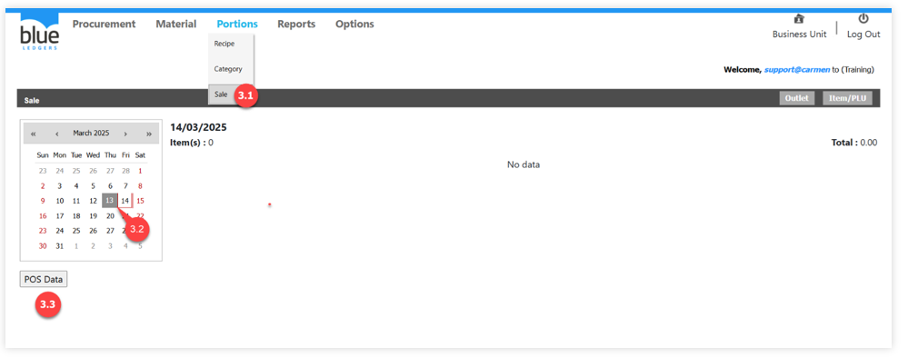
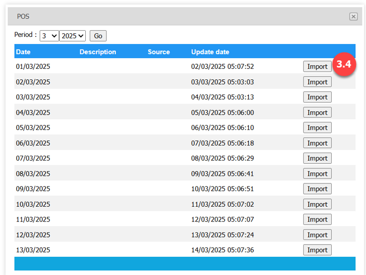
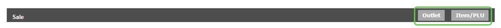
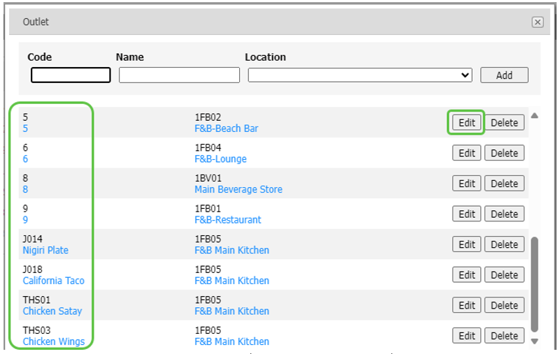
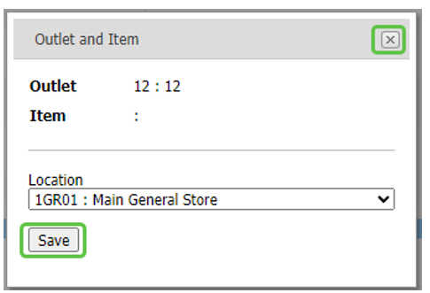
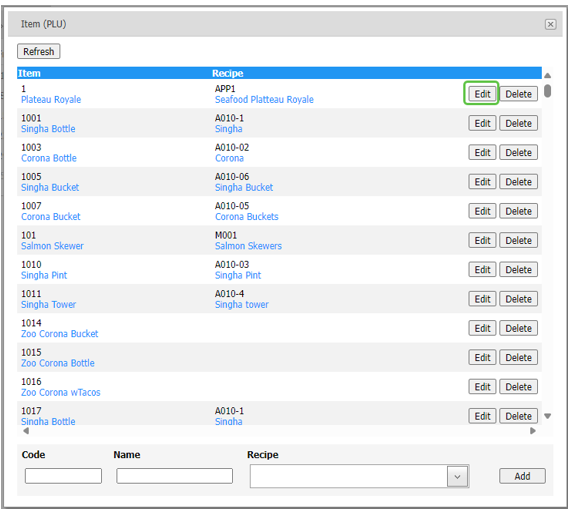
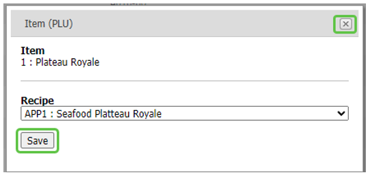
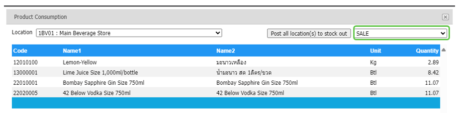
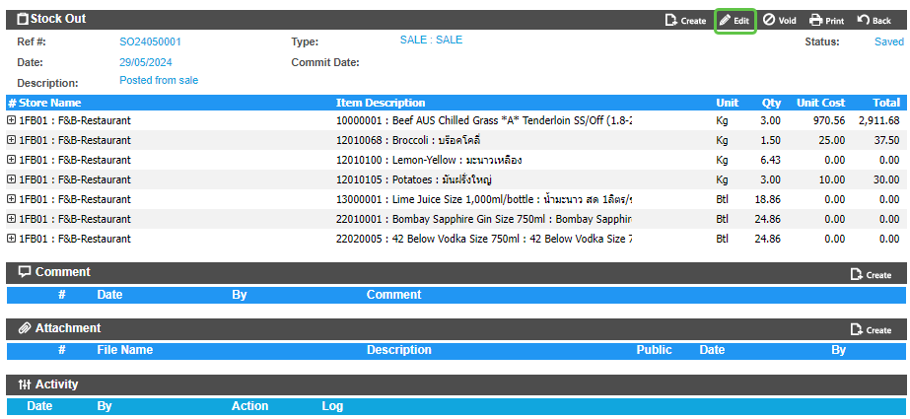

# Sale
คือ หน้าต่างเพื่อสรุปข้อมูลยอดขายจากระบบบ POS เป็นรายวัน
และทำหน้าตัดต้นทุนขายตาม Item Sold (รายการขาย) ในแต่ละวัน

3.1.	เอา cursor ไปวางที่ “Portions” และเลือก “Sale”

3.2.	Click เลือกวันที่ต้องการ เพื่อดูข้อมูลยอดขายจากระบบ Point of Sale หลังจากที่ Import ข้อมูลยอดขายเข้ามาแล้ว

3.3.	Click ปุ่ม “POS Data” เพื่อทำการ Post ยอดขายจากระบบ POS เข้ามาใน “Sale”
 
3.4.	การ Interface ข้อมูลยอดขายจาก POS
-	“Period” กำหนด เดือน และ ปี ของข้อมูลยอดขายที่ต้องการ และ Click “Go”
-	ระบบจะแสดงยอดขายรายวันจาก POS ใน period ที่เลือก
-	Click “Import” จากวันที่ต้องการ เพื่อนำเข้าข้อมูลรายการขายอาหารและเครื่องดื่มเข้าระบบ “Recipe”

3.5.	การ mapping ข้อมูลยอดขายกับ Recipe และ Store/Location

3.5.1.	Click ที่ปุ่ม “Outlet” ระบบจะแสดง รายชื่อ outlet จากระบบ POS เพื่อเชื่อมโยงข้อมูลของ “Outlet” กับ “Store/Location” ของระบบ เพื่อนำไปตัด Stock จาก Location ที่ต้องการ

o	Click ที่ปุ่ม “Edit” เพื่อแก้ไขหรือกำหนด “Location” จากระบบ
 
o	“Location” เลือก Location เพื่อ mapping กับ Outlet ที่ต้องการ

o	Click ที่ปุ่ม “Save” เพื่อบันทึก หรือ click ที่ “กากบาท” เพื่อยกเลิก

3.5.2.	Click ที่ปุ่ม “Item/PLU” ระบบจะแสดง รายชื่อ เมนูอาหารจากระบบ POS เพื่อเชื่อมโยงข้อมูลของ “Item/PLU” กับ “Recipe” ของระบบ เพื่อนำไปตัด Stock ด้วย Product ที่ต้องการได้

o	Click ที่ปุ่ม “Edit” เพื่อแก้ไขหรือกำหนด “Recipe” จากระบบ

o	“Recipe” เลือก Recipe code เพื่อ mapping กับ Item/PLU ที่ต้องการ

o	Click ที่ปุ่ม “Save” เพื่อบันทึก หรือ click ที่ “กากบาท” เพื่อยกเลิก
 
3.6.	การดูข้อมูล Consumption ที่จะใช้ในการตัด Stock และการ Post ตัด stock

3.6.1.	การดูข้อมูล “Product Consumption” ก่อนตัด Stock

o	Click ที่ปุ่ม “Stock Out Information”

o	เลือก “Location” ที่ต้องการ เพื่อดูรายการสินค้าที่จะทำการตัด stock จาก location ที่เลือก โดยระบบจะคำนวณจำนวนสินค้าจากยอดขายและวัตถุดิบใน Recipe ที่ได้ mapping ไว้

3.6.2.	การ Post ข้อมูลเพื่อตัด Stock จากระบบ Inventory

o	เลือก “Adjustment type” ที่ต้องการบันทึก

o	Click ที่ปุ่ม “Post all location(s) to stock out” เพื่อให้ระบบสร้างเอกสาร “Stock Out” ให้โดยอัตโนมัติ

o	ตรวจสอบเอกสาร “Stock Out” ที่สร้างขึ้น

ระบบจะสร้างเอกสารแยกตาม location และ ตามวันที่ขาย

ระบบจะบันทึกด้วย status “Save” เอาไว้ให้ทำการตรวจสอบอีกครั้ง

o	Click ที่ปุ่ม “Edit” และกดปุ่ม “Commit” เพื่อให้ระบบตัด Stock โดยสมบูรณ์

