# Account Code Mapping (การผูกบัญชี สำหรับ Post ข้อมูลไป AP และ GL) 
Account Code Mapping คือ Function ในการผูกผังบัญชีและ department code ให้กับ transaction ใน BlueLedgers

สามารถสร้างโดยการเอา cursor ไปวางที่ “Procurement” 
และ เลื่อน cursor ไปที่ “Configuration”  
จากนั้นเลือก “Account Code Mapping” 
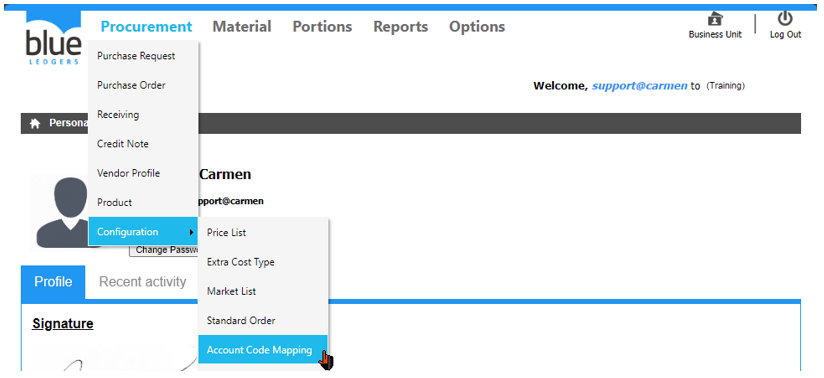
1.	การ Update ข้อมูลใหม่ก่อนการ Mapping

เมื่อเอกสารมีการ commit แล้ว ระบบจึงจะดึงข้อมูลมาแสดงให้ทำการ mapping

1.1	Click “Get new code(s)” เพื่อให้ระบบ update ข้อมูลก่อน mapping

2.	หัวข้อ Account Code Mapping แบ่งการ Mapping เป็น 2 ประเภท

2.1	“Posting to AP” สำหรับ ผูก ผังบัญชี ให้กับ Transaction “Receiving” และ “CN” ระบบจะทำการ Post ข้อมูล ไปสร้างเป็น Invoice ใน Module AP ใน ระบบ Carmen (Accounting) โดยมีขั้นตอน mapping ดังนี้

2.1.1	ขั้นตอนการ Mapping ผ่านระบบ
-	Click icon รูปดินสอ เพื่อแก้ไข หรือทำการ mapping
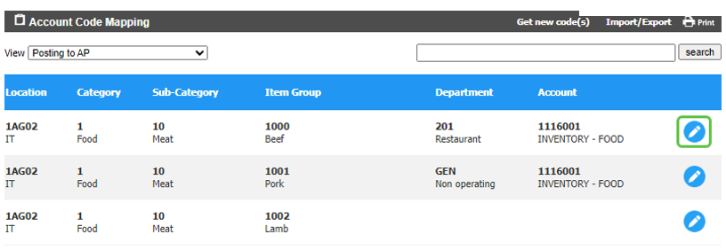
-	ผูก รหัสแผนก “Department” และ ผังบัญชี “Account” ที่ สัมพันธ์ กับ location และ     
Category/Sub Category/Item Group.
-	Click เครื่องหมายถูก  เพื่อ Save หรือ  Click เครื่องหมายกากบาท เพื่อ Cancel
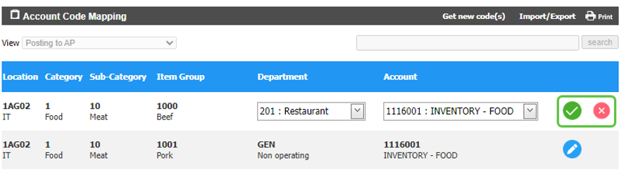 
2.1.2	ตัวอย่างการ Mapping ผ่าน Excel

2.1.2.1	Export ข้อมูลออกไป mapping ผ่าน Excel
-	Click “Import/Export”
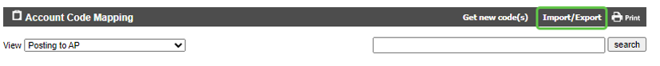
-	Click “Export”
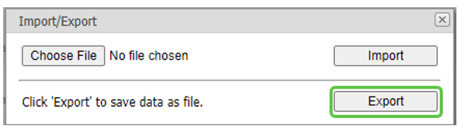
-	ระบบจะแสดง pop up ให้ download file
-	เลือก “Save as” และบันทึกลง computer
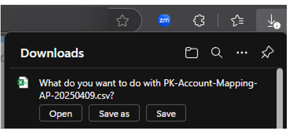
-	เปิด file หลังจากที่ save แล้ว
-	ทำการ mapping ใน column ‘Department” และ “Account” ให้เรียบร้อย และบันทึก file
-	ห้ามแก้ไขข้อมูลใน column อื่น ๆ โดยเด็ดขาด และต้อง save file ด้วยนามสกุล .csv เท่านั้น
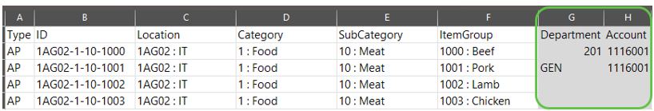
2.1.2.2	การ import mapping กลับเข้าระบบ
-	Click “Import/Export”
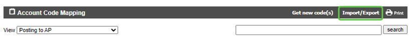
-	Click “Choose File” และทำการเลือก file .csv ที่ mapping เสร็จแล้ว
-	Click “Import” เพื่อนำข้อมูลเข้าระบบ
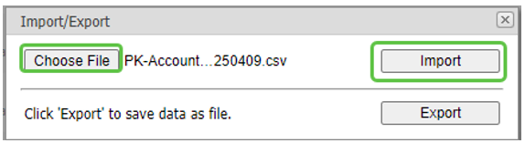
2.1.3	ตัวอย่างการผูกผังบัญชีสำหรับ Posting to AP

2.1.3.1	Mapping สำหรับ Location ที่มี Type เป็น Enter Counted Stock (Inventory)

o	“Department” ให้ mapping เป็น GEN เนื่องจากบันทึกบัญชีในกลุ่ม Inventory ที่อยู่ในหมวด Balance sheet จึงไม่ต้องระบุแผนก

o	“Account” ให้ mapping ด้วย account code ในกลุ่ม Inventory โดยดูข้อมูล item group ประกอบเพื่อระบุว่าจะบันทึกเป็น Inventory Food, Beverage หรือ อื่น ๆ

2.1.3.2	Mapping สำหรับ Location ที่มี Type เป็น Default Zero (Direct)

o	“Department” ให้ mapping เป็นแผนกต่าง ๆ โดยดูข้อมูล location ประกอบ ว่า location นั้นเป็นต้นทุนของแผนกใด

o	“Account” ให้ mapping ด้วย account code ในกลุ่ม ต้นทุน หรือ ค่าใช้จ่าย โดยดูข้อมูล item group ประกอบเพื่อระบุว่าจะบันทึกเป็น COGS - Food, Beverage หรือ อื่น ๆ

2.1.3.3	Mapping สำหรับ Location ที่มี Type เป็น Default System (Inventory - OE)

o	“Department” ให้ mapping เป็น GEN เนื่องจากบันทึกบัญชีในกลุ่ม Inventory ที่อยู่ในหมวด Balance sheet จึงไม่ต้องระบุแผนก

o	“Account” ให้ mapping ด้วย account code ในกลุ่ม Inventory โดยดูข้อมูล item group ประกอบเพื่อระบุว่าจะบันทึกเป็น Inventory Food, Beverage หรือ ประเภท OE

2.2	“Posting to GL” สำหรับ ผูก ผังบัญชี ให้กับ Transaction ของ Inventory ทั้งหมด เช่น Store Requisition, Stock In, Stock Out, EOP In และ EOP Out โดย ระบบจะทำการ Post ข้อมูล ไปสร้างเป็น JV ใน Module GL ใน ระบบ 
Carmen (Accounting) โดยมีขั้นตอน mapping ดังนี้

2.2.1	ขั้นตอนการ Mapping ผ่านระบบ
-	Click icon รูปดินสอ เพื่อแก้ไข หรือทำการ mapping
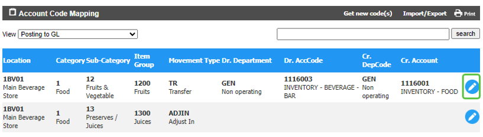
-	ผูก รหัสแผนก “Department” และ ผังบัญชี “Account” ที่ สัมพันธ์ กับ location และ     
Category/Sub Category/Item Group.และ movement type ทั้ง Debit และ Credit
-	Click เครื่องหมายถูก  เพื่อ Save หรือ  Click เครื่องหมายกากบาท เพื่อ Cancel
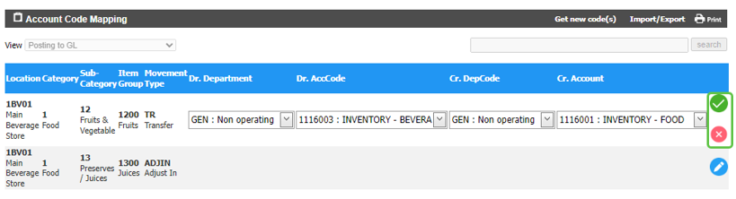
2.2.2	ตัวอย่างการ Mapping ผ่าน Excel
2.2.2.1	Export ข้อมูลออกไป mapping ผ่าน Excel
-	Click “Import/Export”
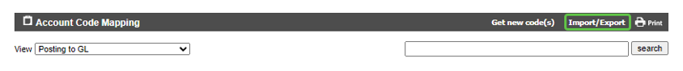
-	Click “Export”
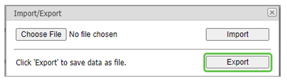
-	ระบบจะแสดง pop up ให้ download file
-	เลือก “Save as” และบันทึกลง computer

-	เปิด file หลังจากที่ save แล้ว
-	ทำการ mapping ใน column ‘Department” และ “Account” ให้เรียบร้อย และบันทึก file
-	ห้ามแก้ไขข้อมูลใน column อื่น ๆ โดยเด็ดขาด และต้อง save file ด้วยนามสกุล .csv เท่านั้น
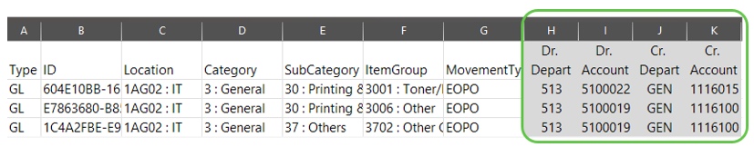
2.2.2.2	การ import mapping กลับเข้าระบบ
-	Click “Import/Export”
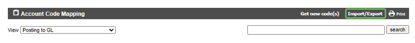
-	Click “Choose File” และทำการเลือก file .csv ที่ mapping เสร็จแล้ว
-	Click “Import” เพื่อนำข้อมูลเข้าระบบ
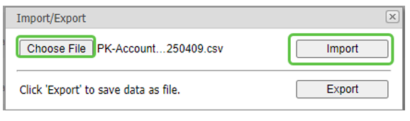
2.2.3	ตัวอย่างการผูกผังบัญชี Posting to GL

การ mapping นั้นจะมีองค์ประกอบ 3 ส่วนคือ Location + Item group + movement type ซึ่งการ mapping จะเป็น location ปลายทาง (To Location)

2.2.3.1	Mapping สำหรับ Location ที่มี Type เป็น Enter Counted Stock (Inventory) 

o “Dr. Department” ให้ mapping เป็น GEN หรือแผนกต่าง ๆ ตามประเภท account code ที่จะ mapping

o “Dr. Account” ให้ mapping ด้วย account code ในกลุ่ม Inventory เพื่อเพิ่มมูลค่าของ Inventory หรือ ลด Cost / ค่าใช้จ่าย โดยดูข้อมูล item group และ movement type ประกอบเพื่อระบุว่าจะบันทึกเป็น Inventory Food, Beverage หรือ อื่น ๆ โดยการบันทึกบัญชีอาจต่างกันไปขึ้นอยู่กับ movement type เช่น Adjust In, EOP In, Brought Forward, Transfer, Adjust Out หรือ EOP Out

o	“Cr. Department” ให้ mapping เป็น GEN เนื่องจากบันทึกบัญชีในกลุ่ม Inventory ที่อยู่ในหมวด Balance sheet จึงไม่ต้องระบุแผนก

o	“Cr. Account” ให้ mapping ด้วย account code ในกลุ่ม Inventory เพื่อลดมูลค่าของ Inventory หรือ ลด Cost / ค่าใช้จ่าย โดยดูข้อมูล item group และ movement type ประกอบเพื่อระบุว่าจะบันทึกเป็น Inventory Food, Beverage หรือ อื่น ๆ โดยการบันทึกบัญชีอาจต่างกันไปขึ้นอยู่กับ movement type เช่น Adjust In, EOP In, Brought Forward, Transfer, Adjust Out หรือ EOP Out

2.2.3.2	Mapping สำหรับ Location ที่มี Type เป็น Default Zero (Direct) 

o	“Dr. Department” ให้ mapping เป็นแผนกต่าง ๆ เนื่องจากบันทึกบัญชีในกลุ่ม Cost หรือ ค่าใช้จ่าย 

o	“Dr. Account” ให้ mapping ด้วย account code ในกลุ่ม Cost หรือ ค่าใช้จ่าย เพื่อบันทึก Cost หรือ 
ค่าใช้จ่าย ให้แผนกต่าง ๆ โดยดูข้อมูล item group และ movement type ประกอบเพื่อระบุว่าจะบันทึกเป็น Cost of Food, Beverage หรือ อื่น ๆ โดยการบันทึกบัญชีอาจต่างกันไปขึ้นอยู่กับ movement type เช่น Issue (SR)

o	“Cr. Department” ให้ mapping เป็น GEN เนื่องจากบันทึกบัญชีในกลุ่ม Inventory ที่อยู่ในหมวด Balance sheet จึงไม่ต้องระบุแผนก

o	“Cr. Account” ให้ mapping ด้วย account code ในกลุ่ม Inventory เพื่อลดมูลค่าของ Inventoryโดยดูข้อมูล item group และ movement type ประกอบเพื่อระบุว่าจะบันทึกเป็น Inventory Food, Beverage หรือ อื่น ๆ 

