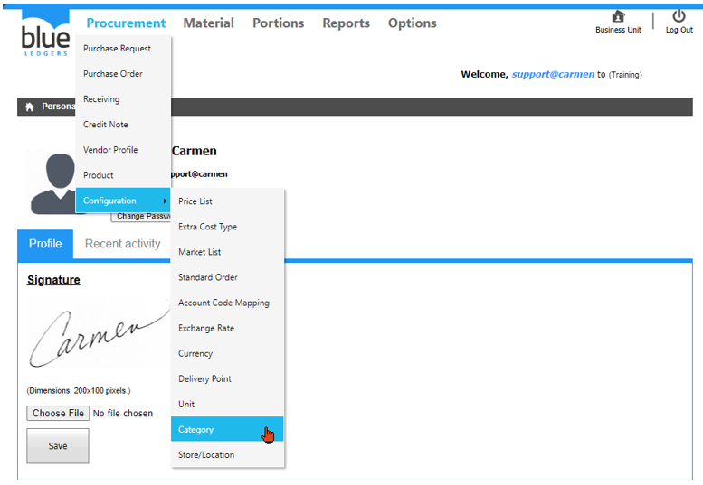
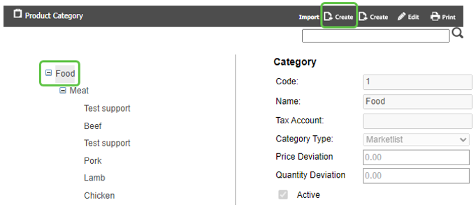
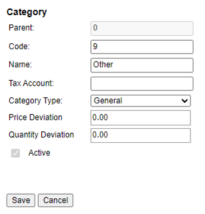
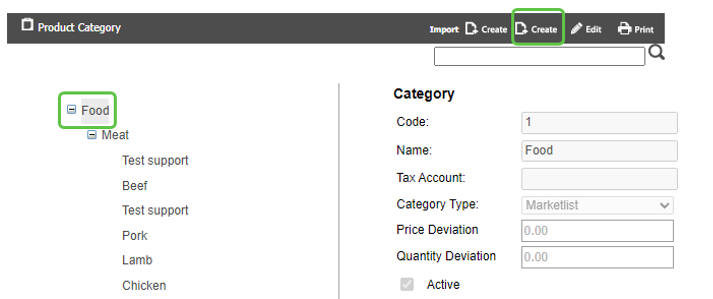
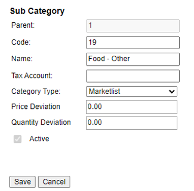
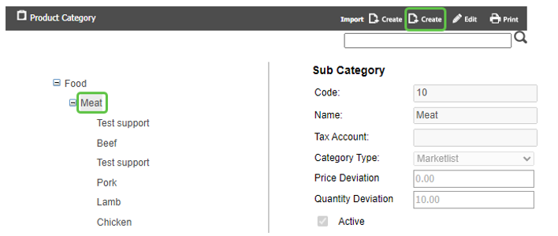
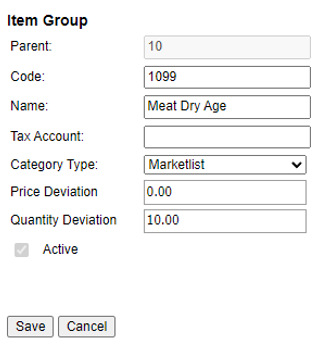

# Category (หมวดหมู่รายการสินค้า)

Category คือ Function ในการสร้าง หมวดหมู่ ของ รายการสินค้า เพื่อ จัดกลุ่มในการใช้งาน

สามารถสร้างโดยการเอา cursor ไปวางที่ “Procurement” 
และ เลื่อน cursor ไปที่ “Configuration”  
จากนั้นเลือก “category” 

ขั้นตอนการสร้าง Category, Sub Category, Item Group
1.	Category
-	Click ที่ Category ที่ต้องการ จากนั้น Click “Create” เพื่อสร้าง Category ใหม่

-	“Code” กำหนดรหัสของ Category ที่ต้องการ
-	“Name” เพื่อใส่ชื่อ Category ที่ต้องการ
-	“Category Type” เพื่อเลือกประเภทของ PR (Marketlist, General, Asset) ให้ Category ที่ต้องการ
-	“Price Deviation” กำหนด % ที่อนุญาตให้รับสินค้าด้วยราคามากกว่า PO ได้
-	“Quantity Deviation” กำหนด % ที่อนุญาตให้รับสินค้าด้วยจำนวนมากกว่า PO ได้
-	Click “Active” เพื่อให้สามารถใช้งานได้
-	Click “Save” เพื่อ บันทึก หรือ “Cancel” เพื่อ ยกเลิก

2.	Sub Category
-	Click ที่ Category ที่ต้องการ จากนั้น Click “Create” เพื่อสร้าง Category ใหม่

-	“Code” กำหนดรหัสของ SubCategory ที่ต้องการ 
-	“Name” เพื่อใส่ชื่อ SubCategory ที่ต้องการ
-	“Category Type” เพื่อเลือกประเภทของ PR (Marketlist, General, Asset) ให้ SubCategory ที่ต้องการ
-	“Price Deviation” กำหนด % ที่อนุญาตให้รับสินค้าด้วยราคามากกว่า PO ได้
-	“Quantity Deviation” กำหนด % ที่อนุญาตให้รับสินค้าด้วยจำนวนมากกว่า PO ได้
-	Click “Active” เพื่อให้สามารถใช้งานได้
-	Click “Save” เพื่อ บันทึก หรือ “Cancel” เพื่อ ยกเลิก

3.	Item Group
-	Click ที่ SubCategory หรือ Item Group ที่ต้องการ จากนั้น Click “Create” เพื่อสร้าง Item Group ใหม่เพื่อให้อยู่ในกลุ่มเดียวกัน

-	“Code” กำหนดรหัสของ Item Group ที่ต้องการ 
-	“Name” เพื่อใส่ชื่อ Item Group ที่ต้องการ
-	“Category Type” เพื่อเลือกประเภทของ PR (Marketlist, General, Asset) ให้ item group ที่ต้องการ
-	“Price Deviation” กำหนด % ที่อนุญาตให้รับสินค้าด้วยราคามากกว่า PO ได้
-	“Quantity Deviation” กำหนด % ที่อนุญาตให้รับสินค้าด้วยจำนวนมากกว่า PO ได้
-	Click “Active” เพื่อให้สามารถใช้งานได้
-	Click “Save” เพื่อ บันทึก หรือ “Cancel” เพื่อ ยกเลิก

  **ขั้นตอนการ Edit Category, Sub Category, Item Group**
-	Click ที่ Category, Sub Category, Item Group ที่ต้องการ จากนั้น Click “Edit”
-	Click เครื่องหมายถูก ออก ที่ “Active” หากไม่ต้องการใช้งาน Category, Sub Category, Item Group ดังกล่าว
-	Click “Save” เพื่อ บันทึก หรือ “Cancel” เพื่อ ยกเลิก

 
