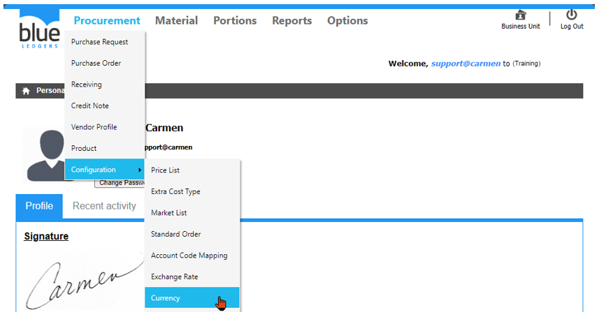
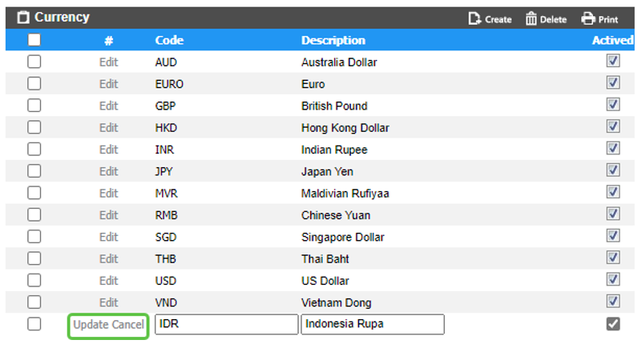
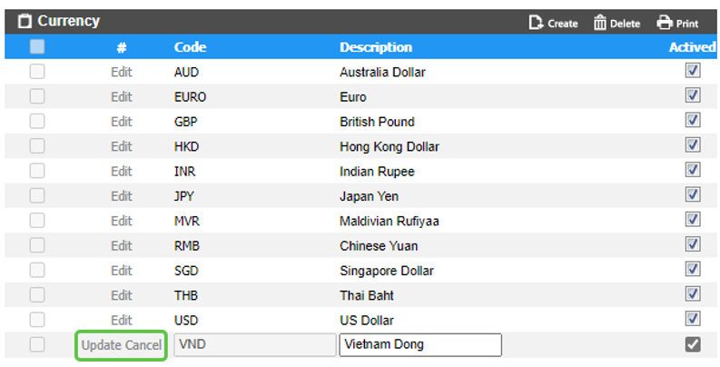
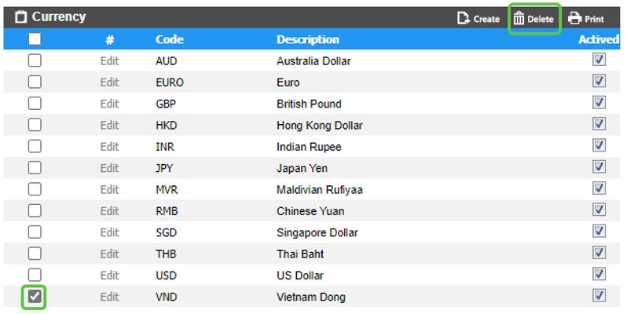
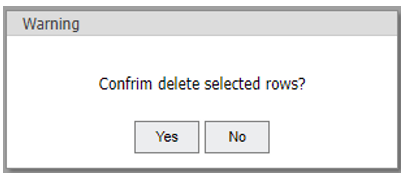

# Currency (สกุลเงิน)

Currency คือ Function ในการสร้างสกุลเงินต่างๆ ที่ต้องการใช้งานในระบบ Blueledgers

สามารถสร้างโดยการเอา cursor ไปวางที่ “Procurement” 
และ เลื่อน cursor ไปที่ “Configuration”  
จากนั้นเลือก “Currency” 

ขั้นตอนการสร้างสกุลเงิน
-	Click “Create” เพื่อทำการสร้างสกุลเงิน

-	“Code” เพื่อใส่ รหัสสกุลเงิน
-	“Description” เพื่อใส่ สกุลเงิน
-	Click เครื่องหมายถูก ออก ที่ “Actived” หากไม่ต้องการใช้งาน สกุลเงิน ดังกล่าว
-	Click “Update” เพื่อ บันทึก หรือ “Cancel” เพื่อ ยกเลิก

  ขั้นตอนการ Edit สกุลเงิน
-	Click “Edit” ที่ สกุลเงิน ที่ต้องการ เพื่อทำการแก้ไข
-	“Description” แก้ไขชื่อสกุลเงิน
-	Click เครื่องหมายถูก ออก ที่ “Actived” หากไม่ต้องการใช้งาน สกุลเงิน ดังกล่าว
-	Click “Update” เพื่อ บันทึก หรือ “Cancel” เพื่อ ยกเลิก

ขั้นตอนการลบสกุลเงิน
-	Click เครื่องหมายถูก ที่ สกุลเงิน ที่ต้องการ
-	Click “Delete” เพื่อ ลบ

-	Click “Yes” เพื่อ ยืนยัน หรือ “No” เพื่อ ยกเลิก

