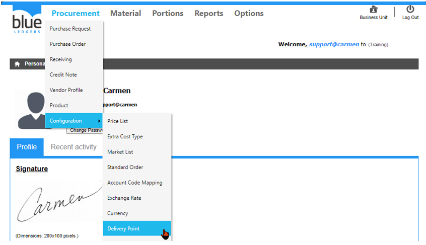
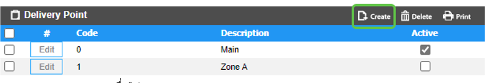
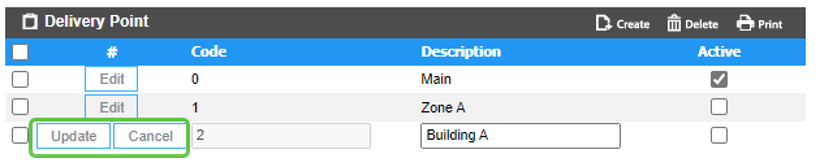
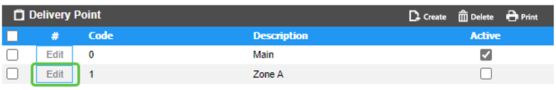
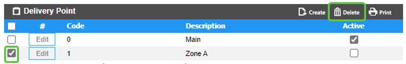

# Delivery Point (จุดรับสินค้า)
Delivery Point คือ Function ในการสร้าง จุดรับสินค้า หากมีจุดรับสินค้ามากกว่า หนึ่ง จุด

สามารถสร้างโดยการเอา cursor ไปวางที่ “Procurement” 
และ เลื่อน cursor ไปที่ “Configuration”  
จากนั้นเลือก “Delivery Point” 

**ขั้นตอนการสร้าง Delivery Point**
-	Click “Create” เพื่อทำการสร้าง Delivery Point

-	“Description” เพื่อใส่ Delivery Point
-	Click เครื่องหมายถูก ออก ที่ “Active” หากไม่ต้องการใช้งาน Delivery Point ดังกล่าว
-	Click “Update” เพื่อ บันทึก หรือ “Cancel” เพื่อ ยกเลิก

 

  **ขั้นตอนการ Edit Delivery Point**
-	Click “Edit” ที่ Delivery Point ที่ต้องการ เพื่อทำการแก้ไข
-	“Description” เพื่อแก้ไข Description
-	Click เครื่องหมายถูก ออก ที่ “Active” หากไม่ต้องการใช้งาน Delivery Point ดังกล่าว
-	Click “Update” เพื่อ บันทึก หรือ “Cancel” เพื่อ ยกเลิก
   

**ขั้นตอนการลบ Delivery Point**
-	Click เครื่องหมายถูก ที่ Delivery Point ที่ต้องการ
-	Click “Delete” เพื่อ ลบ

-	Click “Yes” เพื่อ ยืนยัน หรือ “No” เพื่อ ยกเลิก

 
