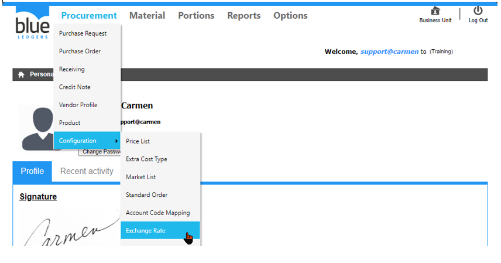
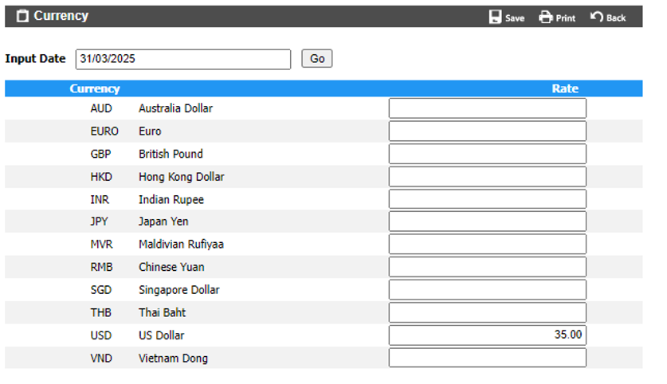

# Exchange Rate (อัตราแลกเปลี่ยน)

Exchange Rate คือ Function ในการสร้างอัตราแลกเปลี่ยนของสกุลเงินต่าง ๆ

สามารถสร้างโดยการเอา cursor ไปวางที่ “Procurement” 
และ เลื่อน cursor ไปที่ “Configuration”  
จากนั้นเลือก “Exchange Rate” 

 

**ขั้นตอนการใส่ข้อมูลอัตราการแลกเปลี่ยน**
-	Click “Edit” เพื่อทำการใส่ข้อมูล อัตราแลกเปลี่ยน
-	“Input Date” เพื่อเลือกวันที่ ที่มีผล เริ่มต้น ของอัตราแลกเปลี่ยน
-	“Rate” ใส่ อัตราแลกเปลี่ยน ใน สกุลเงิน ที่ต้องการ
-	Click “Save” เพื่อ บันทึก หรือ “Back” เพื่อ ย้อนกลับ

 
