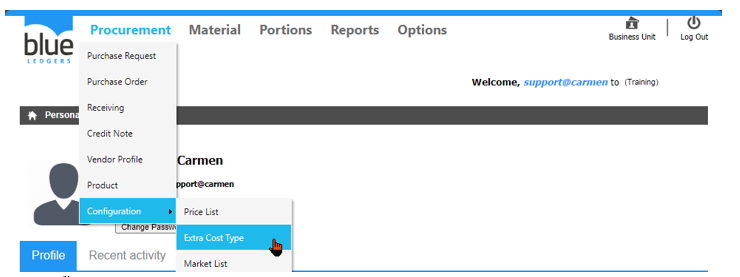
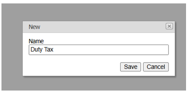
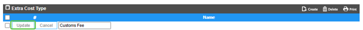
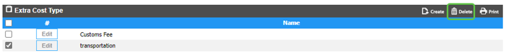
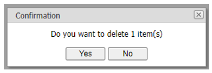

# Extra Cost Type (ค่าใช้จ่ายพิเศษ)

Extra Cost Type คือ Function ในการสร้างประเภทค่าใช้จ่ายต่าง ๆ เช่น ค่าขนส่งจากต่างประเทศ, ค่าภาษีนำเข้า
เพื่อใช้ในการคำนวณ Extra cost เพื่อเพิ่มมูลค่า inventory cost ให้กับสินค้าในเอกสาร Receiving ที่มีการสั่งซื้อ 

สามารถสร้างโดยการเอา cursor ไปวางที่ “Procurement” 
และ เลื่อน cursor ไปที่ “Configuration”  
จากนั้นเลือก “Extra cost Type”

1.	ขั้นตอนการสร้าง Extra Cost Type
-	Click “Create” เพื่อสร้าง Extra Cost 
-	“Name” เพื่อใส่ชื่อของ Extra Cost
-	Click “Save” เพื่อ บันทึก หรือ “Cancel” เพื่อ ยกเลิก

 

2.	ขั้นตอนการ “Edit” Extra Cost Type
-	Click “Edit” ที่ Extra Cost Type ที่ต้องการ เพื่อทำการแก้ไข

-	Click “Update” เพื่อ ยืนยัน หรือ “Cancel” เพื่อ ยกเลิก

3.	ขั้นตอนการ “Delete” Extra Cost Type
-	Click เครื่องหมายถูก ที่ Extra Cost Type ที่ต้องการ
-	Click “Delete” เพื่อ ลบ

 
-	Click “Yes” เพื่อ ยืนยัน หรือ “No” เพื่อ ยกเลิก

 
