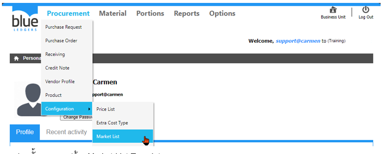
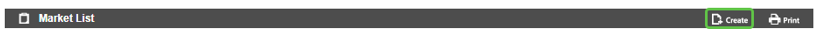
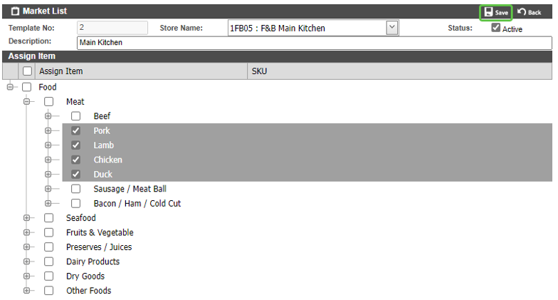
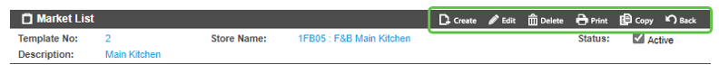
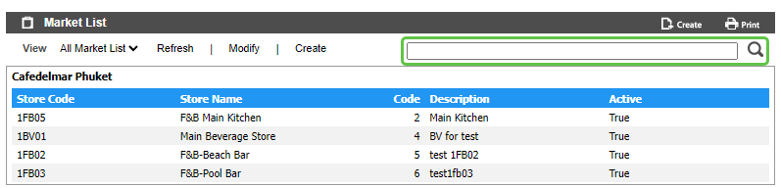

# Market List(Template รายการสินค้าสั่งซื้อ Market List)

Market List คือ Function ในการสร้าง Template สำหรับรายการสินค้าประเภท Market list ที่มีการสั่งซื้อบ่อย ๆ เพื่อช่วยลดเวลาในการเลือกสินค้าตอนสร้าง PR

สามารถสร้างโดยการเอา cursor ไปวางที่ “Procurement” 
และ เลื่อน cursor ไปที่ “Configuration”  
จากนั้นเลือก “Market List” 
 
1.	ขั้นตอนการสร้าง Market List Template
-	Click “Create” เพื่อสร้าง Template

 
-	“Store Name” เพื่อเลือก Store/Location ที่ต้องการสั่งซื้อ
-	Click เครื่องหมายถูก ออก ที่ “active” หากไม่ต้องการใช้งาน Template ดังกล่าว
-	“Description” เพื่อใส่คำอธิบาย Template
-	“Assign Item” โดยการ Click เครื่องหมายถูก ใน แต่ละหมวดหมู่ หรือ รายการสินค้า ที่ต้องการ
-	Click “Save” เพื่อ บันทึก หรือ “Back” เพื่อ ย้อนกลับ 

 

2.	Function อื่น ๆ ของ Market List หลังจากกด “Save”

       o “Create” เพื่อสร้าง Market List ใหม่

       o “Edit” ใช้สำหรับ แก้ไข Market List ดังกล่าว

       o “Delete” ใช้สำหรับ ลบ Market List ดังกล่าว

       o “Copy” ใช้สำหรับ คัดลอก Template Market list ดังกล่าว เป็น Template ใหม่

       o “Back” กลับสู่หน้าเมนู Market List
 

3.	การ ค้นหา และ View Market List

3.1	หลังจากเข้ามาที่หน้าจอ Market List แล้ว สามารถค้นหา Market List ที่ต้องการ โดย พิมพ์ค้นหา ในช่อง Search

3.2	การ View Market List ทำได้โดยการเลือก Market List ที่ต้องการ เพื่อ แสดงรายละเอียดของ Market List นั้นๆ
 

