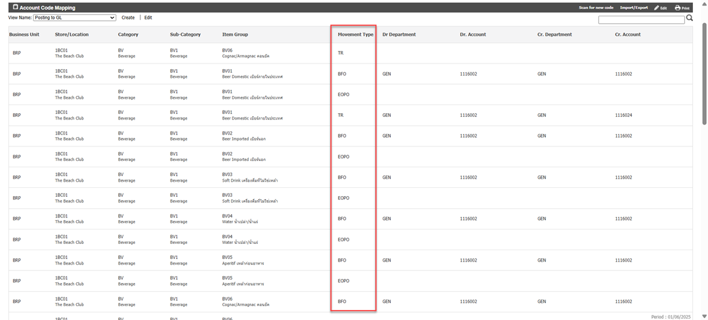

# Movement Type Definition
ความหมายของ Movement Type ในหน้า Account Code Mapping 

<table style="width: 100%; border-collapse: collapse; font-family: 'Segoe UI', Tahoma, Geneva, Verdana, sans-serif;">
  <thead>
    <tr style="background-color: #f2f2f2;">
      <th style="border: 1px solid #ccc; padding: 10px; text-align: center;">ตัวย่อ (Code)</th>
      <th style="border: 1px solid #ccc; padding: 10px; text-align: center;">ชื่อเต็ม (Movement Type)</th>
      <th style="border: 1px solid #ccc; padding: 10px; text-align: center;">คำอธิบาย</th>
      <th style="border: 1px solid #ccc; padding: 10px; text-align: center;">ตัวอย่าง</th>
    </tr>
  </thead>
  <tbody>
    <tr style="background-color: #fafafa;">
      <td style="border: 1px solid #ccc; padding: 10px; text-align: center;"><strong>SI</strong></td>
      <td style="border: 1px solid #ccc; padding: 10px;">Stock In</td>
      <td style="border: 1px solid #ccc; padding: 10px;">การปรับปรุงเพื่อเพิ่มจำนวนสินค้าและราคาในคลังสินค้า</td>
      <td style="border: 1px solid #ccc; padding: 10px;">จำนวนสินค้าในคลังสินค้ามากกว่าระบบ จึงทำการปรับปรุงในระบบให้เท่ากัน</td>
    </tr>
    <tr>
      <td style="border: 1px solid #ccc; padding: 10px; text-align: center;"><strong>SO</strong></td>
      <td style="border: 1px solid #ccc; padding: 10px;">Stock Out</td>
      <td style="border: 1px solid #ccc; padding: 10px;">การปรับปรุงเพื่อลดจำนวนสินค้าในคลังสินค้า</td>
      <td style="border: 1px solid #ccc; padding: 10px;">จำนวนสินค้าในคลังสินค้าน้อยกว่าในระบบ จึงทำการปรับปรุงในระบบให้เท่ากัน</td>
    </tr>
    <tr style="background-color: #fafafa;">
      <td style="border: 1px solid #ccc; padding: 10px; text-align: center;"><strong>SR</strong></td>
      <td style="border: 1px solid #ccc; padding: 10px;">Issues</td>
      <td style="border: 1px solid #ccc; padding: 10px;">เบิกสินค้าและตัดเป็นค่าใช้จ่ายในทันที</td>
      <td style="border: 1px solid #ccc; padding: 10px;">การเบิกสินค้าด้วย movement type ประเภท issue</td>
    </tr>
        <tr>
      <td style="border: 1px solid #ccc; padding: 10px; text-align: center;"><strong>TR</strong></td>
      <td style="border: 1px solid #ccc; padding: 10px;">Transfer</td>
      <td style="border: 1px solid #ccc; padding: 10px;"> การเบิกสินค้าแบบโอนย้ายสินค้าระหว่างกัน</td>
      <td style="border: 1px solid #ccc; padding: 10px;">การเบิกสินค้าด้วย movement type ประเภท transfer</td>
    </tr>
    <tr>
      <td style="border: 1px solid #ccc; padding: 10px; text-align: center;"><strong>EOPI</strong></td>
      <td style="border: 1px solid #ccc; padding: 10px;">End of Period In</td>
      <td style="border: 1px solid #ccc; padding: 10px;">การปรับปรุงเพื่อเพิ่มจำนวนสินค้าโดยอัตโนมัติหลังจากยืนยันการทำ Physical Count</td>
      <td style="border: 1px solid #ccc; padding: 10px;">ในกรณีที่นับ stock แล้วสินค้าที่นับได้มากกว่า On Hand ในระบบ จึงทำการปรับปรุงในระบบให้เท่ากัน</td>
    </tr>
    <tr style="background-color: #fafafa;">
      <td style="border: 1px solid #ccc; padding: 10px; text-align: center;"><strong>EOPO</strong></td>
      <td style="border: 1px solid #ccc; padding: 10px;">End of Period Out</td>
      <td style="border: 1px solid #ccc; padding: 10px;">การปรับปรุงเพื่อลดจำนวนสินค้าโดยอัตโนมัติหลังจากยืนยันการทำ Physical Count</td>
      <td style="border: 1px solid #ccc; padding: 10px;">ในกรณีที่นับ stock แล้วสินค้าที่นับได้น้อยกว่า On Hand ในระบบ จึงทำการปรับปรุงในระบบให้เท่ากัน</td>
    </tr>
  </tbody>
</table>
