# Price List (ใบเสนอราคา)

**Configuration**คือ Module ที่ใช้สำหรับตั้งค่าการใช้งานต่างๆ ที่เกี่ยวข้องกับ Module Procurement
**Price List** คือ Function ในการบันทึกใบเสนอราคาสินค้า จาก Vendor โดยระบบจะนำข้อมูลไปใช้เปรียบเทียบราคาสินค้าจากใบเสนอราคาของหลายๆ Vendor ในขั้นตอนจัดซื้อบนเอกสาร PR

สามารถนำใบเสนอราคามาบันทึกโดยการเอา cursor ไปวางที่ “Procurement”

และ เลื่อน cursor ไปที่ “Configuration”  

จากนั้นเลือก “Price List”
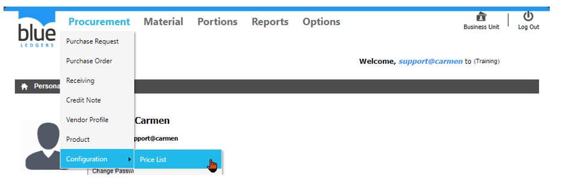
 

1.	ขั้นตอนการสร้าง **Price List** โดยการ **Create Manually**

Click “Create” - “Create Manually” เพื่อสร้าง Price List
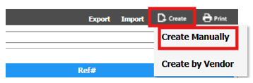
1.1.	การบันทึกข้อมูลใน Price List
กรอกข้อมูลในส่วนของ Header ดังนี้

-	เลือก “Vendor” ที่ต้องการ
-	เลือก “Date From” เพื่อเลือกวันที่เริ่มต้น การแจ้งราคา
-	เลือก “Date To” เพื่อเลือกวันที่สิ้นสุด การแจ้งราคา
-	ใส่ “Reference#” หากมีการอ้างอิงเอกสารอื่นๆ

กรอกข้อมูลในส่วนของ Detail ดังนี้
-	Click “Create” เพื่อเพิ่มรายการสินค้า ที่มีการแจ้งราคา
-	“SKU#” เลือก รายการสินค้า
-	“Unit” เลือก หน่วยการสั่งซื้อ
-	“Rank” เพื่อกำหนดความสำคัญในการเลือกราคา หากใส่ 1 หมายถึงสินค้าจากใบเสนอราคาของvendor นี้จะได้รับการพิจารณาเป็นอันดับที่ 1 แม้ว่า ราคาจะสูงกว่า ใบเสนอราคาจาก vendor อื่น ที่มี rank สูงกว่า 

-	“QtyFrom” เพื่อใส่จำนวนเริ่มต้น ของการแจ้งราคา
-	“To” เพื่อใส่จำนวนสิ้นสุด ของการแจ้งราคา

•	การระบุ “QtyFrom” และ “To” เพื่อกำหนดราคาของสินค้าตามปริมาณการสั่งซื้อได้ เช่น สั่ง ซื้อสินค้าตั้งแต่ 0 – 100 ชิ้น จะได้ราคา 100 บาท ต่อชิ้น

หากซื้อสินค้าตั้งแต่ 101 – 9999 จะได้ราคา 90 บาท ต่อชิ้น เป็นต้น

•	แนะนำให้ระบุ “QtyFrom” เริ่มต้นจาก 0

•	แนะนำให้ระบุ “To” สิ้นสุดที่ 9999
-	“Price” เพื่อใส่ราคาที่ vendor เสนอมา
-	“Market Price” เพื่อใส่ราคากลางของรายการสินค้า
-	“FOC” เพื่อใส่จำนวนของแถม (เป็นหน่วยเดียวกันกับหน่วยซื้อ)
-	“Comment” เพื่ออธิบายรายการสินค้า
-	“Discount (%)” เพื่อใส่จำนวนเปอร์เซ็นต์ที่ลดราคา
-	“Amount” เพื่อระบุ discount เป็นจำนวนเงิน
-	“TaxType” เพื่อเลือกประเภทภาษี
-	“Rate” เพื่อใส่จำนวนเปอร์เซ็นต์ภาษี
-	“Currency” เพื่อเลือกสกุลเงิน
การบันทึกข้อมูลสินค้าใน Price List
-	Click “Update” เพื่อ ยืนยัน หรือ “Cancel” เพื่อยกเลิก
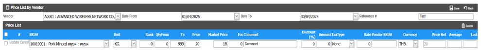
 
1.2.	การเพิ่มสินค้าในใบเสนอราคา

o	กดปุ่ม “Create” และทำตามขั้นตอนในข้อ 1.1

1.3.	การลบ รายการสินค้าจากใบเสนอราคา

o	Click เครื่องหมายถูก ที่สินค้าที่ต้องการ

o	Click “Delete” เพื่อ ลบ
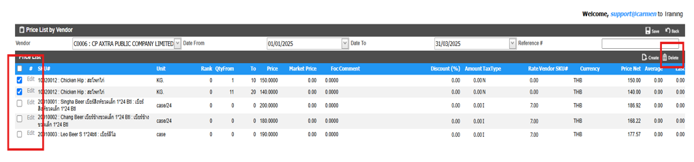
1.4.	การบันทึกเอกสาร Price List

o	Click “Save” เพื่อ บันทึก 

o	Click “Back” เพื่อ กลับหน้าเมนู Price List
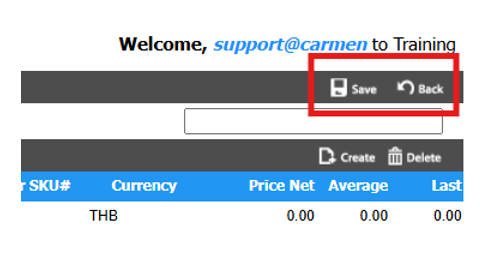

2.	Function อื่น ๆ ของ Price List

  2.1.“Create” เพื่อสร้างเอกสาร Price List ใหม่

  2.2.“Edit” ใช้สำหรับ แก้ไข เอกสาร Price List นั้น

  2.3.“Delete” ใช้สำหรับ ลบเอกสาร Price List นั้น

  2.4.“Back” กลับสู่หน้าเมนู Price List
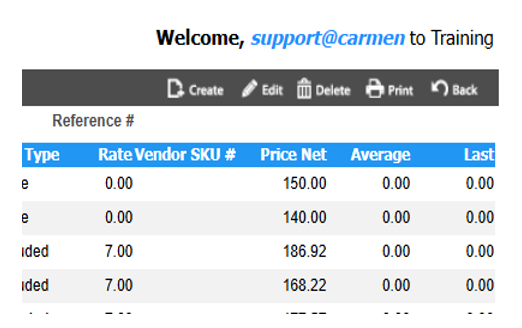
3.	ขั้นตอนการสร้าง Price List โดยการ Import

การ Export ข้อมูลออกจากระบบ 
3.1.	Click “Export” เพื่อเลือกข้อมูลสินค้า ที่ต้องการบันทึกราคาใน excel
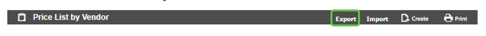 
3.2.	เลือกข้อมูลสินค้าในการ Export Price List ดังนี้
-	เลือก “Category” ที่ต้องการ
-	เลือก “Sub Category” ที่ต้องการ
-	เลือก “Item Group” ที่ต้องการ
-	Click เครื่องหมายถูก เพื่อ เลือก Product ที่ต้องการ หรือ check box ที่หัว column เพื่อเลือกสินค้าทั้งหมด
-	Click “Save” เพื่อ Download เอกสาร PriceList.csv

หมายเหตุ:

o file ที่ export ไปจะเป็นนามสกุล .csv ที่สามารถเปิดผ่าน excel ได้

o เมื่อกรอกข้อมูลเสร็จแล้วต้อง save file เป็นนามสกุล .csv เท่านั้น

o ห้ามเพิ่มหรือลบ column
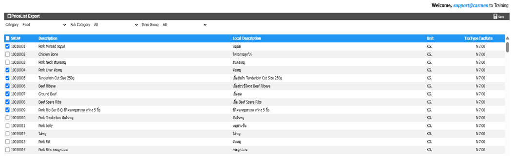
 

3.3.	การกรอกข้อมูลใน Excel มีขั้นตอนดังนี้
-	“Qty From” เพื่อใส่จำนวนเริ่มต้น ของการแจ้งราคา
-	“QtyTo” เพื่อใส่จำนวนสิ้นสุด ของการแจ้งราคา
-	“Quote Price” เพื่อใส่ราคาที่แจ้ง
-	“FOC” เพื่อใส่จำนวนของแถม
-	“Discount Percent” เพื่อใส่จำนวนเปอร์เซ็นต์ของส่วนลด
-	“Discount Amount” เพื่อใส่ราคาส่วนลด
-	“TaxType” เพื่อเลือกประเภทภาษี (N=None, A=Add, I=Include)
-	“TaxRate” เพื่อใส่จำนวนเปอร์เซ็นต์ภาษี
-	“Comment” เพื่ออธิบายรายการสินค้า
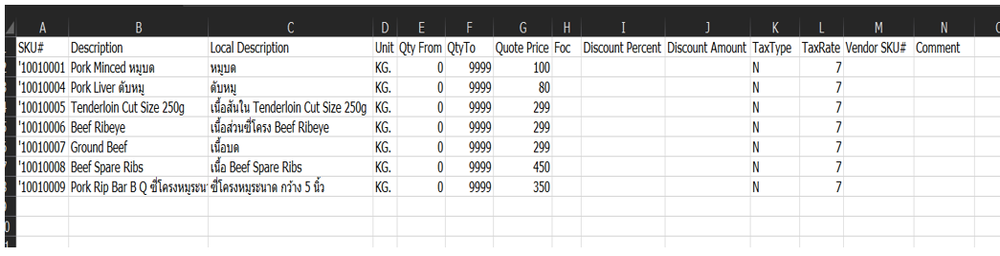
 

3.4.	ขั้นตอนการ Import Price List
-	Click “Import” 
-	“Vendor” เพื่อเลือกร้านค้าที่แจ้งราคา Price List
-	“Currency” เพื่อเลือกสกุลเงิน
-	“Valid From” เพื่อเลือกวันที่เริ่มต้นของใบเสนอราคา
-	“Valid To” เพื่อเลือกวันที่สิ้นสุดของใบเสนอราคา
-	“Reference” เพื่ออ้างอิงเอกสารการเสนอราคา
-	“Vendor Ranking (1-5)” เพื่อจัดลำดับของร้านค้า 
1 หมายถึงเป็นลำดับที่ 1 ที่จะได้รับการเลือก
-	Click “Choose File” เลือก ไฟล์ Price List ที่บันทึกเอาไว้ โดย file จะต้องมีนามสกุลเป็น .csv เท่านั้น
-	Click “Upload” 
-	Click “Save” เพื่อ บันทึก หรือ “Back” เพื่อกลับสู่เมนู Price List
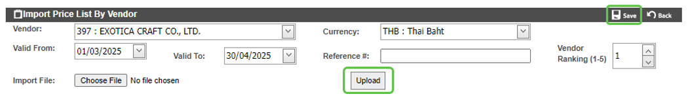 

4.	การ ค้นหา และ View เอกสาร Price List

4.1	หลังจากที่เข้ามาในหน้า Price List แล้วสามารถ เลือก View ได้ด้วย All Vendor, All Active, All In-Active

4.2	สามารถค้นหา Price List ที่ต้องการ โดย พิมพ์ค้นหา ในช่อง Search

4.3	การ View เอกสาร Price List ทำได้โดยการเลือก เอกสาร Price List ที่ต้องการ เพื่อ แสดงรายละเอียดของ เอกสาร Price List นั้นๆ
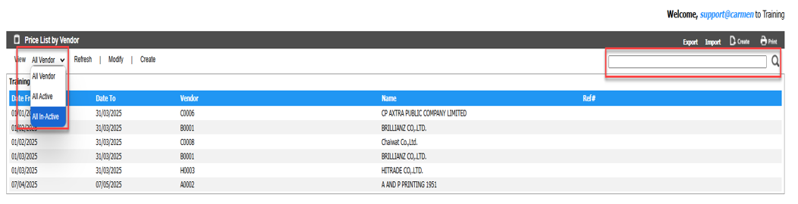

