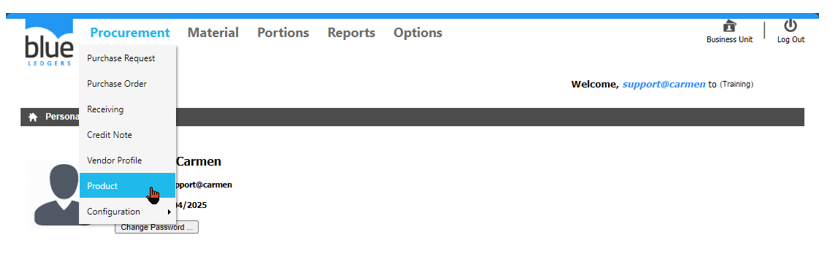
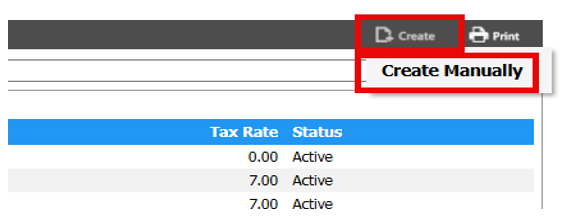
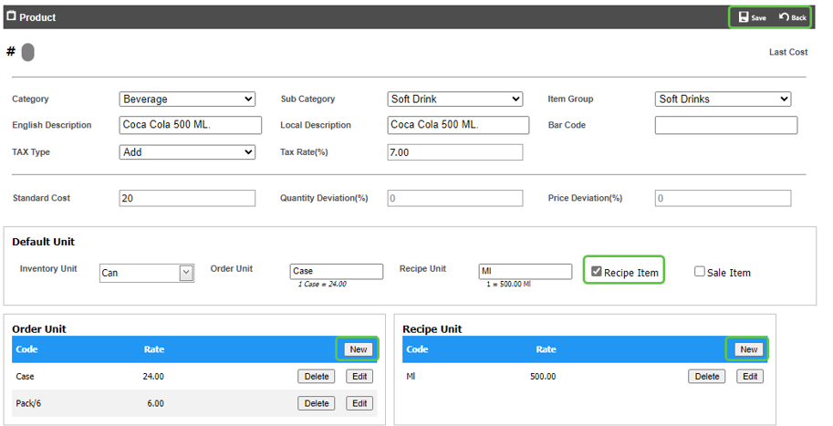
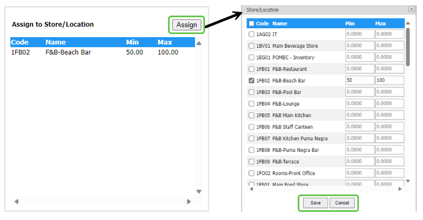
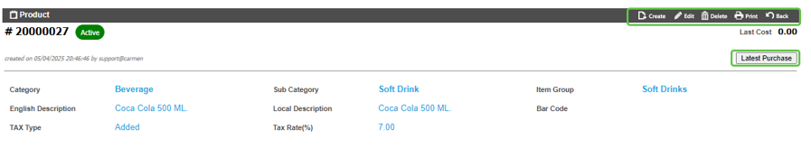
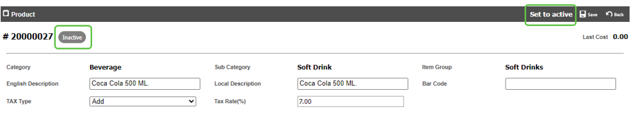

# Product (รายการสินค้า)
Product คือ Function ในการบันทึกรสินค้า เพื่อใช้งานในระบบ Blueledgers

สามารถสร้างโดยการเอา cursor ไปวางที่ “Procurement” 

และ เลื่อน cursor ไปที่ “Product”  

 

1.	ขั้นตอนการสร้าง Product

ชี้ Cursor เมาส์ ไปที่ปุ่ม “Create” และ Click “Create Manually”

การกรอกข้อมูลของ Product มีดังนี้

หมายเหตุ เครื่องหมาย * คือช่องที่จำเป็นต้องระบุ

-   รหัสสินค้า ระบบจะทำการสร้างรหัสให้โดยอัตโนมัติ โดย running ด้วย รหัส item group + running number 4 หลัก
-	*“Category” กำหนดกลุ่มของสินค้า
-	*“Sub Category” กำหนดหมวดหมู่ของสินค้า
-	*“Item Group” กำหนดหมวดหมู่ย่อยของสินค้า
-	*“English Description” กำหนดชื่อของสินค้าเป็นภาษาอังกฤษ
-	“Local Description”  กำหนดชื่อของสินค้าเป็นภาษาอื่นตามการใช้งาน เช่นภาษาไทย

-	*“Tax Type” กำหนดวิธีคำนวรณภาษี 

     o None คือไม่มีภาษี

     o Included คือคำนวณราคาแบบรวมภาษี

     o Add คือคำนวณราคาแบบไม่รวมภาษี

-	*“Tax Rate(%)” กำหนดอัตราภาษี
-	“Standard Cost” ราคามาตรฐานของสินค้า 
-	“Quantity Deviation” กำหนด % ที่อนุญาตให้รับสินค้าด้วยจำนวนมากกว่า PO ได้
-	“Price Deviation” กำหนด % ที่อนุญาตให้รับสินค้าด้วยราคามากกว่า PO ได้
-	*“Inventory Unit” หน่วยที่ใช้ในการนับ inventory เช่น Can

- *“Order Unit” หน่วยในการสั่งซื้อสินค้า สามารถกำหนดได้มากกว่า 1 หน่วย

  o Click “New” จะปรากฏ Popup 

  o เลือก “Order Unit” ที่ต้องการ เช่น Case

  o กำหนด Conversion Rate เช่น case = 24 Can

  o Click เครื่องหมายถูก ที่ “Set as default”

  o Click “Save” เพื่อบันทึก Order Unit

  o Click “Edit” เพื่อแก้ไข Order Unit

  o Click “Delete” เพื่อลบ Order Unit

-	“Recipe Item” ให้ใส่เครื่องหมายถูกหากต้องการให้สินค้านี้สามารถใช้ใน Recipe ได้

- “Recipe Unit” (หากมี) 

   o Click “New” จะปรากฏ Popup 
 
   o เลือก “Recipe Unit” ที่ต้องการเช่น ML

   o กำหนด Conversion Rate เช่น 1 Can = 500 ML

   o Click เครื่องหมายถูกที่ “Set as default”

   o Click “Save” เพื่อบันทึก Recipe Unit

   o Click “Edit” เพื่อแก้ไข Recipe Unit

   o Click “Delete” เพื่อลบ Recipe Unit

-	การบันทึกสินค้า

 o Click “Save” เพื่อบันทึก

 o Click “Back” เพื่อยกเลิก

2.	การ Assign Store/Location ให้กับ Product สามารถทำตามขั้นตอนดังนี้

2.1.	หลังจาก Save “Product” เสร็จแล้ว ระบบจะแสดงกล่อง Store/Location

2.2.	Click “Assign” เพื่อเลือก Location ที่สามารถใช้งาน Product ได้

2.3.	ระบบจะแสดงกล่อง “Store/Location” ให้เลือก สามารถเลือกได้มากกว่า 1 location และสามารถ
กำหนด “Min” “Max” แตกต่างกันไปตามความเหมาะสมการใช้งาน
-	Click เครื่องหมายถูก ที่ Store/Location ที่ต้องการ
-	“Min” กำหนดจำนวนสินค้าขั้นต่ำที่จะต้อง Stock สินค้าเอาไว้
-	“Max” กำหนดจำนวนสินค้ามากที่สุดที่สามารถ Stock สินค้าได้

2.4.	การบันทึก Store/Location
-	Click “Save” เพื่อ บันทึก 
-	Click “Cancel” เพื่อ ยกเลิก

	
3.	Function อื่น ๆ ของ “Product”

     3.1.“Create” สร้างสินค้าใหม่

     3.2.“Edit” แก้ไขข้อมูลสินค้า

     3.3.“Delete” ลบสินค้า (ใช้ได้ในกรณีที่สินค้ายังไม่ได้ใช้เท่านั้น)

     3.4.“Print” พิมพ์หน้าจอสินค้า

     3.5.“Back” กลับไปหน้าจอ Product List
 
     3.6.“Last Purchase” แสดงประวัติ PO และการรับสินค้า (Receiving)

 

4.	วิธี Inactive Product 

     4.1.หลังจาก Click “Edit” ระบบจะแสดงปุ่ม “Set to inactive”

     4.2.Click “Set to inactive” เพื่อเปลี่ยน status 

     4.3.Click “Save” เพื่อบันทึกข้อมูล
 

