# Purchase Order (ใบสั่งซื้อ)
Purchase Order คือ Function ในการสร้างใบสั่งซื้อ (PO) ในระบบ 
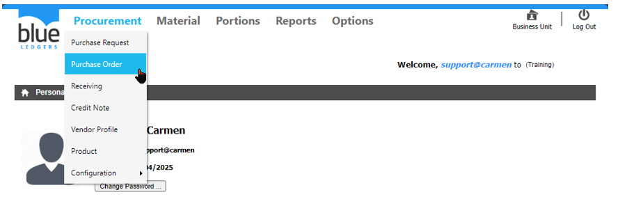
1.	ขั้นตอนการสร้างใบสั่งซื้อ (PO)

นำ Mouse ไปวางที่ ปุ่ม “Create” จากนั้น click “From Purchase Request” เพื่อสร้าง PO จาก PR ที่ได้รับการ approve เสร็จแล้ว
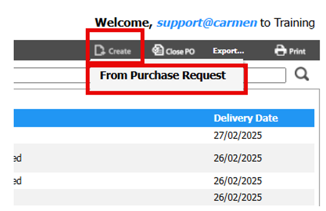
1.1	Click เครื่องหมายถูก ที่ ใบขอซื้อ (PR) ที่ต้องการออก เป็น ใบสั่งซื้อ (PO)

1.2	Click “Generate” ระบบจะแสดง Popup ตามรูป 
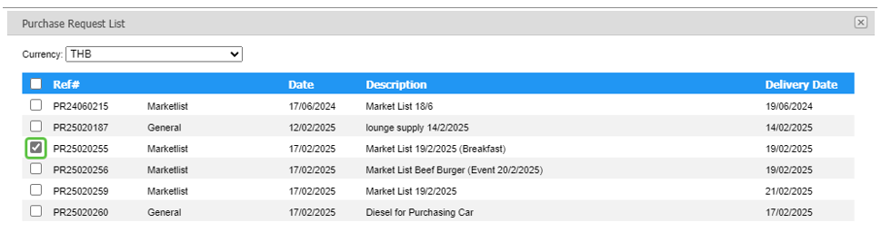 
1.2.1	Click “Confirm” เพื่อ ยืนยัน

1.2.2	Click “Abort” เพื่อ ยกเลิก
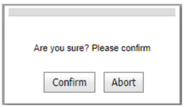
	การส่ง PO เป็น file PDF ให้ Vendor ผ่าน Email        
1.3	Click เครื่องหมายถูก ที่ ใบสั่งซื้อ (PO) ที่ต้องการส่ง email ไปหา Vendor โดยอัตโนมัติ

1.4	Click “Send email” ระบบจะทำการแนบไฟล์ PDF ของ PO ใบดังกล่าวไปหา Vendor โดยจะต้องมีการตั้งค่าการส่ง Email ไว้ก่อนใช้งาน
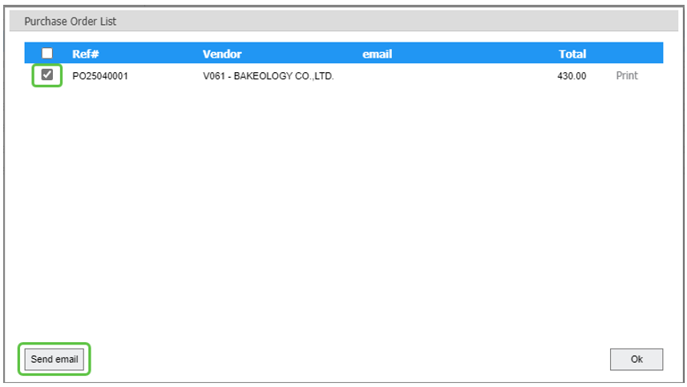
การ Print PO เป็นกระดาษเพื่อส่งให้ Vendor

1.5	Click “Print” เพื่อ Preview ใบสั่งซื้อ (PO) จากระบบ (การทำ Receiving จาก ใบสั่งซื้อ (PO) นั้น ใบสั่งซื้อ (PO) ใบดังกล่าวต้องมีสถานะ เป็น “Printed”)

1.6	Click “OK” เพื่อ ตกลงและสิ้นสุดการทำงาน
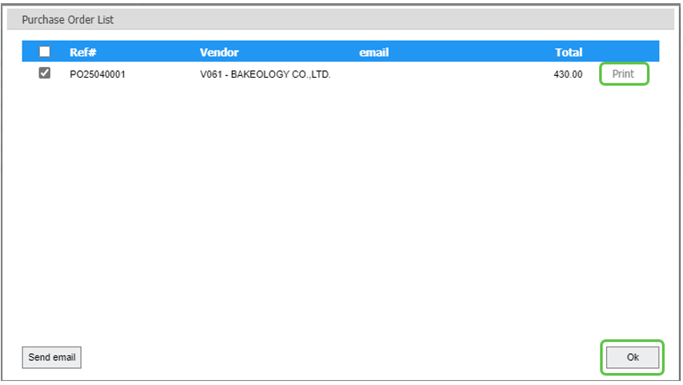         

2.	 ขั้นตอนการ “View”, “Void” หรือ “Close” ใบสั่งซื้อ (PO)

2.1	การดูเอกสาร PO ตาม status ต่าง ๆ สามารถทำได้โดยการเลือก View ใบสั่งซื้อ (PO) ได้ตามที่ปรากฏในรูป
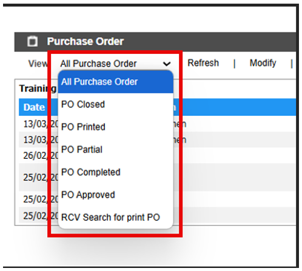
 
2.2	สามารถค้นหา ใบสั่งซื้อ (PO) ที่ต้องการ โดย พิมพ์ค้นหา ในช่อง Search จากนั้น Click ที่ ใบสั่งซื้อ (PO)  ที่ต้องการ เพื่อ แสดงรายละเอียดของ ใบสั่งซื้อ (PO) นั้นๆ
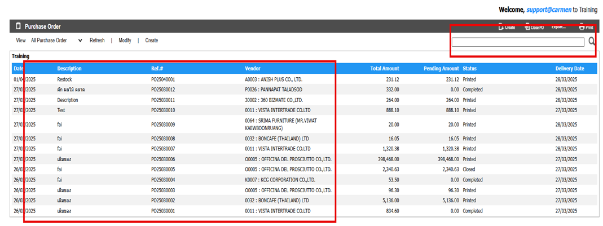
3.	การ Comment หรือ แนบไฟล์ Attachment ในเอกสาร Receiving

3.1.	การเพิ่ม Comment ในเอกสาร ใบขอซื้อเพื่อเป็นการสื่อสารภายใน
-	Click “Create” ที่หัวข้อ “Comment”
-	ใส่ “Comment” ที่ต้องการ
-	Click “Update” เพื่อ บันทึก หรือ “Cancel” เพื่อ ยกเลิก
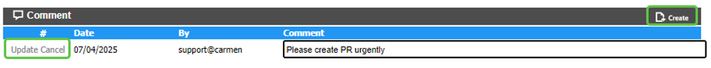 

3.2.การแนบไฟล์ Attachment ในเอกสาร ใบขอซื้อ เพื่อแนบเอกสารประกอบการขอซื้อ

-	“Create” ที่หัวข้อ “Attachment”
-	ใส่ “Description” ที่ต้องการ
-	เลือก “Choose File” เพื่อเลือก File ที่ต้องการแนบ
-	Click “Update” เพื่อ บันทึก หรือ “Cancel” เพื่อ ยกเลิก
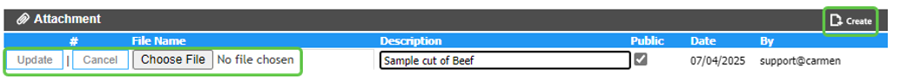

4.การ “Void” หรือ “Close PO” สามารถทำตามขั้นตอนต่อไปนี้

  -  4.1.Click “Void” เพื่อ ยกเลิก PO ใบนี้ โดยสามารถ void ได้เฉพาะ PO ที่มี status = approved เท่านั้น

  - 4.2.Click “Close PO” เพื่อเปลี่ยนสถานะของ PO เป็น Closed ในกรณีที่ vendor ไม่สามารถส่งของได้หรือขอยกเลิก PO ใบนี้
PO ที่มี status = Printed หรือ Partial เท่านั้นที่จะสามารถทำ “Close PO” ได้
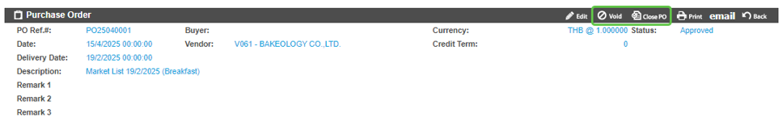
