# Purchase Request (ใบขอซื้อ)
Purchase Request คือ function ในการสร้างใบขอซื้อในระบบ โดยสามารถสร้างเอกสารได้ 2 วิธี

A.	Create Manually สร้างใบขอซื้อ Purchase Request ด้วยตนเอง

B.	From Template สร้างใบขอซื้อ Purchase Request โดยใช้ Template แบ่งได้ 2 ประเภท คือ

B.1.	Market List เป็น Template ที่สร้างด้วย Product ที่อยู่ในหมวด Market list

B.2.	Standard Order เป็น Template ที่สร้างด้วย Product ที่อยู่ในหมวด General และ Asset

สามารถเข้าถึง function นี้โดยไปที่ “Procurement” จากนั้น click “Purchase Request”
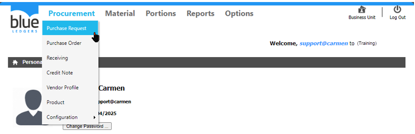
1.การสร้าง เอกสาร ใบขอซื้อ (PR)

      1.1 การสร้าง เอกสาร ใบขอซื้อ ด้วยวิธี “Create Manually”

      Click “Create” - “Create Manually”
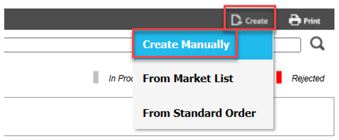

กรอกข้อมูลในส่วนของ header ดังนี้

หมายเหตุ เครื่องหมาย * คือช่องที่จำเป็นต้องระบุ
-	“Ref. #” เลขที่ running เอกสารที่ระบบจะสร้างให้เมื่อ save เอกสาร
-	“Date:” วันที่ปัจจุบันตามที่สร้างเอกสาร
-	“Requestor :” ชื่อผู้สร้างเอกสาร
-	“Process :” Bar ที่แสดงว่าเอกสารมีการ approve ถึงขั้นตอนที่เท่าใด 
-	*“Type” กำหนดประเภทของ PR (Marketlist, General, Asset) ซึ่งมีผลต่อขั้นตอนการ approve ที่ต่างกัน
-	“Description” ใส่คำอธิบายให้กับ เอกสาร ใบขอซื้อ 
-	“Change Delivery Date” เลือกวันที่ Delivery Date ที่ต้องการ (จะมีผล กับ Delivery Date ทุกรายการสินค้าในเอกสาร ใบขอซื้อ)

1.2	Click “Create” เพื่อสร้างสินค้าที่ต้องการสั่งซื้อ
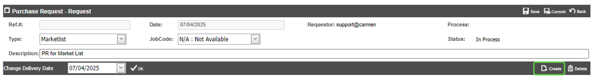
กรอกข้อมูลในส่วนของ detail ของสินค้าดังนี้

หมายเหตุ เครื่องหมาย * คือช่องที่จำเป็นต้องระบุ
-	*“Store” กำหนด Store ที่ต้องการสั่งซื้อและรับสินค้าเข้า
-	*“SKU#” กำหนดรายการสินค้า ที่ต้องการ ขอสั่งซื้อ
-	*“Unit” กำหนดหน่วยในการสั่งซื้อ (หาก รายการสินค้า ดังกล่าว มี “Order Unit” มากกว่าหนึ่ง)
-	*“Qty Req.” ใส่จำนวนที่ต้องการขอสั่งซื้อ
-	*“Delivery Date” เลือกวันที่ Delivery Date ที่ต้องการ รายการสินค้า นี้
-	“Comment” ใส่คำอธิบายให้กับ รายการสินค้า 
1.3	การบันทึกสินค้า
-	Click “Save & New” เพื่อ บันทึก และ เพิ่ม รายการสินค้า รายการถัดไป
-	Click “Save” เพื่อ บันทึก และ สิ้นสุดการเพิ่ม รายการสินค้า
-	Click “Cancel” เพื่อ ยกเลิก
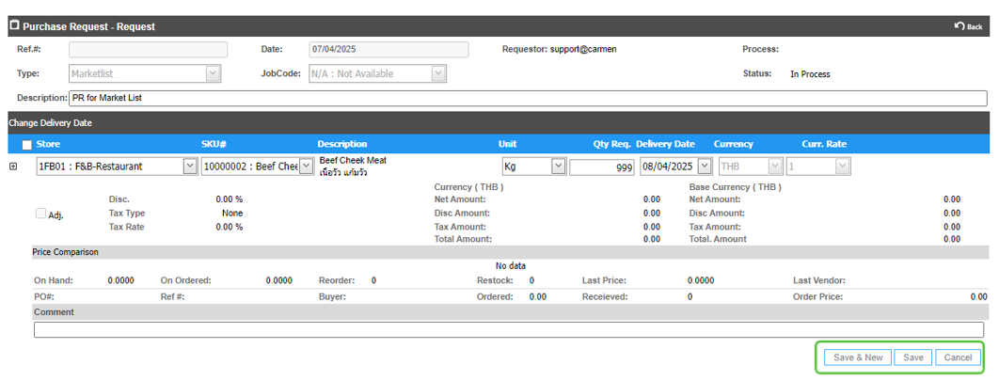
1.4	การ แก้ไข หรือ ลบ รายการสินค้า

         -	Click เครื่องหมาย “+” ที่รายการสินค้าที่ต้องการ
         -	Click “Edit” เพื่อ แก้ไข
         -	Click “Delete” เพื่อ ลบ
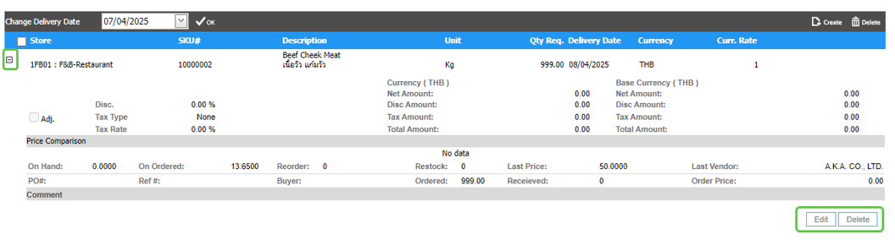 

1.5	การบันทึกเอกสาร ใบขอซื้อ Purchase Request

         -	Click “Save” เพื่อ บันทึก ใบขอซื้อ (ยังไม่ส่งไป ขอพิจารณา ที่ลำดับถัดไป 
         -	สามารถกลับมา Edit ,Void หรือ Commit ภายหลังได้)
         -	Click “Back” เพื่อยกเลิกการบันทึก ใบขอซื้อ
         -	การ Commit เอกสาร ใบขอซื้อ Purchase Request
            o	Click “Commit” เพื่อ ยืนยัน เอกสาร ใบขอซื้อ ขอพิจารณาที่ลำดับถัดไป 
(เมื่อ Commit แล้ว จะไม่สามารถกลับมา Edit หรือ Void ได้อีก)
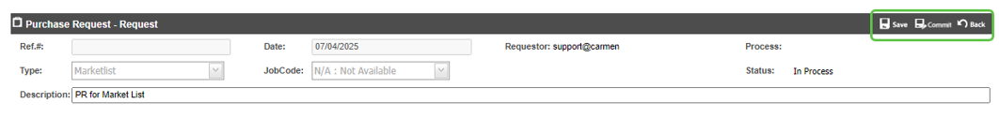 
1.6	หลังจาก Save เอกสารใบสั่งซื้อแล้ว ระบบจะแสดง Function อื่น ๆ ของ Purchase Request

      o	“Commit” ใช้สำหรับ ยืนยัน เอกสาร ใบขอซื้อ จากผู้สร้าง เอกสาร ใบขอซื้อ ดังกล่าว เพื่อขอพิจารณาที่ลำดับถัดไป
      o	“Edit” ใช้สำหรับ แก้ไข เอกสาร ใบขอซื้อ 
      o	“Void” ใช้สำหรับ Void เอกสาร ใบขอซื้อ
      o	“Print” ใช้สำหรับ print แบบฟอร์ม ใบขอซื้อ Purchase Request ในระบบ
      o	“Back” กลับสู่หน้าเมนู Purchase Request
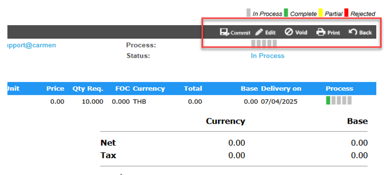                 
2.	การสร้าง เอกสาร ใบขอซื้อ ด้วย Template มี 2 แบบ คือ1. Market List และ 2. Standard Order
      Click “Create” - “From Market List” หรือ “From Standard Order”
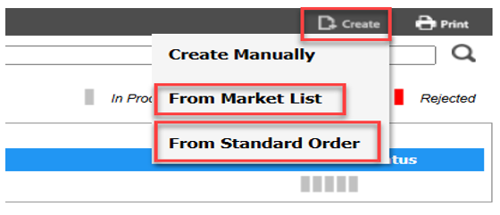
      Click เครื่องหมายถูก ที่ Template ที่ต้องการ จากนั้น Click “OK”
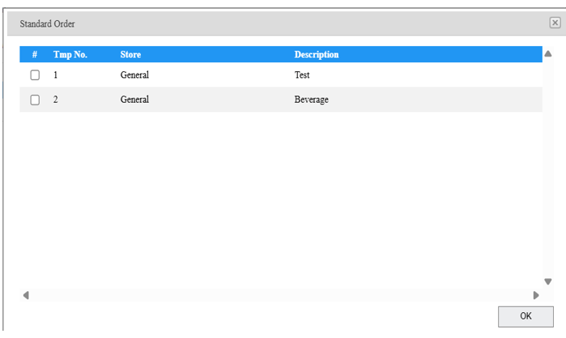 
กรอกข้อมูลดังต่อไปนี้

หมายเหตุ เครื่องหมาย * คือช่องที่จำเป็นต้องระบุ
-	*“Delivery Date” เพื่อเปลี่ยนวันที่ Delivery Date ที่ต้องการ
-	“Description” ระบบจะแสดงคำอธิบายตาม template ที่สร้างไว้ 
-	*“Qty Req.” เพื่อ กรอกจำนวน ที่ต้องการขอซื้อ ในรายการสินค้า ที่ต้องการ
-	Click “Save” เพื่อ สร้าง เป็น เอกสาร ใบขอซื้อ หรือ “Back” เพื่อกลับสู่หน้าเมนู PR
-	Click “Back” เพื่อยกเลิกการสร้าง PR จาก template
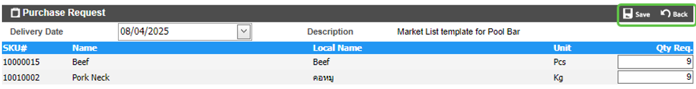 
3.	การ ค้นหา และ View เอกสาร ใบขอซื้อ 

3.1	หลังจากที่เข้ามาในหน้า PR แล้วสามารถ เลือก View ได้ด้วย “View All” หรือ View ตามลำดับอนุมัติ โดย user จะเห็น view ตามที่ได้รับการ assign ใน workflow เท่านั้น

3.2	สามารถค้นหา ใบขอซื้อ ที่ต้องการ โดย พิมพ์ค้นหา ในช่อง Search

3.3	การ View เอกสาร ใบขอซื้อ ทำได้โดยการเลือก เอกสาร ใบขอซื้อ ที่ต้องการ เพื่อ แสดงรายละเอียดของ เอกสาร ใบขอซื้อ นั้นๆ
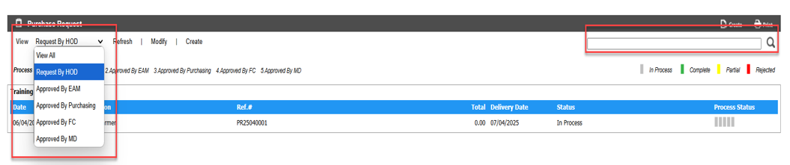

4.	การ Comment หรือ แนบไฟล์ Attachment ในเอกสาร ใบขอซื้อ 

4.1.	การเพิ่ม Comment ในเอกสาร ใบขอซื้อเพื่อเป็นการสื่อสารภายใน
-	Click “Create” ที่หัวข้อ “Comment”
-	ใส่ “Comment” ที่ต้องการ
-	Click “Update” เพื่อ บันทึก หรือ “Cancel” เพื่อ ยกเลิก
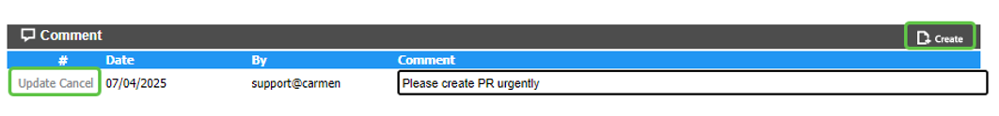

4.2.	    การแนบไฟล์ Attachment ในเอกสาร ใบขอซื้อ เพื่อแนบเอกสารประกอบการขอซื้อ

 -	“Create” ที่หัวข้อ “Attachment”

 -	ใส่ “Description” ที่ต้องการ

  -	เลือก “Choose File” เพื่อเลือก File ที่ต้องการแนบ

 -	Click “Update” เพื่อ บันทึก หรือ “Cancel” เพื่อ ยกเลิก
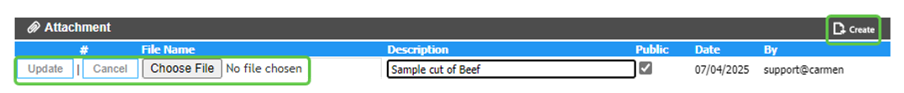 
5.	การ Approve PR
เลือก View ตาม สิทธิ์อนุมัติ ของ User จากนั้น เลือก เอกสาร ใบขอซื้อ ที่ต้องการ
(สามารถพิมพ์ค้นหา เอกสาร ใบขอซื้อ ที่ต้องการได้ ที่ช่อง Search)
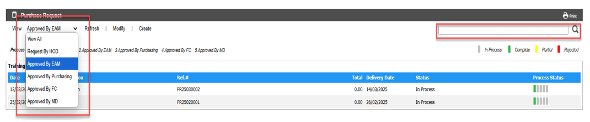
ทำตามขั้นตอนต่อไปนี้

-Click เครื่องหมายถูก ที่ รายการสินค้า ที่ต้องการ

     o “Approve” เพื่ออนุมัติ รายการสั่งซื้อ ที่เลือกไว้ 
     o “Reject” เพื่อ ปฏิเสธ รายการสั่งซื้อ ที่เลือกไว้ (สามารถใส่ Comment ที่ Reject ได้)
     o “Send Back” เพื่อ ส่ง รายการสั่งซื้อ ที่เลือกไว้ กลับไปยัง ลำดับ ก่อนหน้า ที่ต้องการ
             (สามารถ เลือก ลำดับ ที่ต้องการ และ ใส่ Comment ที่ Send Back ได้)
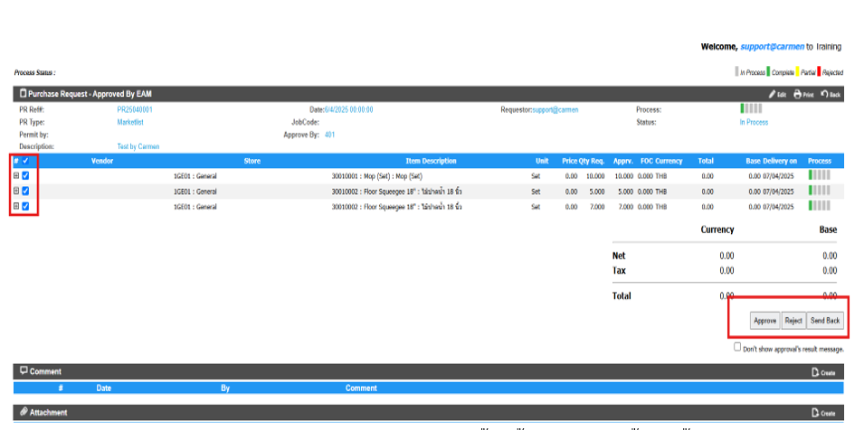      
6.	การ Assign ร้านค้า และ ราคา (ระบบจะแสดง function นี้ ในขั้นตอนของจัดซื้อเท่านั้น)

6.1.	การ Assign ร้านค้า และ ราคา สามารถ Assign ได้ 3 วิธี

6.1.1.	“Auto Allocate” คือการ assign vendor และ ราคา จาก price list ที่ได้สร้างไว้ โดยระบบจะเลือกจาก Rank ในลำดับที่ 1 ก่อน ตามด้วยราคาที่ถูกที่สุด สามารถทำตามขั้นตอนดังนี้
o	Click “Auto Allocate” ระบบจะทำการใส่ ร้านค้า และ ราคา รวมถึง ประเภทภาษี ตาม Price List ที่ได้บันทึกเอาไว้ และเป็น Price list ในข่วงเวลาที่สามารถใช้งานได้อยู่
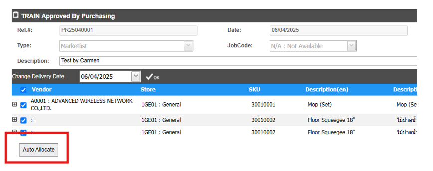
6.1.2.	Manual Assign การเลือก Vendor จาก Price List ใบอื่นที่ไม่ได้อยู่ใน Ranking และ ราคาถูกที่สุด
o	เลือก เอกสาร ใบขอซื้อ ที่ต้องการ จากนั้น Click “Edit”
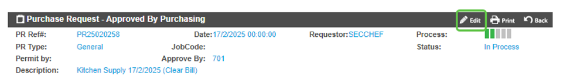
o	กดปุ่ม “Assign” ที่ Price List ที่ต้องการเลือก

o	ระบบจะทำการบันทึกข้อมูล vendor ราคา Tax type และข้อมูลอื่นๆ ให้โดยอัตโนมัติ

o	การบันทึกสินค้า

	การบันทึก Click “Save” เพื่อ บันทึก หรือ “Cancel” เพื่อ ยกเลิก
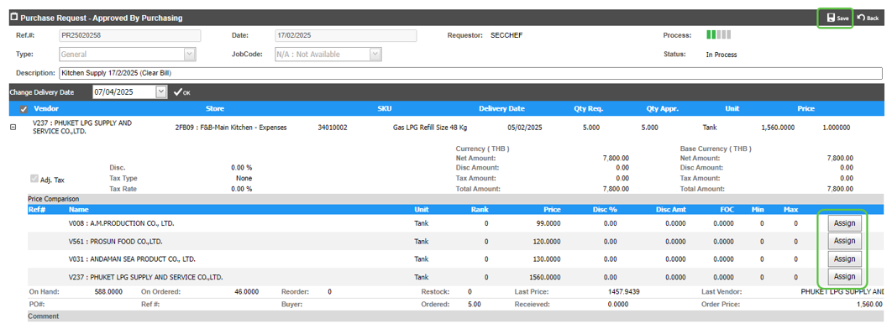
6.1.3.	Manual Allocate การเลือก Vendor และ ราคาด้วยตนเองในกรณีที่ไม่มีการบันทึก Price List
o	เลือก เอกสาร ใบขอซื้อ ที่ต้องการ จากนั้น Click “Edit”
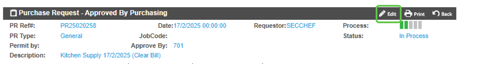 
o	Click เครื่องหมายบวก ที่ รายการสินค้า ที่ต้องการ

o	Click “Edit” เพื่อแก้ไข
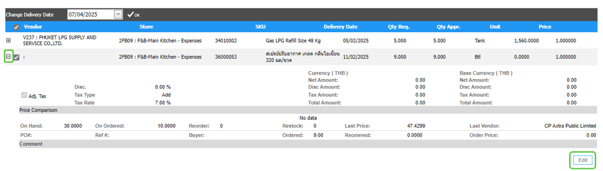

	จากนั้น ใส่รายละเอียด ดังต่อไปนี้

-	“Vendor” เพื่อเลือก ร้านค้า ที่ต้องการสั่งซื้อ
-	“Delivery Date” หากต้องการวันที่ Delivery Date
-	“Qty Appr.” หากต้องการ เพิ่ม หรือ ลด จาก “Qty Req.”
-	“FOC” หากมีรายการ ของแถม
-	“Price” เพื่อใส่ราคา
-	“Disc.” หากมีส่วนลด ด้วย จำนวน %
-	Click เครื่องหมายถูก ที่ “Adj.Tax” เพื่อเลือกประเภท ภาษี (None, Add, Included)
-	ใส่ “Tax Rate” หากมี ภาษี ด้วย จำนวน %
-	ใส่ “Discount Amount” หากต้องการใส่มูลค่าส่วนลดด้วยตนเอง
-	ใส่ “Tax Amount” หากต้องการแก้ไขมูลค่าภาษีด้วยตนเอง
-	“Comment” หากต้องการใส่คำอธิบาย รายการสั่งซื้อ
-	“Net Amount” คือมูลค่าภาษีก่อน ส่วนลด และ ภาษี
-	“Total Amount” คือมูลค่ารวมส่วนลด และ ภาษี

o	การบันทึกสินค้า

	การบัน Click “Save” เพื่อ บันทึก หรือ “Cancel” เพื่อ ยกเลิก
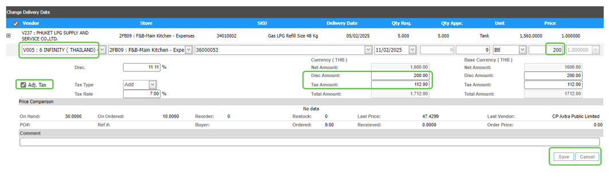 

7.	การ Split & Reject รายการสินค้า

Function นี้ใช้ในกรณีที่ต้องการนำสินค้าที่สามารถกำหนด Vendor และ ราคาได้เรียบร้อยแล้วไปทำการ approve เพื่อออก PO ก่อน
เลือก View ตาม สิทธิ์อนุมัติ ที่สามารถ Assign ร้านค้า และ ราคา ได้ (โดยทั่วไป คือ ตำแหน่งจัดซื้อ) 
จากนั้น เลือก เอกสาร ใบขอซื้อ ที่ต้องการ

7.1.	ขั้นตอนการ Split & Reject รายการสินค้า
-	Click เครื่องหมายถูก ที่รายการสั่งซื้อ ที่ต้องการ Split & Reject
-	Click “Split & Reject”
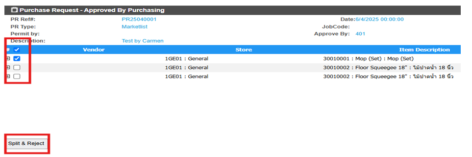

-	ระบบจะแสดง Popup – Click “OK” เพื่อ ตกลง หรือ “Cancel” เพื่อ ยกเลิก
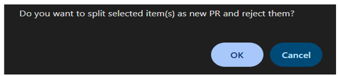

-	ระบบ จะทำการ Reject รายการสั่งซื้อ ที่เลือก จาก PR เดิม และ Split ไปเป็น PR ใหม่ ให้ตามรูป
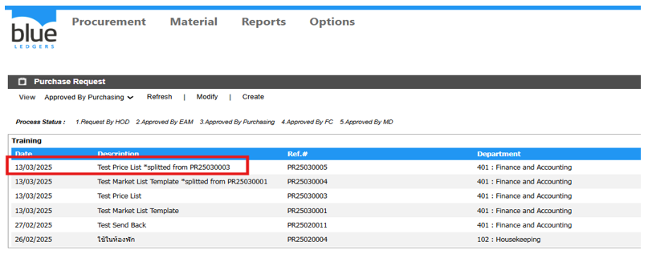         

