# Receiving (การรับสินค้า)
Receiving คือ function ในการสร้าง ใบรับสินค้า ในระบบ โดยสามารถ รับสินค้าจาก เอกสารใบสั่งซื้อ (Purchase Order) หรือ รับสินค้า แบบ Manually 
สามารถเข้าถึง function นี้โดยไปที่ “Procurement” จากนั้น click “Receiving”
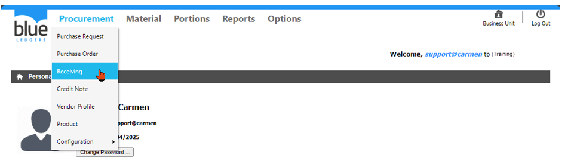 
1.การสร้าง เอกสารใบรับสินค้า “Receiving” สามารถทำได้ 2 วิธี

 1.1.	“From Purchase Order”  การสร้างเอกสารใบรับสินค้า จาก ใบขอซื้อ

 1.1.1.	click “Create” - “From Purchase Order”
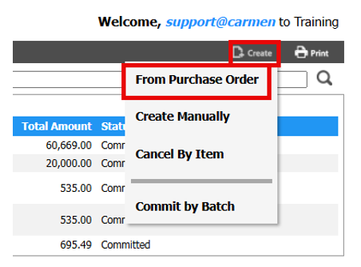
-	เลือก “Vendor” ที่ต้องการ 
-	Click เครื่องหมายถูกที่หมายเลข PO ที่ต้องการทำ Receiving
-	Click “OK” เพื่อ ตกลง
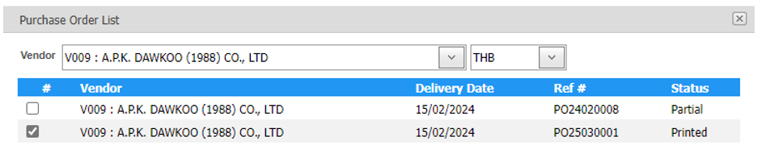 
-	เลือก “Store/Location” ที่ต้องการ

ระบบอนุญาตให้ทำรับสินค้าได้ครั้งละ 1 Location หาก PO ประกอบด้วยหลาย Location ให้ทำการ “Add PO” และทำการเลือก Location เพิ่มเติมอีกครั้ง

-	Click “OK” เพื่อ ตกลง หรือ “Cancel” เพื่อ ยกเลิก
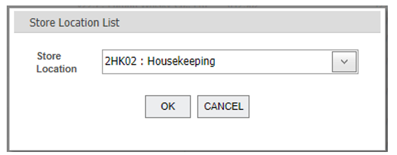
กรอกข้อมูลในส่วนของ header ดังนี้

หมายเหตุ เครื่องหมาย * คือช่องที่จำเป็นต้องระบุ
-	“Ref #” เลขที่เอกสารซึ่งระบบจะทำการ running ให้ หลังจากกด Save
-	*“Date” วันที่ทำ Receiving (มีผลกับ “Input Date” ใน “Invoice” ที่ Module AP) 
-	*“Delivery Point” เพื่อเลือกจุดรับสินค้า ที่ต้องการ (ในกรณี ที่มี มากกว่าหนึ่งจุด)
-	*“Invoice Date” วันที่ของ Invoice ตามเอกสารจริงที่ได้รับจาก Vendor
-	*“Invoice#” เลขที่ของ Invoice ตามเอกสารจริงที่ได้รับจาก Vendor
-	“Description” เพื่อใส่คำอธิบาย เอกสารใบรับสินค้า
-	Click เครื่องหมายถูก “Consignment” ในกรณีที่เป็นของฝากขาย ที่ต้องการรับรู้ข้อมูลเข้าระบบ Inventory แต่ไม่ต้องการบันทึกบัญชี (ระบบจะไม่ส่งข้อมูล Receiving ไปที่ Module AP)
-	“Currency” หากมีการใช้สกุลเงินอื่นๆ และสามารถแก้ไข Rate ที่ต้องการได้
-	“Status” สถานะของเอกสาร (Received, Committed, Void)
-	“Committed Date” คือวันที่ที่ทำการกด Commit
-	“Extra Cost” การนำต้นทุนอื่น ๆ เช่น ค่าขนส่ง ค่าอากรขาเข้า มาบันทึกเพื่อเพิ่มต้นทุนให้กับสินค้าใน Receiving ใบนี้
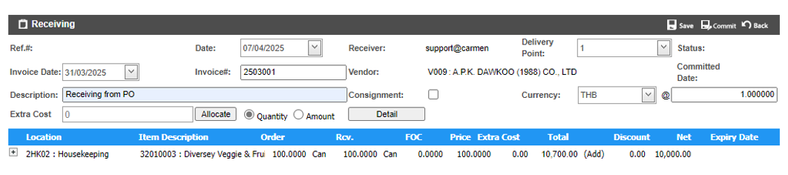

1.1.2.	การแก้ไขข้อมูลสินค้าที่มาจาก PO
-	Click เครื่องหมายบวก ที่ รายการสินค้า ที่ต้องการ 

o	“Edit” เพื่อ แก้ไข รายการสินค้า

o	“Delete” เพื่อ ลบ รายการสินค้า จากการรับ
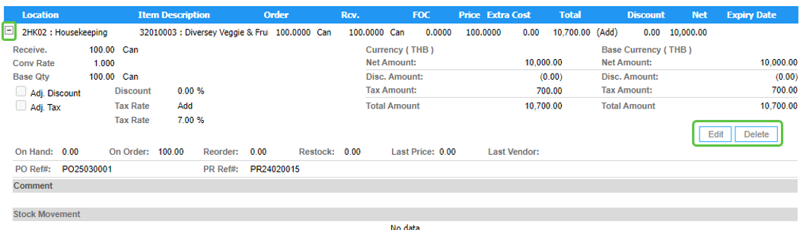
แก้ไขข้อมูลในส่วนของ detail ของ สินค้าในเอกสารใบรับสินค้าดังนี้

หมายเหตุ เครื่องหมาย * คือช่องที่จำเป็นต้องระบุ

-	*“Item Description” เลือกสินค้าเพื่อรับสินค้า
-	*“Rcv.” ใส่จำนวนที่ต้องการรับสินค้า
-	*“Unit” เลือก Order Unit ที่ต้องการรับสินค้า
-	“FOC” (Free of Charge) ใส่จำนวนของแถมเป็นหน่วยเดียวกับ Order Unit
-	*“Price” ใส่ราคาต่อหน่วย
-	“Expiry Date” ใส่วันหมดอายุ
-	Click “Adj. Discount” เพื่อแก้ไข
o	Discount (%) ใส่ส่วนลด % ที่ต้องการ
o	“Disc Amount” สามารถแก้ไขมูลค่าส่วนลดที่ต้องการ
-	Click “Adj. Tax” เพื่อ แก้ไข “Tax Type” และ “Tax Rate” ที่ ต้องการ
o	Tax Type มี 3 ประเภท 
	“Added” ใช้สำหรับ “Price” เป็นราคาไม่รวมภาษี
	“Included” ใช้สำหรับ “Price” เป็นราคารวมภาษี
	“None” ใช้สำหรับ “Price” ไม่รวมภาษี
o	Tax Rate ใช้กำหนด % ของภาษี
o	Tax Amount สามารถแก้ไขมูลภาษีตามที่ต้องการ
-	ใส่ “Comment” อธิบายข้อมูลเพิ่มเติมของสินค้า
-	Click “Save” เพื่อบันทึก หรือ “Cancel” เพื่อยกเลิก 
-	การบันทึกข้อมูลสินค้า
o	Click “Save” เพื่อบันทึก หรือ “Cancel” เพื่อยกเลิก 
-	การบันทึกข้อมูลสินค้า
o	Click “Save” เพื่อบันทึก หรือ “Cancel” เพื่อยกเลิก 
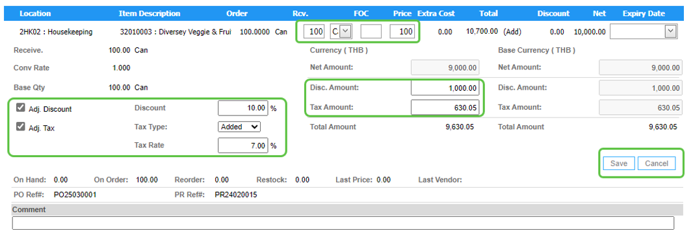

1.2	“Create Manually” การสร้าง เอกสารใบรับสินค้า ด้วยตนเอง

1.2.1	click “Create” - “Create Manually”
                                   
กรอกข้อมูลในส่วนของ header ดังนี้

หมายเหตุ เครื่องหมาย * คือช่องที่จำเป็นต้องระบุ
-	“Ref #” เลขที่เอกสารซึ่งระบบจะทำการ running ให้ หลังจากกด Save
-	*“Date” วันที่ทำ Receiving (มีผลกับ “Input Date” ใน “Invoice” ที่ Module AP) 
-	*“Delivery Point” เพื่อเลือกจุดรับสินค้า ที่ต้องการ (ในกรณี ที่มี มากกว่าหนึ่งจุด)
-	*“Invoice Date” วันที่ของ Invoice ตามเอกสารจริงที่ได้รับจาก Vendor
-	*“Invoice#” เลขที่ของ Invoice ตามเอกสารจริงที่ได้รับจาก Vendor
-	“Description” เพื่อใส่คำอธิบาย เอกสารใบรับสินค้า
-	Click เครื่องหมายถูก “Consignment” ในกรณีที่เป็นของฝากขาย ที่ต้องการรับรู้ข้อมูลเข้าระบบ Inventory แต่ไม่ต้องการบันทึกบัญชี (ระบบจะไม่ส่งข้อมูล Receiving ไปที่ Module AP)
-	“Currency” หากมีการใช้สกุลเงินอื่นๆ และสามารถแก้ไข Rate ที่ต้องการได้
-	“Status” สถานะของเอกสาร (Received, Committed, Void)
-	“Committed Date” คือวันที่ที่ทำการกด Commit
-	“Extra Cost” การนำต้นทุนอื่น ๆ เช่น ค่าขนส่ง ค่าอากรขาเข้า มาบันทึกเพื่อเพิ่มต้นทุนให้กับสินค้าใน Receiving ใบนี้
-	กด “Add Item” เพื่อเพิ่มสินค้าที่ต้องการทำรับ
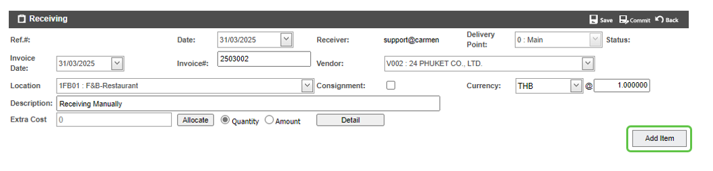

กรอกข้อมูลในส่วนของ detail ของ สินค้าในเอกสารใบรับสินค้าดังนี้

หมายเหตุ เครื่องหมาย * คือช่องที่จำเป็นต้องระบุ

-	*“Item Description” เลือกสินค้าเพื่อรับสินค้า
-	*“Rcv.” ใส่จำนวนที่ต้องการรับสินค้า
-	*“Unit” เลือก Order Unit ที่ต้องการรับสินค้า
-	“FOC” (Free of Charge) ใส่จำนวนของแถมเป็นหน่วยเดียวกับ Order Unit
-	*“Price” ใส่ราคาต่อหน่วย
-	“Expiry Date” ใส่วันหมดอายุ
-	Click “Adj. Discount” เพื่อแก้ไข
o	Discount (%) ใส่ส่วนลด % ที่ต้องการ
o	“Disc Amount” สามารถแก้ไขมูลค่าส่วนลดที่ต้องการ
-	Click “Adj. Tax” เพื่อ แก้ไข “Tax Type” และ “Tax Rate” ที่ ต้องการ
o	Tax Type มี 3 ประเภท 
	“Added” ใช้สำหรับ “Price” เป็นราคาไม่รวมภาษี
	“Included” ใช้สำหรับ “Price” เป็นราคารวมภาษี
	“None” ใช้สำหรับ “Price” ไม่รวมภาษี
o	Tax Rate ใช้กำหนด % ของภาษี
o	Tax Amount สามารถแก้ไขมูลภาษีตามที่ต้องการ
-	ใส่ “Comment” อธิบายข้อมูลเพิ่มเติมของสินค้า
-	Click “Save” เพื่อบันทึก หรือ “Cancel” เพื่อยกเลิก 
-	การบันทึกข้อมูลสินค้า

o	Click “Save” เพื่อบันทึก หรือ “Cancel” เพื่อยกเลิก 
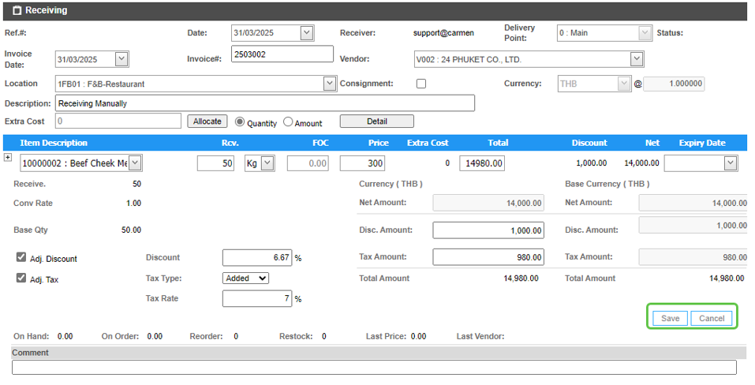
 

2.	การบันทึกเอกสาร ใบรับสินค้า

2.1.	Click “Save” เพื่อ บันทึก ใบรับสินค้า สามารถกลับมา Edit, Void หรือ Commit ภายหลังได้

2.2.	Click “Back” เพื่อยกเลิกการบันทึก ใบขอซื้อ

3.	การ Commit เอกสาร ใบรับสินค้า

3.1.	Click “Commit” เพื่อ ยืนยัน เอกสารการรับสินค้า 

3.2.	เมื่อ commit ระบบจะทำการบันทึกข้อมูลลงระบบ Inventory ให้ตาม Commit Date

3.3.	เมื่อเอกสารถูก Commit จึงจะสามารถส่งข้อมูลไปที่ module AP Invoice ได้
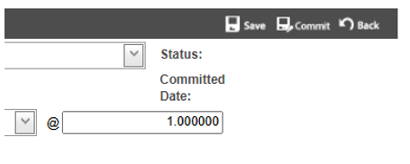 
4.	  Function อื่น ๆ ของ Receiving

4.1.	“Edit” ใช้สำหรับ แก้ไข เอกสารใบรับสินค้า

4.2.	Void” ใช้สำหรับ Void เอกสารใบรับสินค้า

4.3.	“Print” ใช้สำหรับ print แบบฟอร์ม เอกสารใบรับสินค้า ในระบบ

4.4.	“Back” กลับสู่หน้าเมนู Receiving

5.	Extra Cost

Function นี้ใช้กรอกข้อมูลในส่วนของ Extra Cost (หากมี) เช่น ค่าภาษีนำเข้า, ค่าขนส่งจากต่างประเทศ เป็นต้น เพื่อเพิ่มมูลค่าของ “Inventory Cost” ให้กับสินค้าในเอกสาร Receiving ใบนี้

5.1.	ขั้นตอนการบันทึก Extra Cost

5.1.1.	กด “Edit” เพื่อแก้ไขเอกสาร Receiving

5.1.2.	ประเภทการคำนวณ Extra Cost

-	“Quantity” คำนวณ Extra Cost โดยเฉลี่ยตามจำนวนของสินค้า
-	“Amount” คำนวณ Extra Cost โดยเฉลี่ยตามมูลค่าของสินค้า

5.1.3.	“Detail” เพื่อ เลือก ประเภท “Extra Cost” 
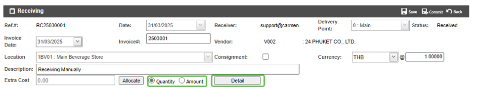 
5.1.4.	เลือก “Extra Cost” ที่ต้องการ 

5.1.5.	ใส่ มูลค่า ของ “Extra Cost”

5.1.6.	Click “Add” เพื่อเพิ่มประเภทของ “Extra Cost” และสามารถเพิ่มได้มากกว่า 1 รายการ

5.1.7.	Click “Save and Allocate” เพื่อ บันทึก และ Allocate หรือ “Cancel” เพื่อ ยกเลิก
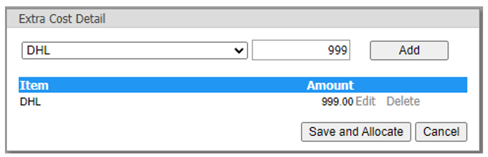                               
5.1.8.	ระบบจะทำการบันทึก Extra Cost ให้สินค้าแต่ละรายการ

5.1.9.	กด “Save” เพื่อเสร็จสินการบันทึก Extra Cost ให้เอกสาร Receiving
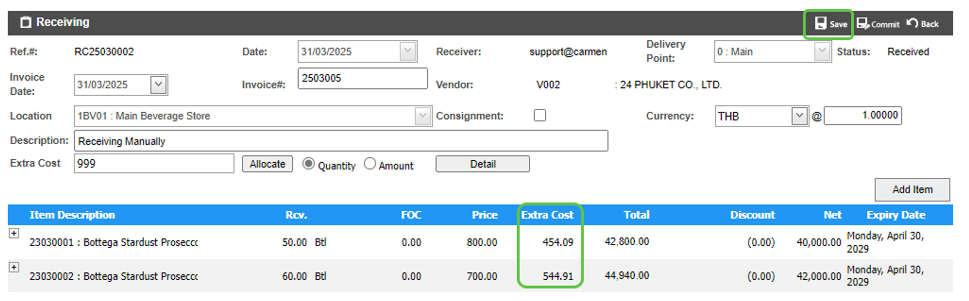
 
6.	การ ค้นหา และ View เอกสารใบรับสินค้า 

6.1	หลังจากที่เข้ามาในหน้า Receiving แล้วสามารถ เลือก View ได้ด้วย Status ต่างๆ

6.2	สามารถค้นหา เอกสารใบรับสินค้า ที่ต้องการ โดย พิมพ์ค้นหา ในช่อง Search

6.3	การ View เอกสารใบรับสินค้า ทำได้โดยการเลือก เอกสารใบรับสินค้า ที่ต้องการ เพื่อ แสดงรายละเอียดของ เอกสารใบรับสินค้า นั้นๆ
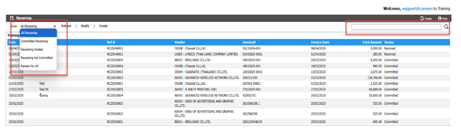 
7.	การ Comment หรือ แนบไฟล์ Attachment ในเอกสาร Receiving

7.1.	การเพิ่ม Comment ในเอกสาร ใบขอซื้อเพื่อเป็นการสื่อสารภายใน

-	Click “Create” ที่หัวข้อ “Comment”
-	ใส่ “Comment” ที่ต้องการ
-	Click “Update” เพื่อ บันทึก หรือ “Cancel” เพื่อ ยกเลิก
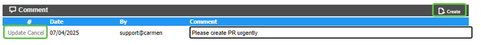
7.2.	การแนบไฟล์ Attachment ในเอกสาร ใบขอซื้อ เพื่อแนบเอกสารประกอบการขอซื้อ

-	“Create” ที่หัวข้อ “Attachment”
-	ใส่ “Description” ที่ต้องการ
-	เลือก “Choose File” เพื่อเลือก File ที่ต้องการแนบ
-	Click “Update” เพื่อ บันทึก หรือ “Cancel” เพื่อ ยกเลิก
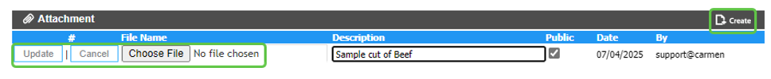

