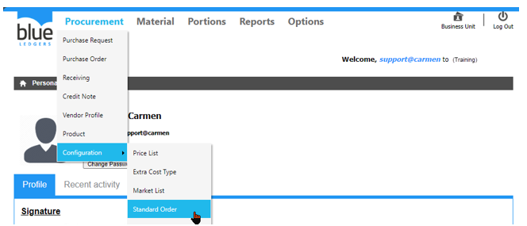
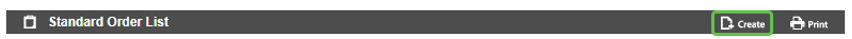
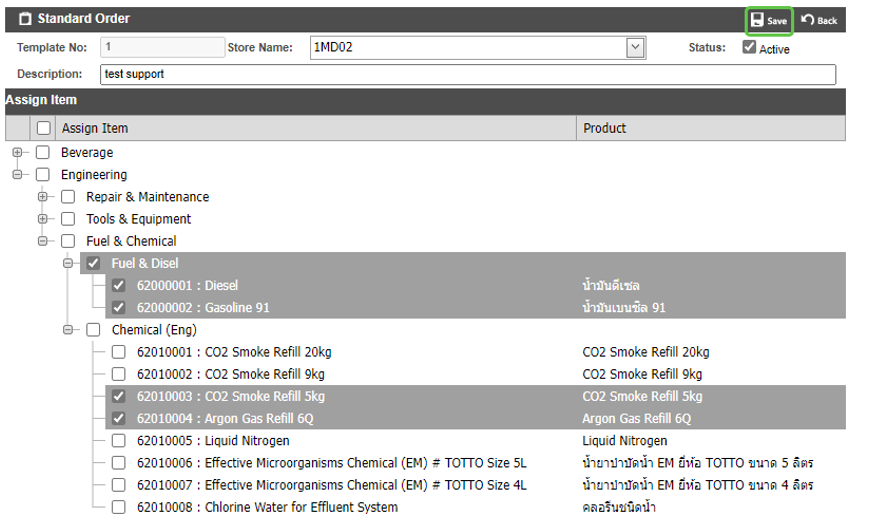
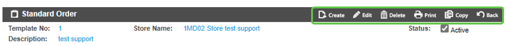
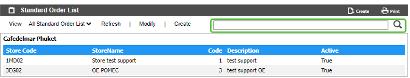

# Standard Order (Template รายการสินค้าสั่งซื้อ Standard Order)

Configuration คือ Module ที่ใช้สำหรับตั้งค่าการใช้งานต่างๆ ที่เกี่ยวข้องกับ Module Procurement
Standard Order คือ Function ในการสร้าง Template สำหรับรายการสินค้าประเภท General ที่มีการสั่งซื้อบ่อย ๆ เพื่อช่วยลดเวลาในการเลือกสินค้าตอนสร้าง PR

สามารถสร้างโดยการเอา cursor ไปวางที่ “Procurement” 
และ เลื่อน cursor ไปที่ “Configuration”  
จากนั้นเลือก “Standard Order” 

1.	ขั้นตอนการสร้าง Standard Order Template 
-	Click “Create” เพื่อสร้าง Template

-	“Store Name” เพื่อเลือก Store/Location
-	Click เครื่องหมายถูก ออก ที่ “active” หากไม่ต้องการใช้งาน Template ดังกล่าว
-	“Description” เพื่อใส่คำอธิบาย Template
-	“Assign Item” โดยการ Click เครื่องหมายถูก ใน แต่ละหมวดหมู่ หรือ รายการสินค้า ที่ต้องการ
-	Click “Save” เพื่อ บันทึก หรือ “Back” เพื่อ ย้อนกลับ 

 

2.	Function อื่น ๆ ของ Standard Order หลังจากกด “Save”

     o “Create” เพื่อสร้าง Standard Order ใหม่

     o “Edit” ใช้สำหรับ แก้ไข Standard Order ดังกล่าว

     o “Delete” ใช้สำหรับ ลบ Standard Order ดังกล่าว

     o “Copy” ใช้สำหรับ คัดลอก Template Standard Order ดังกล่าว เป็น Template ใหม่

     o “Back” กลับสู่หน้าเมนู Standard Order
 
3.	การ ค้นหา และ View Standard Order

3.1	หลังจากเข้ามาที่หน้าจอ Standard Order แล้ว สามารถค้นหา Standard Order ที่ต้องการ โดย พิมพ์ค้นหา ในช่อง Search

3.2	การ View Standard Order ทำได้โดยการเลือก Standard Order ที่ต้องการ เพื่อ แสดงรายละเอียดของ Standard Order นั้นๆ

