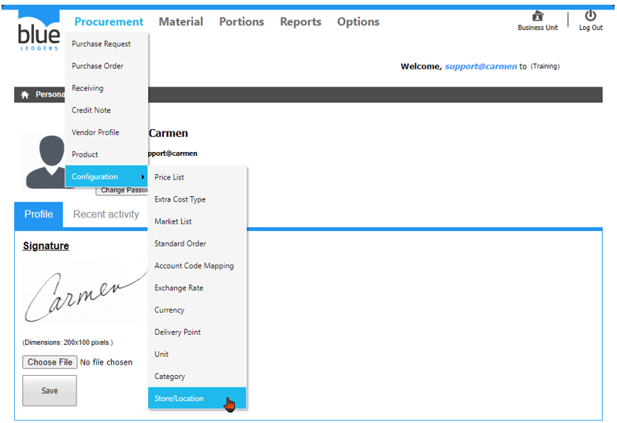
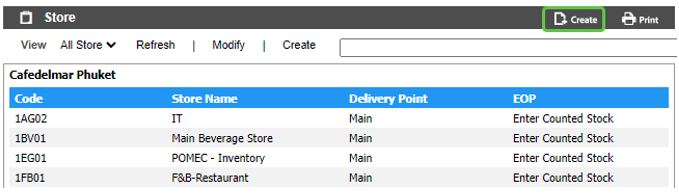
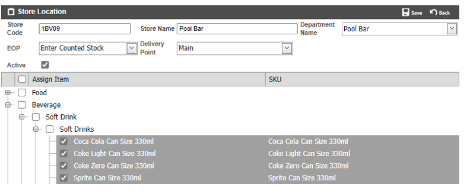
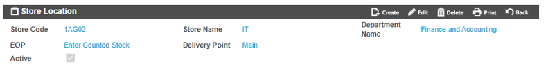
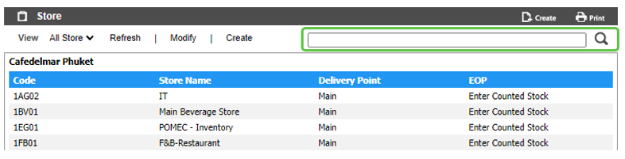

# Store/Location (คลังสินค้า/สถานที่)

Store/Location คือ Function ในการสร้าง คลังสินค้า/สถานที่ เพื่อ สั่งซื้อ, รับ, เบิก, โอน หรือ ตรวจนับ 
รายการสินค้าต่างๆ

สามารถสร้างโดยการเอา cursor ไปวางที่ “Procurement” 
และ เลื่อน cursor ไปที่ “Configuration”  
จากนั้นเลือก “Store/Location” 
 

1.**ขั้นตอนการสร้าง Store/Location**
-	Click “Create” เพื่อทำการสร้าง Store/Location 

กรอกข้อมูล Store/Location ดังนี้
-	“Store Code” เพื่อใส่รหัส Store/Location
-	“Store Name” เพื่อใส่รหัส Store/Location
-	“Department Name” เพื่อเลือก Department ของ Store/Location ดังกล่าว 
-	“EOP” เพื่อเลือก ประเภทการนับสินค้า ของ Store/Location ดังกล่าว

o Enter Counted Stock (สำหรับ Store/Location ที่ต้องทำการตรวจนับทุกสิ้นเดือน)

o Default System (สำหรับ Store/Location ที่ไม่จำเป็นต้องทำการตรวจนับ)

o Default Zero (สำหรับ Store/Location ที่มีการสั่งซื้อ แล้วตัดเป็น ต้นทุนหรือค่าใช้จ่าย)

-	“Delivery Point” เพื่อเลือกจุดรับสินค้าของ Store/Location ดังกล่าว
-	Click เครื่องหมายถูก ออก ที่ “Active” หากไม่ต้องการใช้งาน Store/Location ดังกล่าว
-	“Assign Item” ทำการเลือกสินค้าที่สามารถใช้งานกับ Location นี้ได้ โดยการ Click เครื่องหมายถูก ใน แต่ละหมวดหมู่ หรือ รายการสินค้า ที่ต้องการ และสามารเลือกได้มากกว่า 1 กลุ่ม
-	Click “Save” เพื่อ บันทึก หรือ “Back” เพื่อ ย้อนกลับ 

 

- Function อื่น ๆ ของ Store/Location

o “Create” เพื่อสร้าง Store/Location **ใหม่**

o “Edit” ใช้สำหรับ แก้ไข Store/Location ดังกล่าว

o “Delete” ใช้สำหรับ ลบ Store/Location ดังกล่าว

o “Back” กลับสู่หน้าเมนู Store/Location

 

2.	การ ค้นหา และ View Store/Location

2.1	สามารถค้นหา Store/Location ที่ต้องการ โดย พิมพ์ค้นหา ในช่อง Search

2.2	การ View Store/Location ทำได้โดยการเลือก Store/Location ที่ต้องการ เพื่อ แสดงรายละเอียดของ Store/Location นั้นๆ

