# Troubleshoot Guide PR
## กด Approved PR ไม่ได้ 
ตัวอย่าง PR24020004 กดเข้ามาแล้วไม่พบปุ่มปุ่ม Approved / Reject / Send Back ให้กด
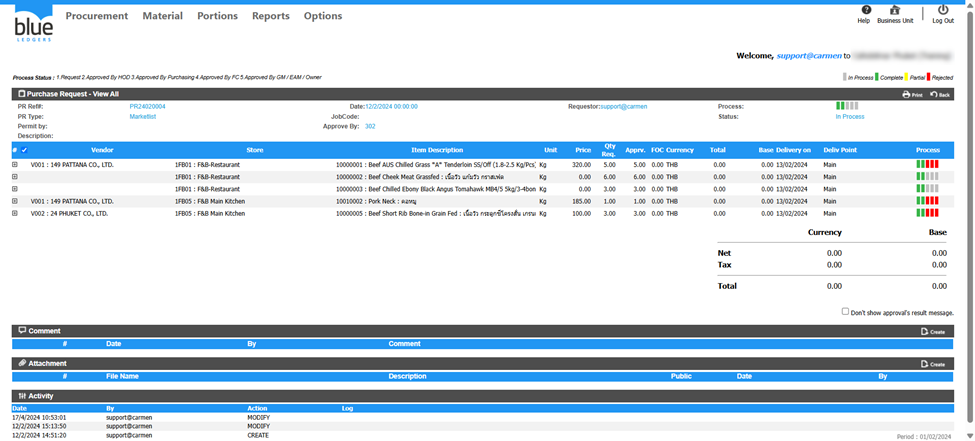

สาเหตุเกิดจากอยู่ในหัวข้อ View All ทำให้ไม่สามารถแก้ไขได้

ไปที่หัวข้อ View  หรือตาม View Step เอกสาร PR ของลูกค้า <!-- ( [หากไม่เจอไปที่หัวข้อ View PR ไม่เจอ](#หาหัวข้อ-view-Approved-pr-ไม่เจอ) ) -->
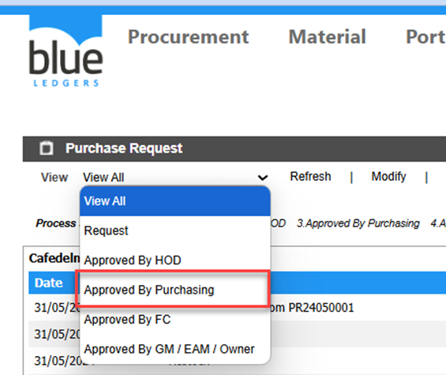

ทำการคลิกที่PR24020004หรือหมายเลขPR ของลูกค้า
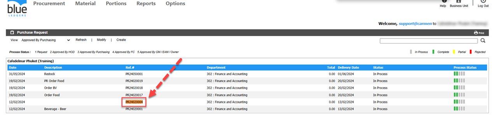

จะพบว่าปุ่ม Approved/Reject/Send Back ปรากฏขึ้นมาแล้วตามรูปภาพ
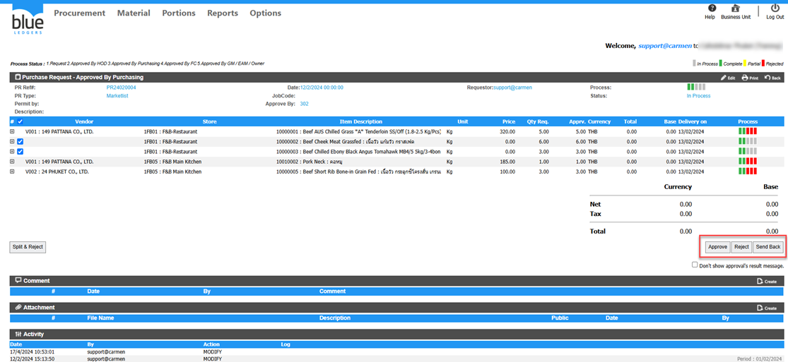

## Approved PR ช้า

ตัวอย่าง กด Approved PR25060001 ช้าผิดปกติ
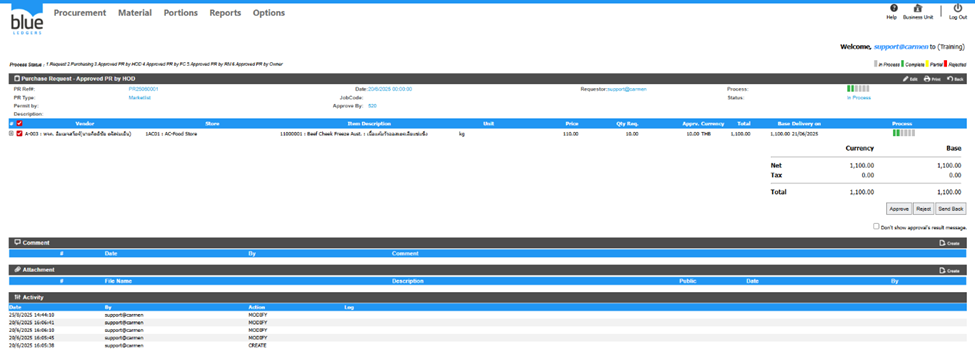

สาเหตุ มีการตั้งค่า Web & Mail Server แต่ Mail Server ไม่สามารถส่ง Email ได้และมีการเลือก Receive Notification Via Email ในหัวข้อการ ตั้งค่า ใน Workflow Configuration 

วิธีตรวจสอบและแก้ไข

1. ไปที่ Options > System Setting > Web & Mail Server 
2. ทดสอบ กดปุ่ม Test sending PR/SR หรือ PO เพื่อดูว่าระบบสามารถส่งEmail ได้หรือไม่

จากตัวอย่าง พบError : (400) Bad Request.
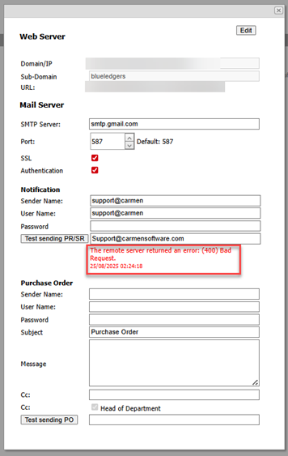

3. ให้ทำการแก้ไข Setting Mail Server ให้ถูกต้อง ก็จะสามารถแก้ไขการ Approved ช้า ได้ครับซึ่งสามารถดูได้ที่
คู่มือการตั่งค่า Mail Setting
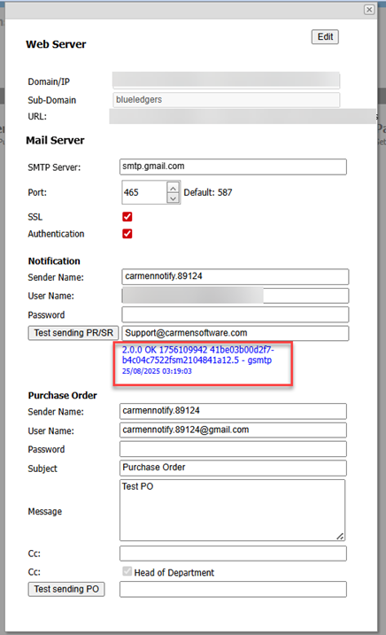
 
## PR 1 ใบ Gen PO ได้ 2 PO

ตัวอย่าง PR25080007 Gen แล้วได้ PO 2 ใบ คือ PO25080001 และ PO25080002
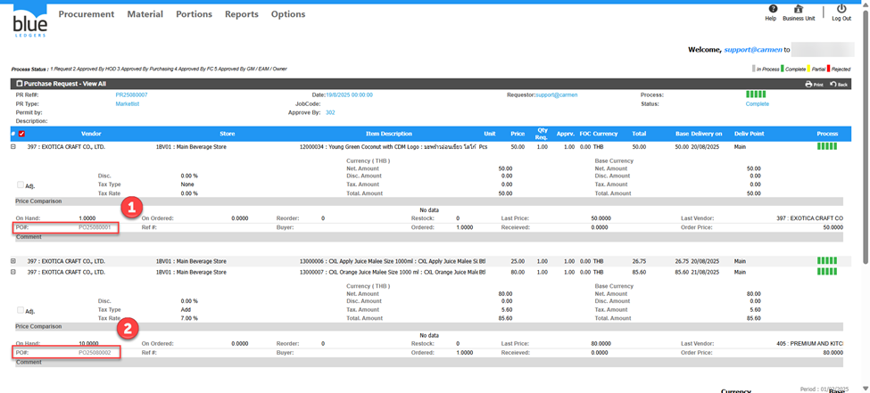

สาเหตุเกิดจาก มี Delivery on 2 วัน คือ 20/08/2025 และ 21/08/2025 ทำให้ระบบแยกเป็น2 PO
ระบบจับจาก Vendor และ Delivery on 
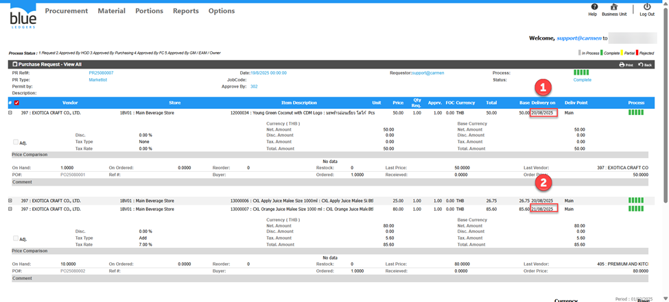

วิธีแก้ไข ไม่สามารถรวมเป็น 1 PO ได้เนื่องจากระบบจับจาก Vendor และ Delivery on หากต้องการรวมต้องแก้ไข Delivery on และ Close PO และทำ PR ใบใหม่ครับ

## สร้าง PR ไม่เจอ Store ให้เลือก

ตัวอย่าง ต้องการสร้าง PR ของ Store A&G-Accounting แต่ไม่พบ Store A&G-Accounting ให้เลือก
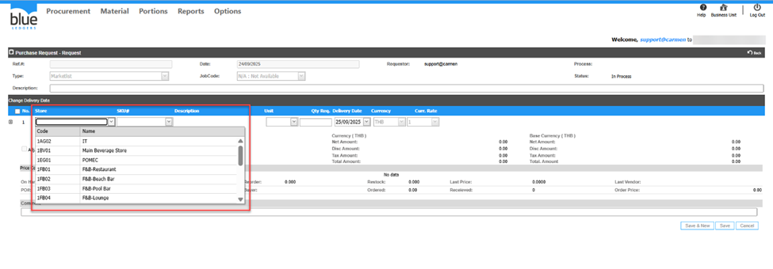
สาเหตุ: User ที่เปิด PR อาจจะไม่ได้ถูก Assign  Location ให้มองเห็น Store/Location นี้ทำให้มองไม่เห็น

วิธีแก้ไข

เข้าเมนู ดังนี้
1. Options
2. Administrator
3. User
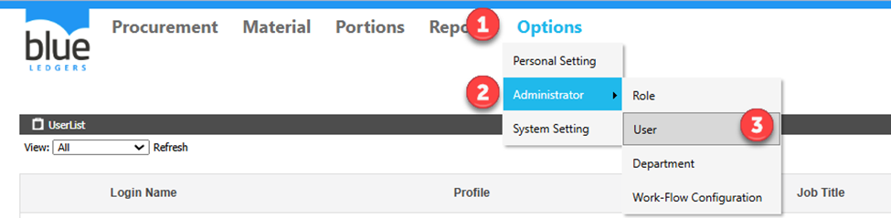
4. คลิก User ที่ติดปัญหา จากตัวอย่าง คือ User: Support 
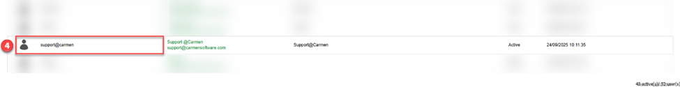
5. คลิกเลือก BU ที่ใช้งานจากตัวอย่างคือ BU PK 
6. กดปุ่ม Edit
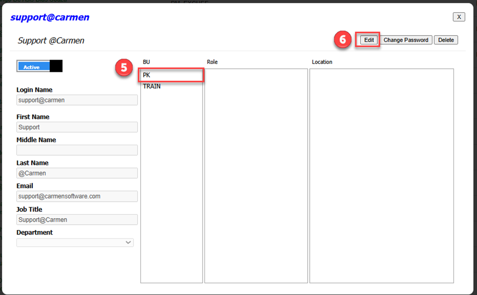
7. เลือก Store A&G-Accounting 
8. กด Save 
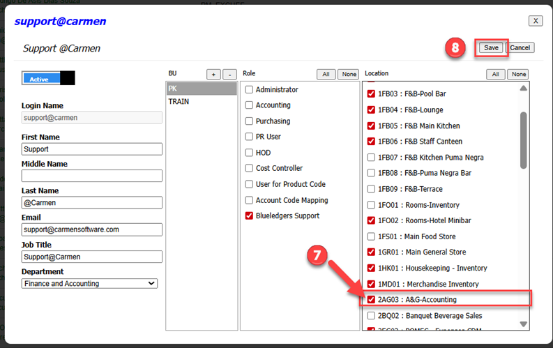

กลับมาที่เอกสาร PR ก็จะพบ Store A&G-Accounting ให้คลิกเลือกแล้วครับ ตามรูปภาพด้านล่าง
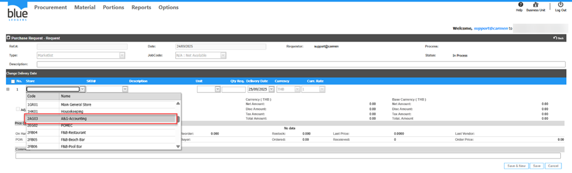

## หาหัวข้อ View Approved PR ไม่เจอ
ตัวอย่าง จะกด PR24050002 ที่ Step Approved By HOD แต่เลือกหัวข้อ View ลำดับขั้นในการอนุมัติเอกสาร ไม่พบ ทำอย่างไร 
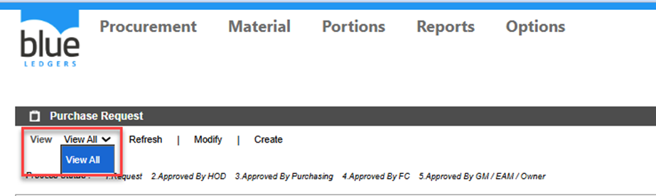 
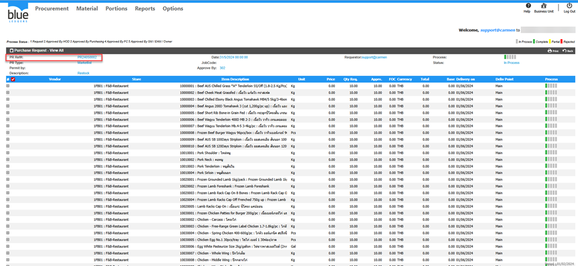
สาเหตุ 

User ที่ติดปัญหา ไม่ได้ถูก Assign เอาไว้ที่หัวข้อ Step ตั้งค่า By HOD ใน Workflow Configuration ส่วนของ Purchase Request 

วิธีแก้ไข

เข้าเมนู ดังนี้
1. Options
2. Administrator
3. Workflow Configuration
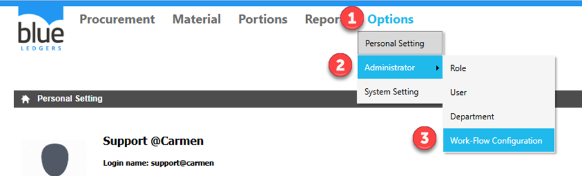
4. ไปที่ Step ตั้งค่า By HOD ใน Workflow Configuration จากตัวอย่างคือ (2) ตั้งค่า By HOD
5. กดปุ่ม Edit Approval 
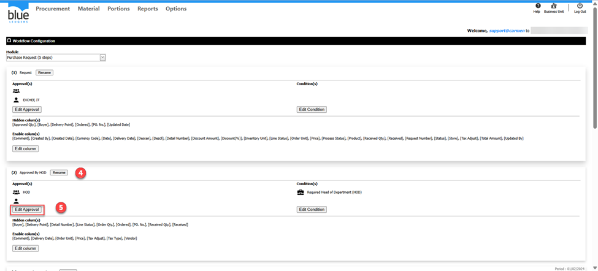
6. ทำการเลือก User ที่ต้องการเปิดสิทธิ์การ ตั้งค่า By HOD จากตัวอย่าง คือ User:Support

หมายเหตุ:การเลือกสามารถเลือกได้ทั่ง2แบบ คือ 1.Role(s) 2.User(s)

7. กด Save
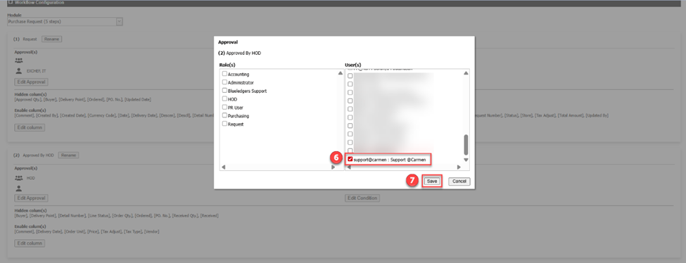

กลับไปที่ หัวข้อ PR คลิก View จะปรากฏ View ของ ตั้งค่า By HOD เรียบร้อย

ทำการคลิก Approved By HOD จะพบเอกสาร กด PR24050002 ที่ Step Approved By HOD เรียบร้อย

สามารถดำเนินการ ตั้งค่า เอกสารได้ตามปกติ
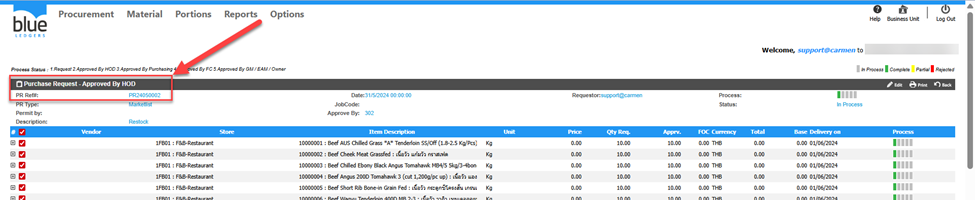

## สร้าง PR แล้วไม่พบ Product ที่ต้องการ
ต้องการเลือก Product 10000002   สั่งซื้อเข้าที่ Store 1GR01 แต่เมื่อสร้าง PR แล้วไม่พบรายการสินค้า
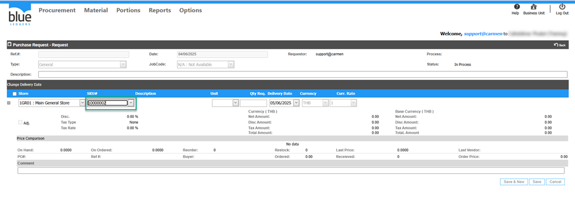
สาเหตุเกิดจาก 2 ส่วน ดังนี้
1. Prodcut ไม่ได้อยู่ใน Category Type ของ PR ที่สร้าง
2. Product ไม่ได้ถูก Assign to Store/Location

วิธีตรวจสอบและแก้ไข

- Prodcut ไม่ได้อยู่ใน Category Type ของ PR ที่สร้าง

1. เข้าเมนู Procurement 
2. Configuration
3. Category 
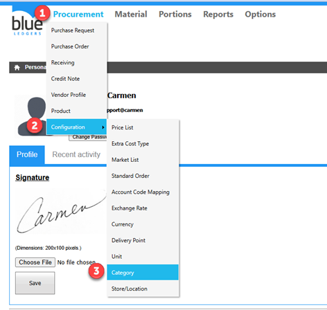
เลือก Category >Sub Category>Item Group
จากตัวอย่างคือ 

1.Category (Food)

2.Sub Category (Meat)

3.Item Group (Beef)

จากตัวอย่าง Product 10000002  อยู่ใน Category Type Market List หากสร้าง PR Type General ก็จะไม่พบProduct ตัวนี้
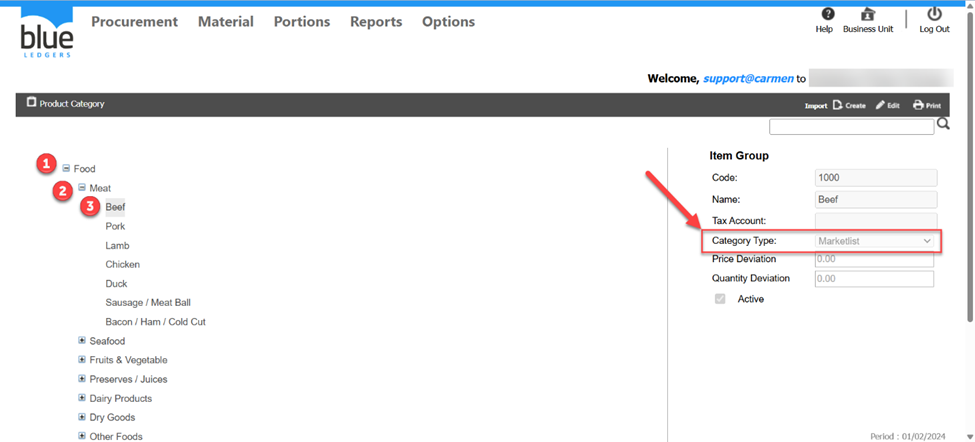

- ตรวจสอบว่า Product นี้ถูก Assign to Store/Location ไว้ที่ 1GR01 แล้วหรือยัง

วิธีตรวจสอบและแก้ไข
1. ไปที่เมนู Procurement
2. Product
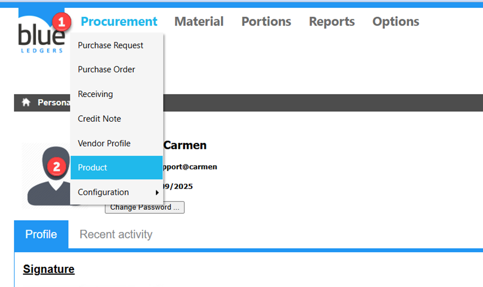
3. คลิกเลือก Product 10000002 หรือพิมพ์ Product Code 10000002 หรือตาม Product ที่ต้องการ ในช่องค้นหา
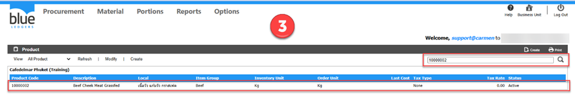
4. ดูในช่อง Assign to Store/Location ว่า Store 1GR01 หรือ Store ที่ต้องการ ถูกติ๊กเลือกไว้หรือไม่
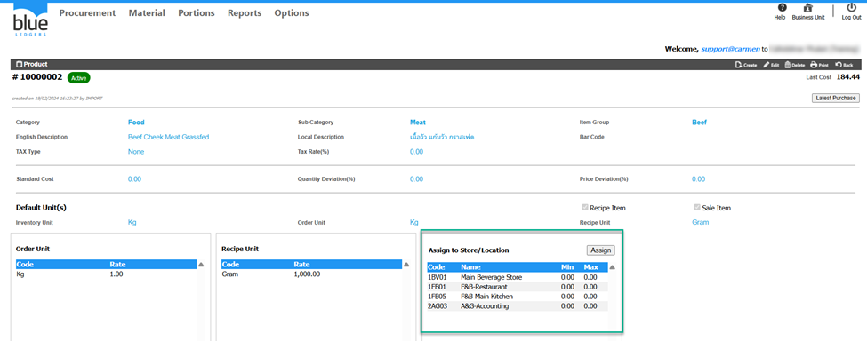
5. หากยังให้ทำการ Assign to Store/Location ที่ 1GR01 หรือ Store ที่ต้องการและกด Assign และกด Save
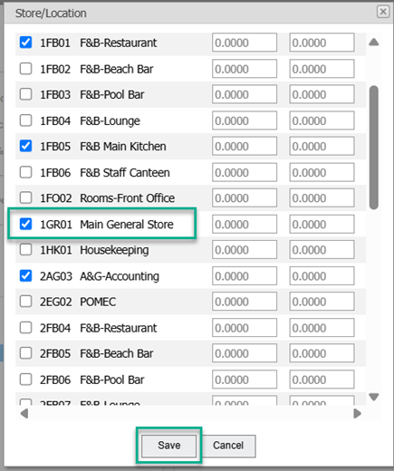
6. กลับไปที่ PR จะปรากฏรายการ Product 10000002  และสามารถดำเนินการทำเอกสาร PR ได้ตามปกติ 
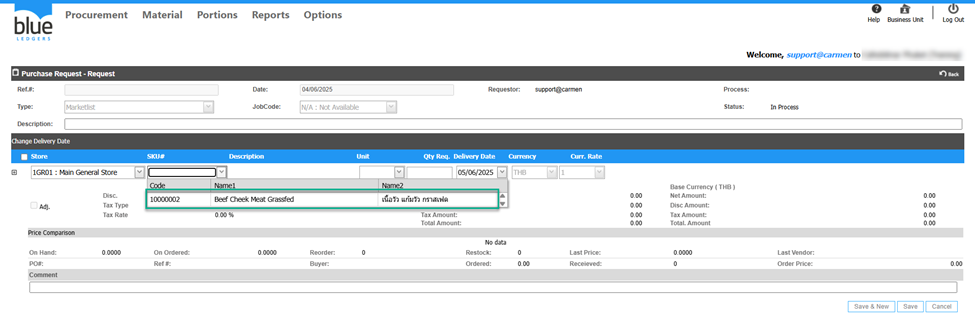
