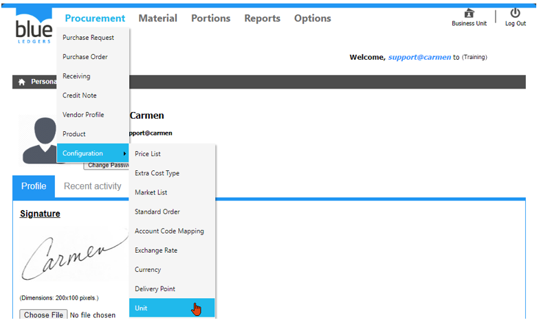
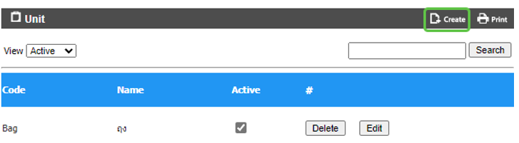
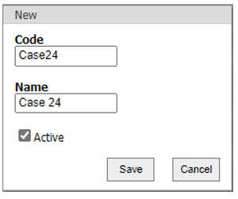
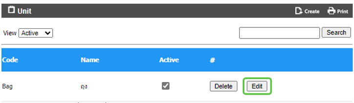
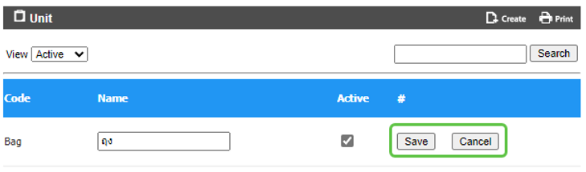
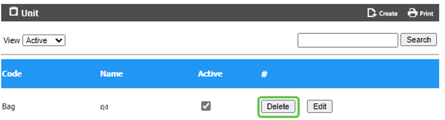
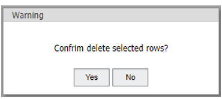

# Unit (หน่วยรายการสินค้า)

Unit คือ Function ในการสร้าง หน่วยของรายการสินค้าเพื่อใช้เป็น Inventory Unit, Order Unit และ Recipe Unit เพื่อใช้งาน ในการสั่งซื้อ, การเบิก, การโอน, การนับของ   

สามารถสร้างโดยการเอา cursor ไปวางที่ “Procurement” 
และ เลื่อน cursor ไปที่ “Configuration”  
จากนั้นเลือก “Unit” 

**ขั้นตอนการสร้าง Unit**
-	Click “Create” เพื่อทำการสร้าง Unit

-	“Code” เพื่อใส่ รหัส Unit
-	“Name” เพื่อใส่ ชื่อ Unit
-	Click เครื่องหมายถูก ที่ “Active” 
-	Click “Save” เพื่อ บันทึก หรือ “Cancel” เพื่อ ยกเลิก

**ขั้นตอนการ Edit Unit**
-	Click “Edit” ที่ Unit ที่ต้องการ เพื่อทำการแก้ไข

-	“Name” เพื่อแก้ไขชื่อ Unit
-	Click เครื่องหมายถูก ออก ที่ “Active” หากไม่ต้องการใช้งาน Unit ดังกล่าว
-	Click “Save” เพื่อ บันทึก หรือ “Cancel” เพื่อ ยกเลิก

**ขั้นตอนการลบ Unit**
-	Click “Delete” ที่ Unit ที่ต้องการ

-	Click “Yes” เพื่อ ยืนยัน หรือ “No” เพื่อ ยกเลิก
            
