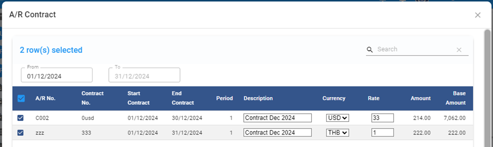
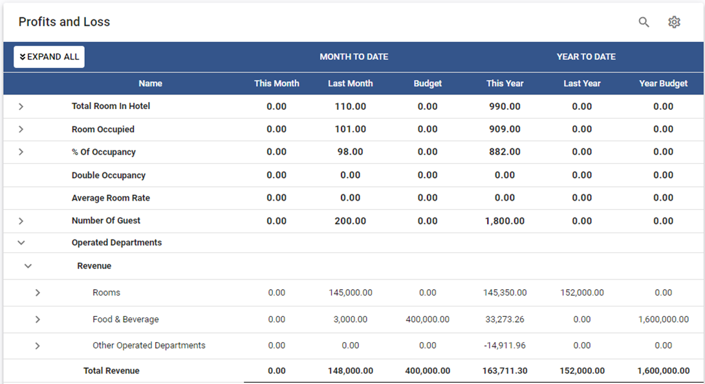
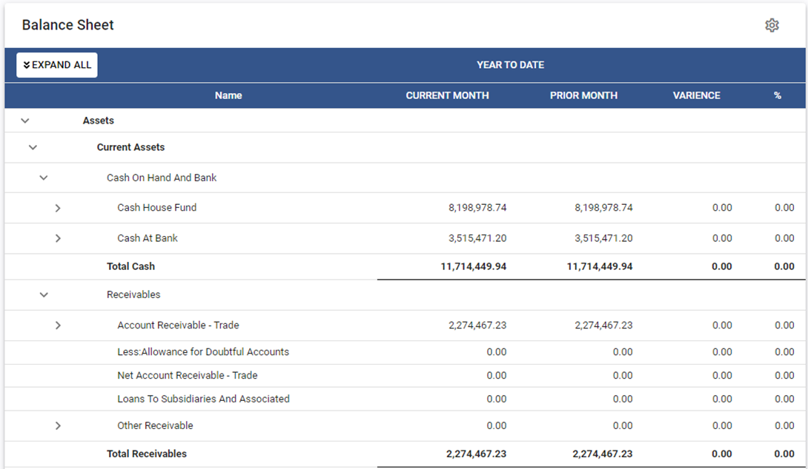
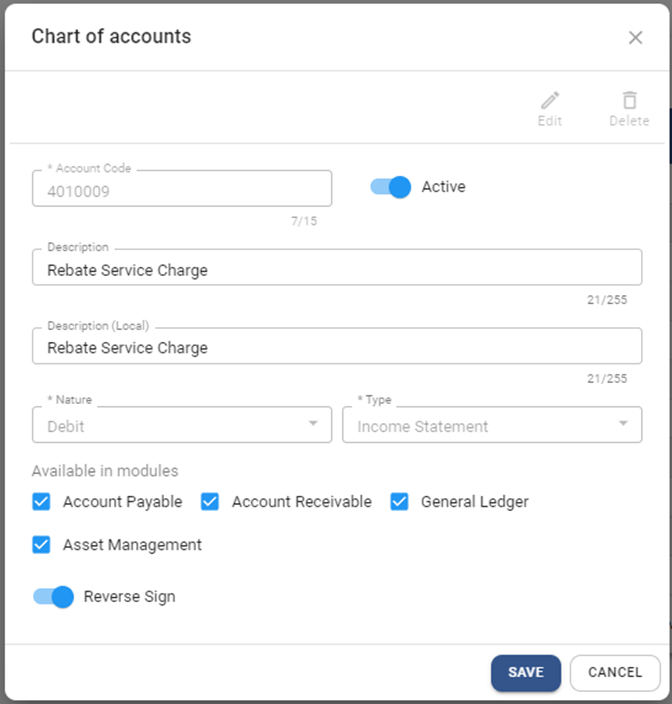

# April 2025 Relaese Infomation

## Account Receivable

### Account Receivable - Apply Contract - Add features to revise invoice description and currency rate before apply invoice

- Note : Allow to revise description and currency rate before generating invoice
- From : Account Receivable > Procedure > Apply Contract

    

### Account Receivable - Receipt - fix the calculation of available credit

- Note : When select and deselect invoice, the available credit is not correct. 
- From : Account Receivable > Receipt

## General Ledger

### General Ledger - Posting from AP - fix bug for dimension in AP not post to GL

- Note : When record dimension in AP invoice, system will post dimension value to GL
- From : General Ledger > Procedure > Posting from AP

### General Ledger - Financial Report - new features to view Balance Sheet right in the systems

- Note : Built in Financial report with standard format. It require account code mapping before use.
- From : General Ledger > Financial Report

    

### General Ledger - Financial Report - new features to view Balance Sheet right in the systems

- Note : Built in Financial report with standard format. It require account code mapping before use.
- From : General Ledger > Financial Report

    

## Configuration

### Configuration - COA - new features to reverse sign for presenting in Built in financial report

- Note : This features will affect to presenting the amount in Built in financial report only. It will reverse the sign of amount.
- From : Configuration > Chart of Account

### Configuration - COA - remove default value for nature and type in Chart of accounts

- Note : System will not set default value for nature and type to avoid save without review.
- From : Configuration > Chart of Accounts

    

