# Input Tax Reconciliation

Function นี้ใช้สำหรับตรวจสอบใบกำกับภาษี และเลือกรายการเพื่อยืนยันภาษีซื้อ และออกรายงานภาษีซื้อ
สามารถกำหนดให้ระบบทำการบันทึกปรับปรุงยอดภาษีซื้อค้างจ่าย ให้เป็นภาษีซื้อ ใน GL ได้โดยอัตโนมัติ (ในกรณีที่มีการตั้งค่าให้ระบบ Auto Posting Vat Reconcile JV) โดยข้อมูลจะถูกโพสไปบันทึกบัญชีที่ GL เข้า Prefix “TX” 
การยืนยันยอดภาษีซื้อ (Input Tax Reconciliation) (1-5)
1.	คลิกเข้าสู่ Account Payable Module
2.	เลือกฟังก์ชัน Procedure ส่วนของ Input Tax Reconciliation

3.	กำหนดในส่วนของ Default tax period เพื่อเลือก Period หรือเดือน ที่ต้องการยืนยันยอดภาษีซื้อ
4.	ระบบจะแสดงใบกำกับภาษีทั้งหมดที่ยังไม่ถูกยื่นภาษี หรือ Tax Status เป็น Pending เพื่อให้ผู้ใช้งานทำการตรวจสอบและกระทบยอด (ดูตัวอย่างจากภาพด้านล่าง) ด้วยวิธีการดังต่อไปนี้

4.1.เลือกใบกำกับภาษี โดยการ ติ๊กเครื่องหมายถูก☑️ที่ช่องด้านหน้าสุด รายการที่ต้องการยื่นภาษีใน Period หรือ เดือนที่เลือกไว้ 

ผู้ใช้งานจะสามารถทำการ Update และ แก้ไขข้อมูลใบกำกับภาษีได้ดังต่อไปนี้
-	Tax Status ระบบจะเปลี่ยนจาก Pending ให้เป็น Confirm อัตโนมัติเมื่อติ๊กเครื่องหมายถูก
-	Tax Period ระบบจะเปลี่ยนตาม Default Tax Period อัตโนมัติเมื่อติ๊กเครื่องหมายถูก
-	Tax Invoice No.	หมายเลขใบกำกับภาษี หากไม่ถูกต้อง สามารถแก้ไขได้
-	Tax Invoice Date วันที่ใบกำกับภาษี หากไม่ถูกต้อง สามารถแก้ไขได้

4.2.	กดปุ่ม Next เพื่อดำเนินการต่อในขั้นตอนถัดไป 

การกลับบัญชี Input Tax – Undue ใน JV

4.3.ในกรณีที่มีการตั้งค่าให้ระบบ Auto Posting Vat Reconcile JV ระบบจะแสดงข้อความให้ทราบว่า ระบบจะทำการสร้าง JV ที่ Prefix “TX” เพื่อบันทึกปรับปรุงยอดภาษีซื้อค้างจ่าย ให้เป็นภาษีซื้อ ใน GL ได้โดยอัตโนมัติ

•	Click “Yes” เพื่อให้ระบบดำเนินการกระบวนการต่อ

•	Click “No” เพื่อยกเลิก กรณีที่ต้องการกลับไปแก้ไขรายการ
 

4.4.	หลังจาก Click “Yes” ระบบจะแสดงข้อความเพื่อยืนยันจำนวนใบกำกับภาษีซื้อตาม Status ที่ถูกเลือก

Found Updated data: - transactions จำนวนใบกำกับภาษีทั้งหมดที่ระบบจะทำการอัพเดตข้อมูล โดยแบ่ง ตาม Status ดังต่อไปนี้นี้
-	(Y) Confirm:  หมายถึง จำนวน ใบกำกับภาษีที่ระบบจะ อัพเดต Tax Status เป็น Confirm 
-	(N) Not confirm: หมายถึง จำนวน ใบกำกับภาษีที่ระบบจะ อัพเดต Tax Status เป็น Not confirm
-	(U) Unclaim: หมายถึง จำนวน ใบกำกับภาษีที่ระบบจะ อัพเดต Tax Status เป็น Unclaim
ให้ กดปุ่ม “Yes” อีกครั้ง เพื่อยืนยัน หรือกดปุ่ม “No” เพื่อยกเลิก

4.5.หลังจาก Click “Yes” ระบบจะแสดงข้อความเพื่อยืนยันจำนวนใบกำกับภาษีซื้อตาม Status ที่ถูกเลือก

5.เมื่อระบบทำการบันทึกข้อมูลเรียบร้อยแล้วจะแสดงข้อความ Success กด OK เพื่อเสร็จสิ้นขั้นตอน

ตัวอย่าง JV จากการกลับบัญชีของระบบ
-	ระบบจะบันทึกข้อมูลลงที่ Prefix “TX” ใน GL โดยอัตโนมัติ 
-	การบันทึกบัญชีนั้นระบบจะ Debit ด้วย Account code ตามการตั้งค่าและ Credit เพื่อกลับบัญชีด้วย Account code ที่บันทึกเอาไว้ในใบกำกับภาษีแต่ละใบ 
-	การกลับบัญชีจะมีผลกับใบกำกับภาษีที่บันทึกบน A/P Invoice เท่านั้น

## การบันทึกใบกำกับภาษีซื้อจาก module อื่น ๆ เช่น AR และ GL (6-11)

Function ที่ใช้ในกรณี ต้องการเพิ่มเติมรายการในรายงานภาษีซื้อ (Tax Invoice) ที่มีการสั่งซื้อของ ต่างๆ ของบริษัท แต่บันทึกที่ module อื่น ๆ ของระบบ เช่นใบกำกับภาษีซื้อที่ซื้อด้วยเงินสดย่อย หรือ ภาษีซื้อจาก Credit Card Commission เป็นต้น 

สามารถนำใบกำกับภาษีมาบันทึกเพื่อนำส่ง และ ออกรายงานภาษีซื้อเป็นชุดเดียวกัน

6. ทำตามขั้นตอน 1 และ 2 อีกครั้ง จากนั้น click 

7.	เลือก Period หรือเดือนของภาษีซื้อ ที่ต้องการ จะเพิ่มใบกำกับภาษีซื้อ 
ระบบจะแสดงรายการใบกำกับภาษีซื้อที่ถูก Reconcile แล้ว เพื่อเป็นข้อมูลตั้งต้น
8.	กดปุ่ม + เพื่อเพิ่มรายการภาษีซื้อ
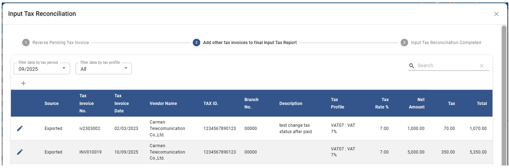
9.	การกรอกรายละเอียดใบกำกับภาษีซื้อ 

หมายเหตุ สัญลักษณ์  * ช่องที่จำเป็นต้องระบุ
-	*Tax Invoice No > เลขที่ใบกำกับภาษี
-	*Tax Invoice Date > วันที่ในใบกำกับภาษี
-	*Tax ID > ระบุหมายเลขประจำตัวผู้เสียภาษีอากร (13 หลัก)
-	*Branch No > ระบุรหัสสาขา (5 หลัก) เช่น 00000 (รหัสสาขาของสำนักงานใหญ่)
-	Vendor > กำหนดรหัสร้านค้า หากมีข้อมูลอยู่ในระบบ สามารถปล่อยว่างเอาไว้ได้หากไม่มีข้อมูลในระบบ
-	*Vendor Name > ระบุชื่อร้านค้า หรือชื่อผู้ขายตามใบกำกับภาษี
-	Description > คำอธิบายเพิ่มเติม
-	*Tax Profile > ระบุประเภทของภาษี
-	*Net Amount > จำนวนเงินก่อนภาษีซื้อ
-	Tax Rate > อัตราภาษีจะอ้างอิงตาม Tax Profile
-	*Tax > จำนวนเงินภาษีซื้อ
-	Total > จำนวนเงินรวมตามใบกำกับภาษีซื้อ
10.	กด  เพื่อบันทึกข้อมูล หรือ Cancel เพื่อยกเลิก
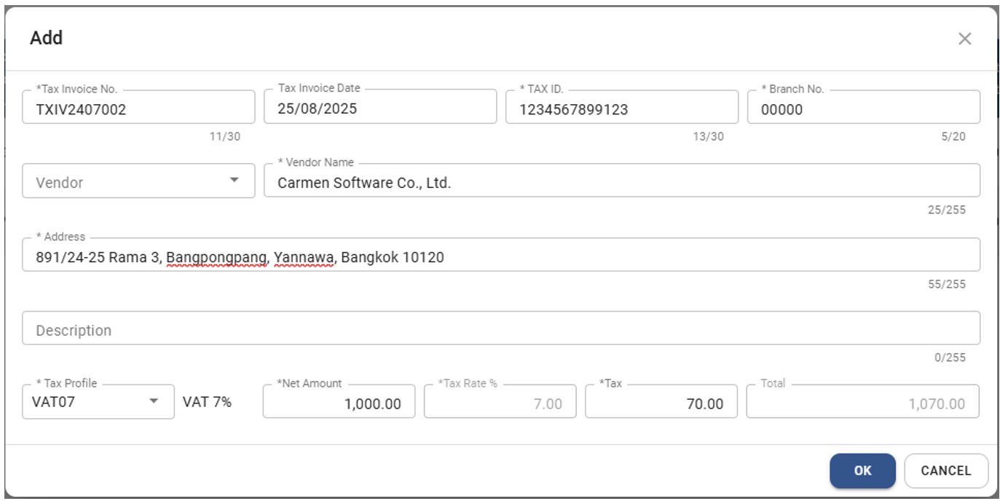
11.	กด “Finish” เพื่อจบขั้นตอนการบันทึกใบกำกับภาษีจาก module อื่น ๆ

Source บนหน้าจอใช้ในการระบุแหล่งที่มาของใบกำกับภาษีแต่ละใบโดยแบ่งเป็น 2 รูปแบบ

11.1.	Exported คือ ใบกำกับภาษีที่มาจาก A/P Invoice ที่มี Tax Status เป็น Confirm ไม่สามารถลบรายการออกไปได้ แต่สามารถแก้ไขข้อมูลได้บางส่วน และมีวิธีการแก้ไข ดังนี้
-	กดที่ช่อง Tax Period เพื่อเลือก Period ที่ต้องการแก้ไข
-	กดปุ่ม  หน้ารายการที่ต้องการแก้ไข 
-	ระบบจะแสดงหน้าต่าง ให้แก้ไขข้อมูลได้บางส่วน ได้แก่ Vendor Name, Tax ID, Branch No

11.2.	User คือ ใบกำกับภาษีที่ ผู้ใช้งานทำการเพิ่มเองในระบบ
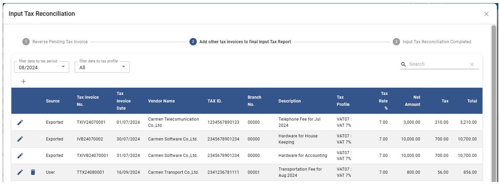

## การบันทึกใบกำกับภาษีซื้อเพิ่มเติมโดย Excel Template เพื่อรวบรวมใบกำกับภาษีซื้อจาก module อื่น ๆ เช่น AR และ GL ในระบบ (12-16)
Function ที่ใช้ในกรณี ต้องการเพิ่มเติมรายการในรายงานภาษีซื้อ (Tax Invoice) ที่มีการสั่งซื้อของ ต่างๆ ของบริษัท แต่บันทึกที่ module อื่น ๆ ของระบบ เช่นใบกำกับภาษีซื้อที่ซื้อด้วยเงินสดย่อย หรือ ภาษีซื้อจาก Credit Card Commission เป็นต้น สามารถนำใบกำกับภาษีมาบันทึกใน Excel Template และ Import เข้าในระบบเพื่อนำส่ง และ ออกรายงานภาษีซื้อเป็นชุดเดียวกัน

12.	ทำตามขั้นตอน 1 และ 2 อีกครั้ง จากนั้น click  
13.	กดปุ่ม “EXPORT TEMPLATE” เพื่อ Export file ที่ใช้ในการบันทึกผ่าน Excel

13.1.	กดปุ่ม “Download File” (ขั้นตอนอาจแตกต่างไปขึ้นอยู่กับ Browser ที่ใช้งาน)

13.2.	กดปุ่ม “Save as” และเลือกตำแหน่งที่ต้องการเก็บ
 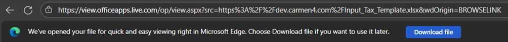

14.	เปิด file ชื่อ “Input_Tax_Template” ที่ได้มาจากการ download

15.	การกรอกรายละเอียดใบกำกับภาษีซื้อ 

หมายเหตุ สัญลักษณ์  * ช่องที่จำเป็นต้องระบุ
การลบข้อมูลในเอกสาร ให้ เลือก Cell ที่ต้องการ, กด Click ขวา และเลือก “Clear Content” หรือ กดปุ่ม “Delete” ที่ Keyboard แต่จะไม่สามารถลบข้อมูลทั้งแถวได้

-	*Tax Invoice No > เลขที่ใบกำกับภาษี
-	*Tax Invoice Date > วันที่ในใบกำกับภาษี
-	*Tax ID > ระบุหมายเลขประจำตัวผู้เสียภาษีอากร (13 หลัก)
-	*Branch No > ระบุรหัสสาขา (5 หลัก) เช่น 00000 (รหัสสาขาของสำนักงานใหญ่)
-	*Vendor Name > ระบุชื่อร้านค้า หรือชื่อผู้ขายตามใบกำกับภาษี
-	Description > คำอธิบายเพิ่มเติม
-	*Address > ระบุที่อยู่ร้านค้า หรือชื่อผู้ขายตามใบกำกับภาษี
-	*Tax Profile > ระบุประเภทของภาษี
-	*Net Amount > จำนวนเงินก่อนภาษีซื้อ
-	*Tax Rate > อัตราภาษีจะอ้างอิงตาม Tax Profile
-	*Tax > จำนวนเงินภาษีซื้อ
-	Total > จำนวนเงินรวมตามใบกำกับภาษีซื้อ
15.1.	เมื่อบันทึกข้อมูลใบกำกับภาษีซื้อเสร็จแล้วให้ Save file excel

16.	การ Import ข้อมูลใบกำกับภาษีซื้อจาก Excel File เข้าสู่ระบบ

16.1.	ทำตามขั้นตอน 1 และ 2 อีกครั้ง จากนั้น click  

16.2.	กดปุ่ม “IMPORT FROM FILE” และเลือก Excel file ที่ตาม Template ของระบบ และมีนามสกุล .xlsx เท่านั้น
 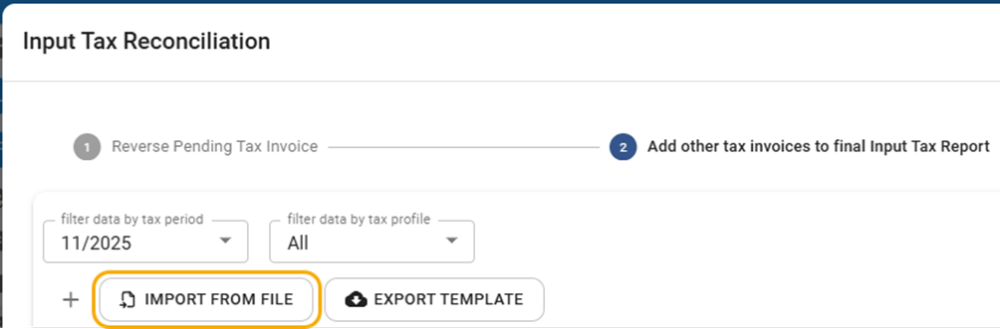

16.3.	ในกรณีที่ข้อมูลไม่ครบถ้วน

16.3.1.	ระบบจะแจ้งเตือนรายละเอียดข้อมูลที่ไม่ถูกต้อง

16.3.2.	ให้ทำการแก้ไขข้อมูลใน Excel ให้ถูกต้องทั้งหมดก่อนทำการ Import อีกครั้ง
 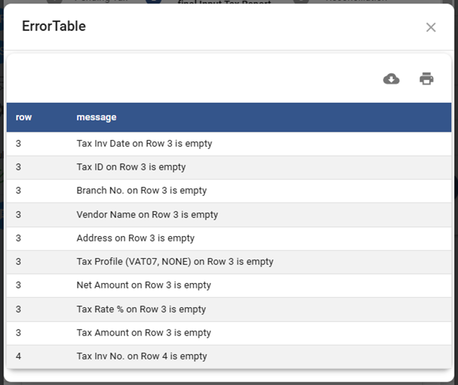
16.4.	ในกรณีที่มีการ Import มาก่อนแล้ว

16.4.1.	ระบบจะแจ้งเตือน “Warning : Data Will Be Overwritten”
-	Click “Yes”, เพื่อยืนยันการ Import โดยระบบจะทำการลบข้อมูลที่เคย Import (Source “Import” เอาไว้ทั้งหมดก่อนนำข้อมูลใหม่เข้าสู่ระบบ
-	Click “No”, เพื่อยกเลิกการ Import
 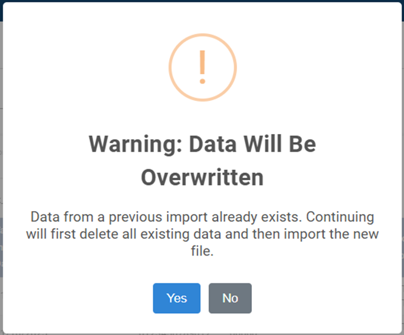
16.5.	ในกรณีที่ข้อมูลครบถ้วน

16.5.1.	เมื่อ import สำเร็จระบบจะแจ้งเตือน Success และกด OK เพื่อเสร็จสิ้น
 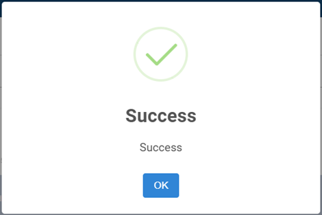
16.5.2.	ระบบจะแสดงข้อมูลใบกำกับภาษีซื้อและแสดง Source “Import”
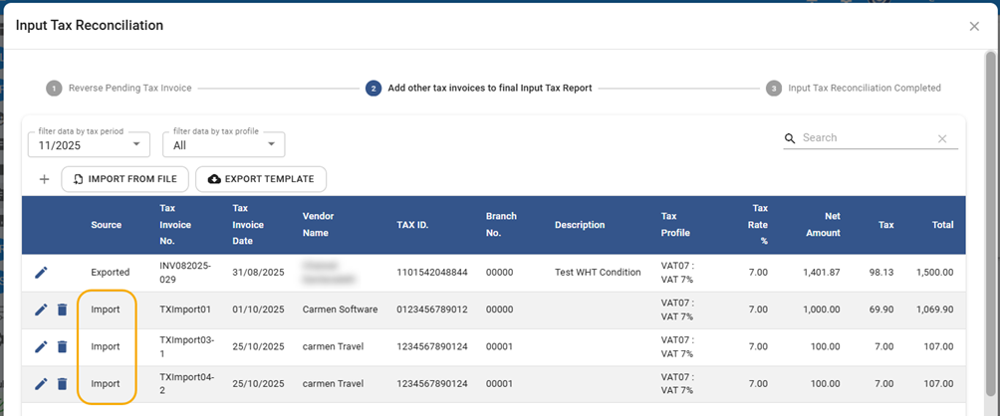

16.6.
## การ Print รายงานภาษีซื้อ Thai version (17)

เมื่อทำการบันทึกใบกำกับภาษีซื้อที่จะใช้ในการนำส่งภาษีของเดือนนั้นเสร็จแล้ว สามารถ Print รายงานภาษีซื้อได้จากหน้าจอ Input Tax Reconciliation ตามขั้นตอนดังนี้

17.	 เมื่อบันทึกข้อมูลใบกำกับภาษีทั้งหมด และกด ปุ่ม **FINISH** จากข้อ 11 ระบบ จะเปิด tab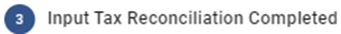

เพื่อทำการ Print หรือ Export รายงานภาษีซื้อ โดยมีขั้นตอนดังนี้

17.1.	กำหนด Tax Period ที่ต้องการ Print หรือ Export รายงานภาษีซื้อ

17.2.	เลือก ”Print Input TAX Report” เพื่อพิมพ์รายงานภาษีซื้อ

17.3.	เลือก ”Export Input TAX xlsx report” file เพื่อ Export รายงานภาษีซื้อให้อยู่ในรูปแบบ Excel

17.4.	เลือก ”Export Input TAX.xlsx file” เพื่อ Export ข้อมูลภาษีซื้อให้อยู่ในรูปแบบ Excel ที่ข้อมูลตรงตาม Column
 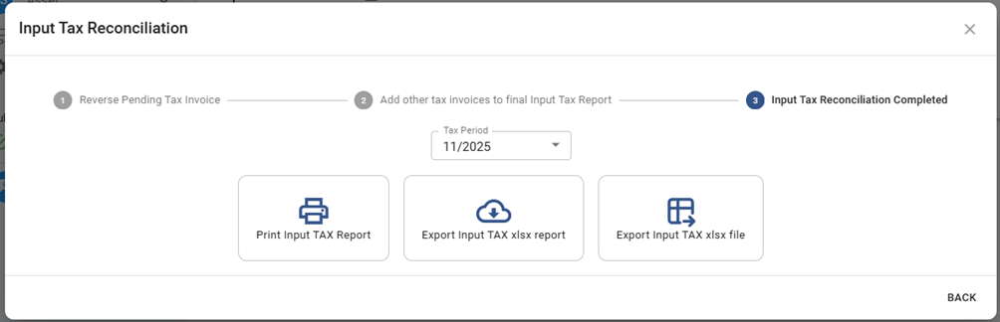
ตัวอย่างรายงานภาษีซื้อ
 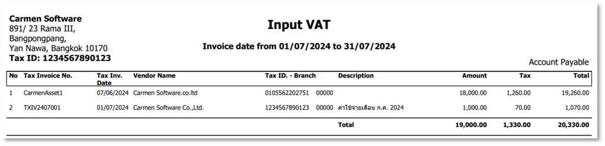

## ขั้นตอนการ Print รายงานภาษีซื้อ Japan Version
1.	Select “Account Payable”
2.	Click “Procedure”
3.	Click “Input Tax Reconciliation”
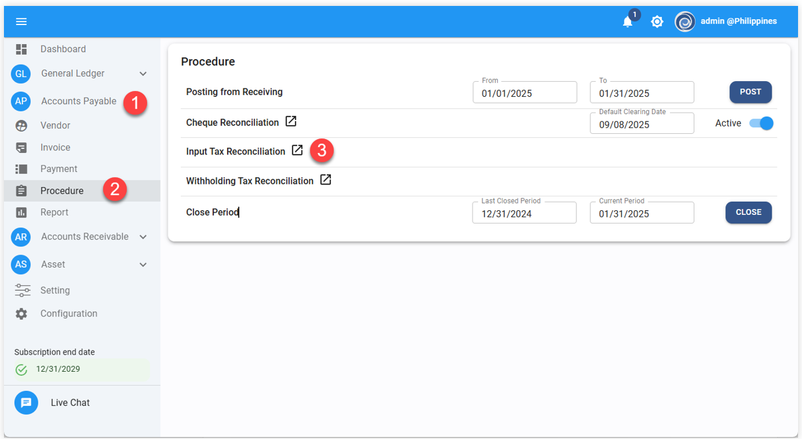
4.	Click “Input Tax Reconciliation Complete”
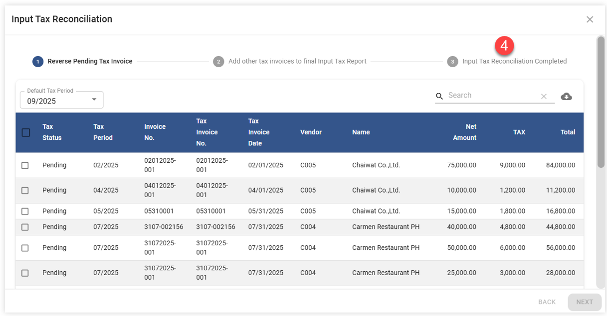
5.	Click “Export Input Tax xlsx file”
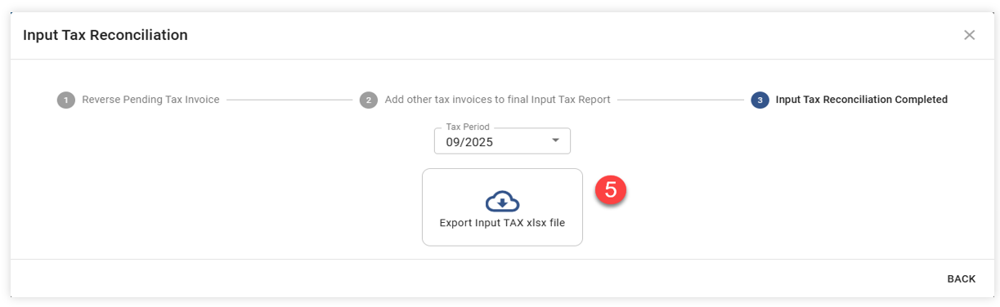

“หลังจากทำการ Export Excel file เรียบร้อยแล้ว ให้ทำการตรวจสอบความถูกต้องทั้งในส่วนของข้อมูล และการจัดหน้ากระดาษ”

6.	ตั้งค่าหน้ากระดาษให้อยู่ใน Scaling ที่ต้องการ
7.	Click "Print Preview" เพื่อตรวจสอบก่อน Print
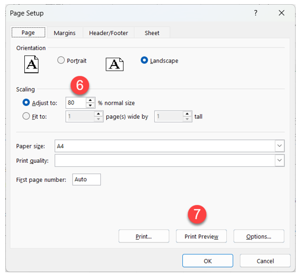
8.	เมื่อตรวจสอบเรียบร้อยแล้ว click "print" เพื่อสั่งพิมพ์เอกสาร
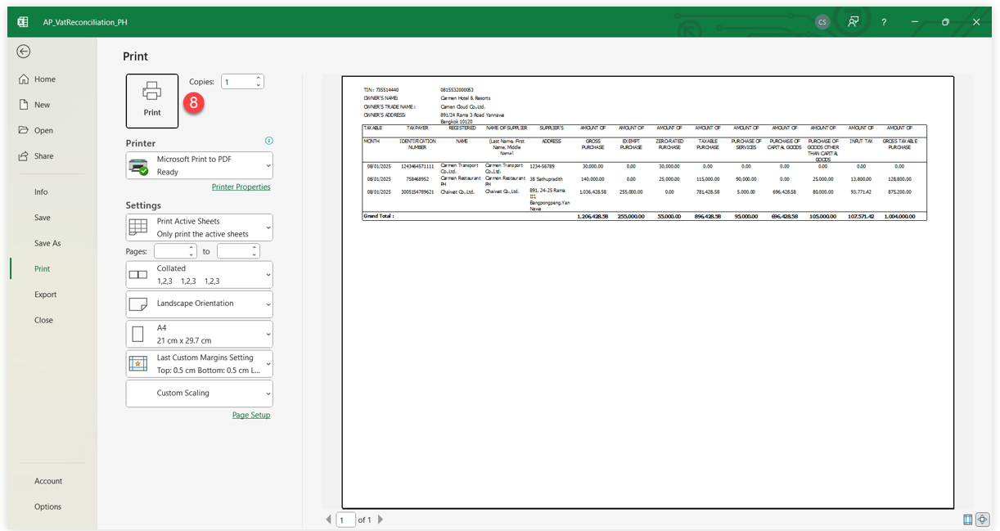

Video ประกอบ

<h3 style="margin: 0;">Input Vat Reconciliation | การตรวจสอบรายการใบกำกับภาษีซื้อ</h3>

<iframe width="560" height="315" src="https://www.youtube.com/embed/9VefhfqbF1A?si=qDpprUdG2-2Z0hD8" title="YouTube video player" frameborder="0" allow="accelerometer; autoplay; clipboard-write; encrypted-media; gyroscope; picture-in-picture; web-share" referrerpolicy="strict-origin-when-cross-origin" allowfullscreen></iframe>

<iframe width="560" height="315" src="https://www.youtube.com/embed/sV4VCwWPUFM?si=PSM2pVFLbhEuVlpu" title="YouTube video player" frameborder="0" allow="accelerometer; autoplay; clipboard-write; encrypted-media; gyroscope; picture-in-picture; web-share" referrerpolicy="strict-origin-when-cross-origin" allowfullscreen></iframe> 

<!-- # Input Tax Reconciliation

Function นี้ใช้สำหรับตรวจสอบใบกำกับภาษี และเลือกรายการเพื่อยืนยันภาษีซื้อ และออกรายงานภาษีซื้อ
สามารถกำหนดให้ระบบทำการบันทึกปรับปรุงยอดภาษีซื้อค้างจ่าย ให้เป็นภาษีซื้อ ใน GL ได้โดยอัตโนมัติ (ในกรณีที่มีการตั้งค่าให้ระบบ Auto Posting Vat Reconcile JV) โดยข้อมูลจะถูกโพสไปบันทึกบัญชีที่ GL เข้า Prefix “TX”

## การยืนยันยอดภาษีซื้อ (Input Tax Reconciliation) (1-5)

1. Click เข้าสู่ Account Payable Module

2. เลือกฟังก์ชัน Procedure ส่วนของ Input Tax Reconciliation 

3. กำหนดในส่วนของ Default tax period เพื่อเลือก Period หรือเดือน ที่ต้องการยืนยันยอดภาษีซื้อ

4. ระบบจะแสดงใบกำกับภาษีทั้งหมดที่ยังไม่ถูกยื่นภาษี หรือ Tax Status เป็น Pending เพื่อให้ผู้ใช้งานทำการตรวจสอบและกระทบยอด (ดูตัวอย่างจากภาพด้านล่าง) ด้วยวิธีการดังต่อไปนี้

4.1. เลือกใบกำกับภาษี โดยการ ☑️ ติ๊กเครื่องหมายถูก ที่ช่องด้านหน้าสุด รายการที่ต้องการยื่นภาษีใน Period หรือ เดือนที่เลือกไว้
ผู้ใช้งานจะสามารถทำการ Update และ แก้ไขข้อมูลใบกำกับภาษีได้ดังต่อไปนี้

- Tax Status > ระบบจะเปลี่ยนจาก Pending ให้เป็น Confirm โดยอัตโนมัติเมื่อติ๊กเครื่องหมายถูก
- Tax Period > ระบบจะเปลี่ยนตาม Default Tax Period ให้โดยอัตโนมัติเมื่อติ๊กเครื่องหมายถูก
- Tax Invoice No. > หมายเลขใบกำกับภาษี หากไม่ถูกต้อง สามารถแก้ไขได้
- Tax Invoice Date > วันที่ใบกำกับภาษี หากไม่ถูกต้อง สามารถแก้ไขได้

4.2. กดปุ่ม **NEXT** เพื่อดำเนินการต่อในขั้นตอนถัดไป

## การกลับบัญชี Input Tax – Undue ใน JV

4.3. ในกรณีที่มีการตั้งค่าให้ระบบ Auto Posting Vat Reconcile JV ระบบจะแสดงข้อความให้ทราบว่า ระบบจะทำการสร้าง JV ที่ Prefix “TX” เพื่อบันทึกปรับปรุงยอดภาษีซื้อค้างจ่าย ให้เป็นภาษีซื้อ ใน GL ได้โดยอัตโนมัติ

- กด **OK** เพื่อยืนยัน
- กด Cancel เพื่อยกเลิก ในกรณีที่ต้องการกลับไปแก้ไขรายการ

## ตัวอย่าง JV จากการกลับบัญชีของระบบ

- ระบบจะบันทึกข้อมูลลงที่ Prefix “TX” ใน GL โดยอัตโนมัติ
- การบันทึกบัญชีนั้นระบบจะ Debit ด้วย Account code ตามการตั้งค่าและ Credit เพื่อกลับบัญชีด้วย Account code ที่บันทึกเอาไว้ในใบกำกับภาษีแต่ละใบ
- การกลับบัญชีจะมีผลกับใบกำกับภาษีที่บันทึกบน A/P Invoice เท่านั้น

4.4. ระบบจะแสดงข้อความเพื่อยืนยันจำนวนใบกำกับภาษีซื้อตาม Status ที่ถูกเลือก
Found Updated data: - transactions จำนวนใบกำกับภาษีทั้งหมดที่ระบบจะทำการอัพเดตข้อมูล
โดยแบ่ง ตาม Status ดังต่อไปนี้นี้
• (Y) Confirm: หมายถึง จำนวน ใบกำกับภาษีที่จะถูกนำส่ง และ ออกรายงานภาษีใน Period หรือ เดือนที่เลือกไว้
• (N) Not confirm: หมายถึง จำนวน ใบกำกับภาษีที่ยังไม่ได้ถูกนำส่ง
• (U) Unclaim: หมายถึง จำนวน ใบกำกับภาษีที่ไม่สามารถยื่นภาษีได้

- กด **OK** เพื่อยืนยัน
- กด Cancel เพื่อยกเลิก ในกรณีที่ต้องการกลับไปแก้ไขรายการ

4.5. เมื่อระบบทำการบันทึกข้อมูลเรียบร้อยแล้วจะแสดงข้อความ Success ตามตัวอย่างภาพด้านล่าง

5. กด **OK** เพื่อเสร็จสิ้นขั้นตอน

## การบันทึกใบกำกับภาษีซื้อจาก module อื่น ๆ เช่น AR และ GL (6-11)

Function ที่ใช้ในกรณี ต้องการเพิ่มเติมรายการในรายงานภาษีซื้อ (Tax Invoice) ที่มีการสั่งซื้อของ ต่างๆ ของบริษัท แต่บันทึกที่ module อื่น ๆ ของระบบ เช่นใบกำกับภาษีซื้อที่ซื้อด้วยเงินสดย่อย หรือ ภาษีซื้อจาก Credit Card Commission เป็นต้น สามารถนำใบกำกับภาษีมาบันทึกเพื่อนำส่ง และ ออกรายงานภาษีซื้อเป็นชุดเดียวกัน

6. ทำตามขั้นตอน 1 และ 2 อีกครั้ง จากนั้น click 

7. เลือก Period หรือเดือนของภาษีซื้อ ที่ต้องการ จะเพิ่มใบกำกับภาษีซื้อ
   ระบบจะแสดงรายการใบกำกับภาษีซื้อที่ถูก Reconcile แล้ว เพื่อเป็นข้อมูลตั้งต้น

8. กดปุ่ม + เพื่อเพิ่มรายการภาษีซื้อ

9. การกรอกรายละเอียดใบกำกับภาษีซื้อ

**หมายเหตุ** เครื่องหมาย \*
(สัญลักษณ์ \* ช่องที่จำเป็นต้องระบุ)

- \* Tax Invoice No > เลขที่ใบกำกับภาษี
- \* Tax Invoice Date > วันที่ในใบกำกับภาษี
- \* Tax ID > ระบุหมายเลขประจำตัวผู้เสียภาษีอากร (13 หลัก)
- \* Branch No > ระบุรหัสสาขา (5 หลัก) เช่น 00000 (รหัสสาขาของสำนักงานใหญ่)
- Vendor กำหนดรหัสร้านค้า หากมีข้อมูลอยู่ในระบบ สามารถปล่อยว่างเอาไว้ได้หากไม่มีข้อมูลในระบบ
- \* Vendor Name > ระบุชื่อร้านค้า หรือชื่อผู้ขายตามใบกำกับภาษี
- Description คำอธิบายเพิ่มเติม
- \* Net Amount > จำนวนเงินก่อนภาษีซื้อ
- \* Tax > จำนวนเงินภาษีซื้อ
- Total จำนวนเงินรวมตามใบกำกับภาษีซื้อ

10. กด **OK** เพื่อบันทึกข้อมูล หรือ Cancel เพื่อยกเลิก

11. กด **FINISH** เพื่อจบขั้นตอนการบันทึกใบกำกับภาษีจาก module อื่น ๆ Source บนหน้าจอใช้ในการระบุแหล่งที่มาของใบกำกับภาษีแต่ละใบโดยแบ่งเป็น 2 รูปแบบ

11.1. Exported คือ ใบกำกับภาษีที่มาจาก A/P Invoice ที่มี Tax Status เป็น Confirm ไม่สามารถลบรายการออกไปได้ แต่สามารถแก้ไขข้อมูลได้บางส่วน และมีวิธีการแก้ไข ดังนี้

- กดที่ช่อง Tax Period เพื่อเลือก Period ที่ต้องการแก้ไข
- กดปุ่ม  หน้ารายการที่ต้องการแก้ไข
- ระบบจะแสดงหน้าต่าง ให้แก้ไขข้อมูลได้บางส่วน ได้แก่ Vendor Name, Tax ID, Branch No

---

11.2. **User** คือ ใบกำกับภาษีที่ ผู้ใช้งานทำการเพิ่มเองในระบบ

## การ Print รายงานภาษีซื้อ (12)

เมื่อทำการบันทึกใบกำกับภาษีซื้อที่จะใช้ในการนำส่งภาษีของเดือนนั้นเสร็จแล้ว สามารถ Print รายงานภาษีซื้อได้จากหน้าจอ Input Tax Reconciliation ตามขั้นตอนดังนี้

12. เมื่อบันทึกข้อมูลใบกำกับภาษีทั้งหมด และกดปุ่ม**FINISH**  จากข้อ 11 ระบบ จะเปิด tab 
เพื่อทำการ Print รายงานภาษีซื้อ โดยมีขั้นตอนดังนี้

    12.1. กำหนด Tax Period ที่ต้องการ Print รายงานภาษีซื้อ

    12.2. เลือก Print Input TAX Report เมื่อต้องการพิมพ์รายงานภาษีซื้อ

    12.3. เลือก Export Input TAX xlsx file เมื่อต้องการ Export ข้อมูลภาษีซื้อเป็นไฟล์ Excel

## ตัวอย่างรายงานภาษีซื้อ

    

Video ประกอบ

<h3 style="margin: 0;">Input Vat Reconciliation | การตรวจสอบรายการใบกำกับภาษีซื้อ</h3>

<iframe width="560" height="315" src="https://www.youtube.com/embed/9VefhfqbF1A?si=qDpprUdG2-2Z0hD8" title="YouTube video player" frameborder="0" allow="accelerometer; autoplay; clipboard-write; encrypted-media; gyroscope; picture-in-picture; web-share" referrerpolicy="strict-origin-when-cross-origin" allowfullscreen></iframe>

<iframe width="560" height="315" src="https://www.youtube.com/embed/sV4VCwWPUFM?si=PSM2pVFLbhEuVlpu" title="YouTube video player" frameborder="0" allow="accelerometer; autoplay; clipboard-write; encrypted-media; gyroscope; picture-in-picture; web-share" referrerpolicy="strict-origin-when-cross-origin" allowfullscreen></iframe> -->