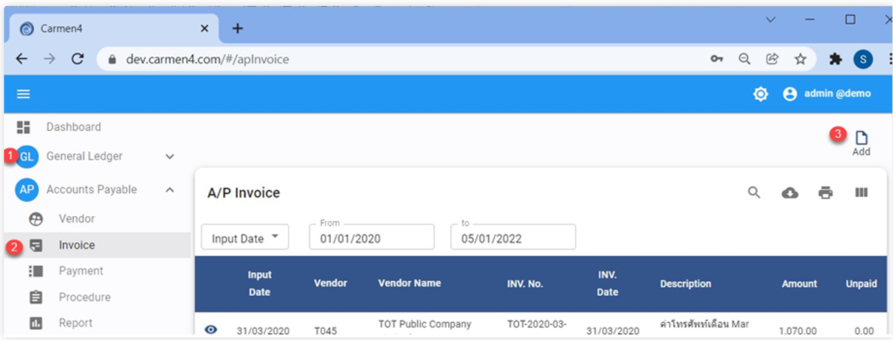
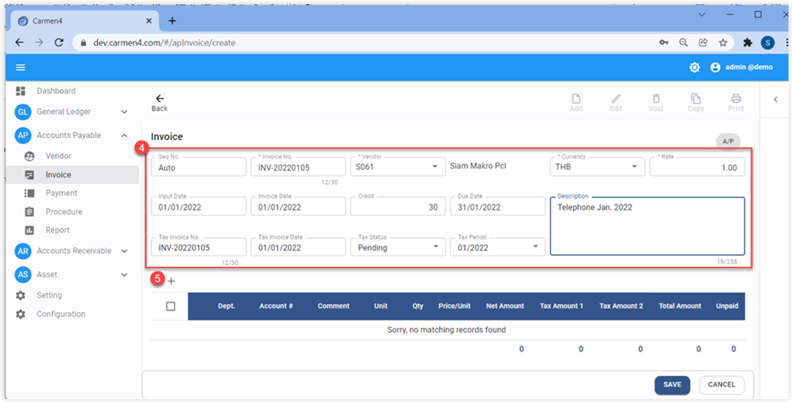
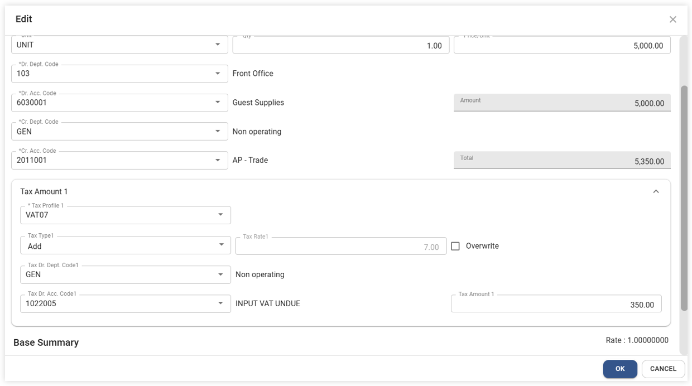
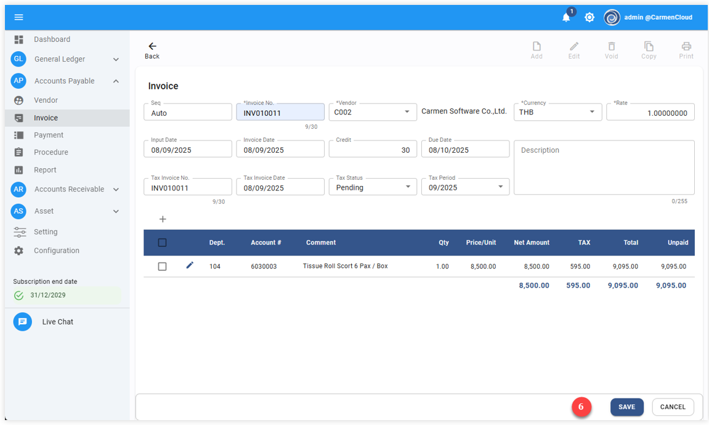
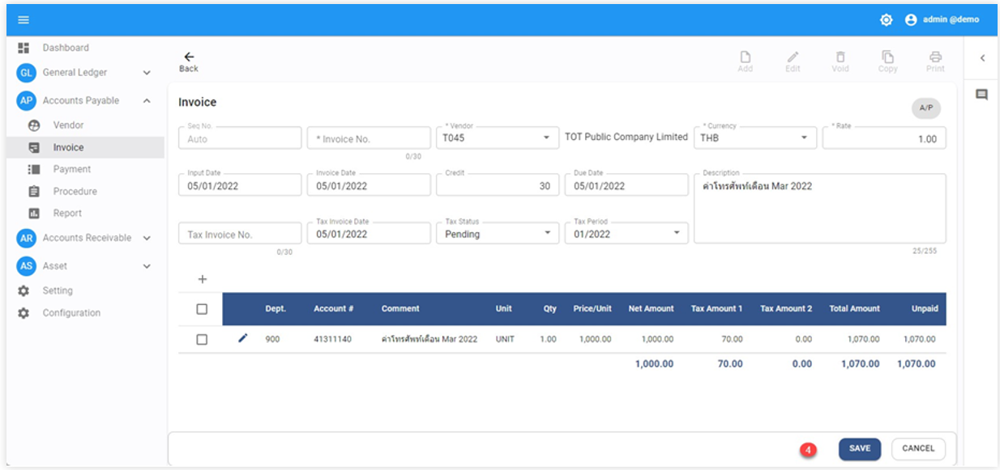
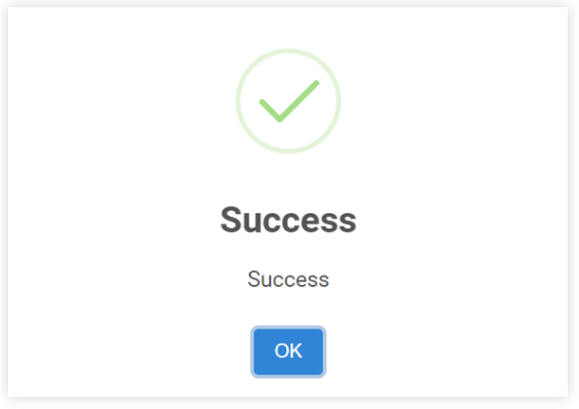

# ขั้นตอนการบันทึก A/P Invoice (User Manual)

A/P Invoice (User Manual)
1.	Click “Account Payable Module”
2.	เลือกฟังก์ชัน Invoice

3.	Click “Add” ระบบจะแสดงหน้า AP Invoice
4.	ให้ผู้ใช้งานระบุข้อมูลของใบแจ้งหนี้ Invoice Header ดังต่อไปนี้ (สัญลักษณ์*ช่องที่จำเป็นต้องระบุ)

Seq No.	เลขลำดับที่ของใบแจ้งหนี้ (ระบบจะกำหนดโดยอัตโนมัติ)

*Invoice No	เลขที่ใบแจ้งหนี้

*Vendor	กำหนดรหัสเจ้าหนี้

*Currency	กำหนดสกุลเงิน

*Rate		อัตราแลกเปลี่ยนเงินตรา

*Input Date	วันที่ตามที่ระบุไว้ในใบแจ้งหนี้

*Invoice Date 	วันที่ตามที่ระบุไว้ในใบแจ้งหนี้

Credit Term 	ระยะเวลาการให้สินเชื่อ(วัน)

Due Date 	วันที่ครบกำหนดชำระเงิน

Tax Invoice No. เลขที่ต้นฉบับใบกำกับภาษี ในกรณีที่ได้รับใบกำกับภาษีแล้วในวันที่บันทึกใบแจ้งหนี้ใบบันทึกได้ทันที แต่หาก ณ วันที่บันทึกใบแจ้งหนี้ยัง ไม่ได้รับต้นฉบับใบกำกับภาษีก็ไม่ต้องบันทึกข้อมูลใด ๆ

Tax invoice Date วันที่ในเอกสารต้นฉบับใบกำกับภาษี

Tax Status 	สถานะของใบกำกับภาษี ในระบบจะแบ่งเป็น 4 สถานะได้แก่

•	 Confirm ขณะที่บันทึกใบแจ้งหนี้ได้รับใบกำกับภาษีแล้วรายการนี้จะไปแสดงในรายงานภาษีซื้อทันที (ถ้าใช้สถานะนี้ควรจะบันทึกรหัสบัญชีเป็น Dr. ภาษีซื้อ)

•	Pending ใบแจ้งหนี้ที่บันทึกยังไม่ได้รับใบกำกับภาษีเมื่อได้รับใบกำกับภาษีในภายหลงัจะถูกบนั ทึกในรายงานภาษีซื้อโดยผ่านฟังก์ชัน Thai Tax Reconciliation ถ้าใช้ถานะนี้ควรจะบันทึกรหัสบัญชีเป็น Dr. ภาษีซื้อตั้งพักไว้

•	 Un claim ใบกำกับภาษีซื้อที่ไม่สามารถขอคืนได้

•	None ใบแจ้งหนี้ที่ไม่มีภาษีซื้อ Tax Period กำหนด Period ที่จะยื่นภาษีมูลค่าเพิ่ม Description ระบุรายละเอียดของใบแจ้งหนี้

5.	Click “    ” เพื่อเพิ่มข้อมูลในส่วนของInvoice Detail ระบบจะแสดงหน้าต่างขึ้นมาให้ระบุข้อมูลดังต่อไปนี้

*	Comment ใส่รายละเอียดรายการสินค้า หรือ บริการ
*	Unit หน่วยซื้อ
*	Qty. จำนวนที่ซื้อ
*	Price/Unit ราคาต่อหน่วย
*	Dr Acc Code รหัสบัญชีค่าใช้จ่าย
*	Cr Acc. Code รหัสบัญชีเจ้าหนี้การค้า
Tax Amount 1 คือ การภาษีมูลค่าเพิ่ม
*	Tax Profile1 เลือกประเภทภาษีมูลค่าเพิ่ม (None, VAT07)
*	Tax Type กำหนดประเภทการคำนวณภาษี ดังนี้
a)	None ไม่มีภาษีมูลค่าเพิ่มในราคาสินค้า หรือ บริการ
b)	Addบวกภาษีมูลค่าเพิ่ม ในราคาสินค้า หรือ บริการ
c)	Include มีภาษีมูลค่าเพิ่มรวมอยู่ในราคาสินค้า หรือ บริการแล้ว
Tax Rate 1 ระบุเปอร์เซ็นต์ร้อยละของฐานภาษีมูลค่าเพิ่ม
*	Dr. Acc. Code (Tax 1) ระบุรหัสบัญชีสำหรับการบันทึกบัญชีภาษีมูลค่าเพิ่ม
Overwrite ใช้ในกรณีต้องการแก้ไข ภาษีมูลค่าเพิ่ม ให้ติ๊กเครื่องหมายถูกที่ช่องนี้ กรณีที่ติ๊กเครื่องหมายถูกที่ช่อง Overwrite ให้พิมพ์ ยอดภาษีที่ช่อง Tax Amount 1
*	Click “OK” เมื่อบันทึกข้อมูลเสร็จสิ้น

6.	ตรวจสอบความถูกต้อง เมื่อ เรียบร้อยแล้ว Click “Save”

หากมีมากกว่า 1 รายการ ให้ท˚าตามขั้นตอนที่ 5-7 จนครบ จากนั้น Click “Save” ด้านล่างขวามือเพื่อบันทึก A/P Invoice
A/P Invoice (Copy)
กรณีที่ต้องการคัดลอกใบแจ้งหน้าที่เคยมีอยู่ในระบบ มาสร้างเป็นใบแจ้งหนี้ใบใหม่ ฟังก์ชันนี้จะช่วยให้ผู้ใช้ทำงาน สะดวกและรวดเร็วมากขึ้น โดยในระบบมีวิธีการดังต่อไปนี้
1.	เข้าไปที่ A/P Invoice ที่ต้องการจะคัดลอก
2.	Click “Copy” ด้านบนขวามือ

•	ระบบจะแสดงหน้า Invoice ใบใหม่ ให้ User ตรวจสอบ เพิ่มเติม หรือ แก้ไข ข้อมูลตามที่ต้องการ
•	Click “Save” เพื่อบันทึก A/P Invoice
•	เมื่อระบบทำการบันทึกข้อมูลเรียบร้อยแล้ว จะขึ้นหน้าต่างแสดงข้อความ Success ให้ Click “OK”

Video ประกอบ

<h3 style="margin: 0;">Invoice | การสร้างใบแจ้งหนี้</h3>

<iframe width="560" height="315" src="https://www.youtube.com/embed/R69tQPAHvvQ?si=PBx7dNUed3E9i6Cb" title="YouTube video player" frameborder="0" allow="accelerometer; autoplay; clipboard-write; encrypted-media; gyroscope; picture-in-picture; web-share" referrerpolicy="strict-origin-when-cross-origin" allowfullscreen></iframe>