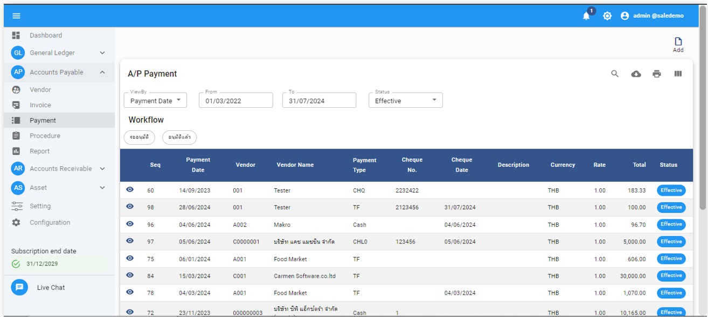
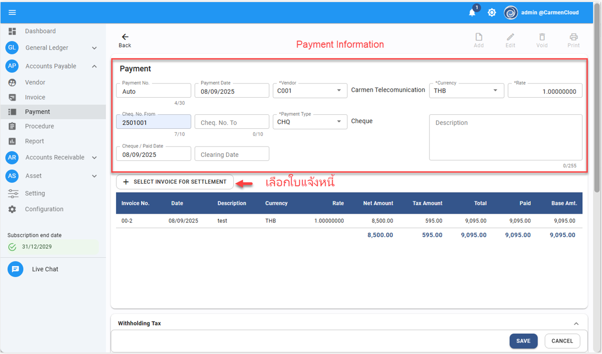
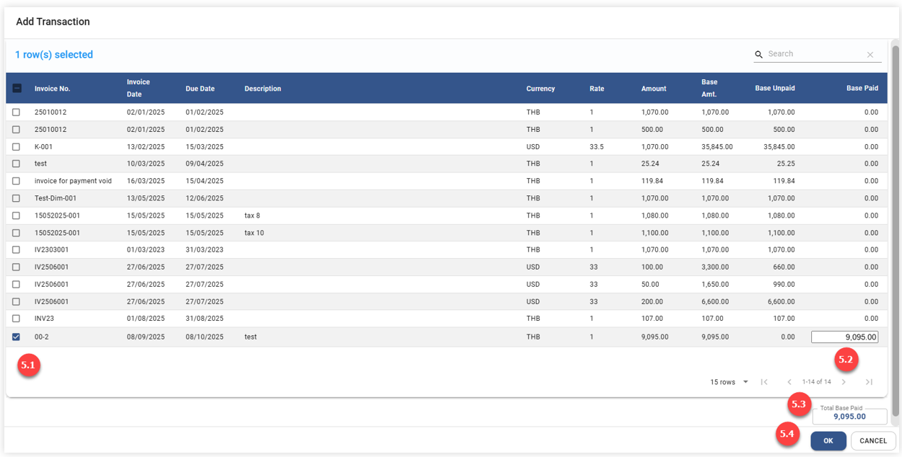
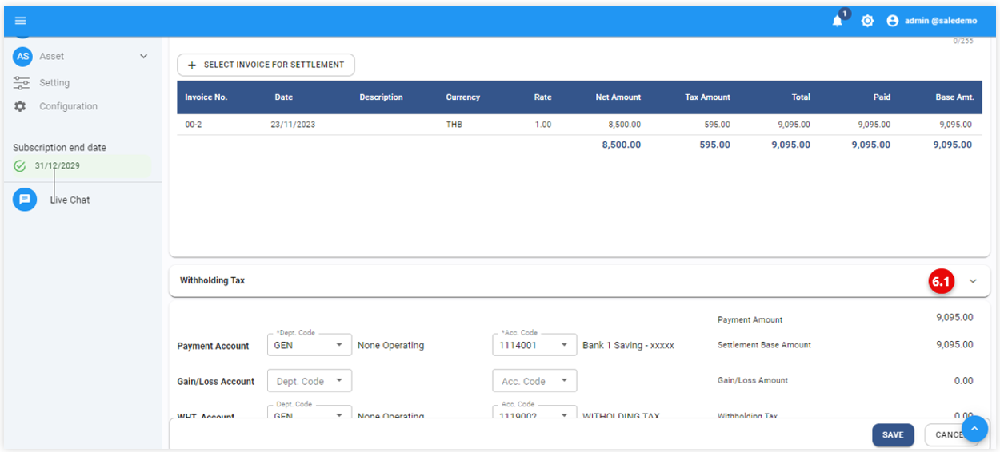
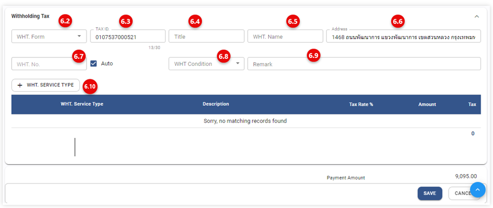
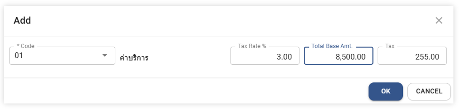
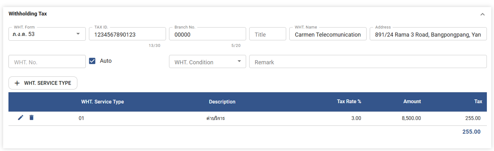
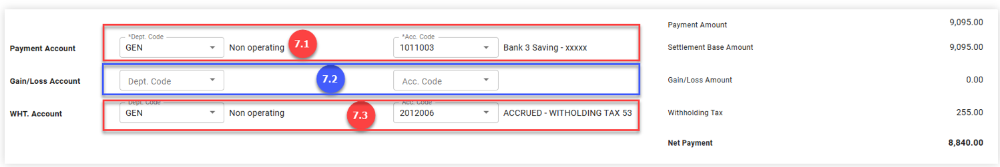
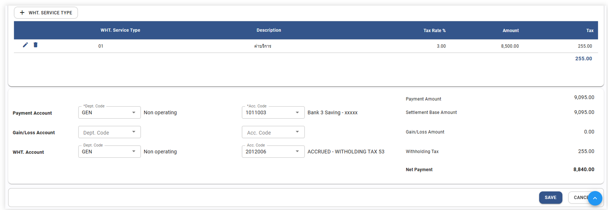
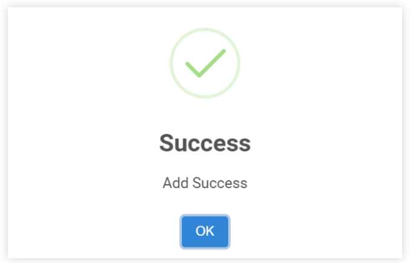

# ขั้นตอนการตัดชำระหนี้ A/P Payment
1. เข้าสู่ Account Payable Module 
2. เลือกฟังก์ชัน Payment ระบบจะแสดงหน้าจอ ตามภาพด้านล่าง

3. Click ระบบจะแสดงหน้าจอ Payment Blank Form เพื่อให้ระบุข้อมูลการชำระเงิน
4. ให้ผู้ใช้งาน ระบุข้อมูลของPayment ดังต่อไปนี้ (*ช่องที่จำเป็นต้องระบุ)

*	Payment No เลขลำดับที่ของใบชำหระหนี้ (ระบบจะกำหนดโดยอัตโนมัติ) 
*	Payment Date วันที่สร้างเอกสารทำจ่าย (Payment Prepare)
*	Vendor ระบุรหัสหรือชื่อเจ้าหนี้ (สามารถพิมพ์รหัสลงในช่อง *Vendor ได้เลย)
*	Currency ระบุสกุลเงิน (ระบบจะทำการ Default ข้อมูลไว้ให้)
*	Rate ระบุอัตราแลกเปลี่ยนเงินตรา (ระบบจะทำการ Default ข้อมูลไว้ให้)
*	Cheque No. From ระบุเลขที่เช็คเริ่มต้นเมื่อมีการสั่งจ่ายเจ้าหนี้ด้วยเช็คธนาคาร
*	Cheque No. To ระบุเลขที่เช็คสุด้ายเมื่อมีการสั่งจ่ายเจ้าหนี้ด้วยเช็คธนาคารมากกว่า 1 ใบ
*	Payment Type ระบุประเภทการชำระ เช่น Cash, Cheque หรือ Bank Transfer
*	Cheque Date/Paid Date วันที่ Cheque/ วันที่สั่งจ่ายเช็ค (ให้ระบุวันที่จ่ายทุกประเภทการสั่งจ่ายในช่อง Cheque Date)
•	Clearing Date วันที่เคลียร์ริงเช็ค สามารถบันทึกวันที่ เคลียร์ริงเช็คได้ที่ช่องนี้ หรือผ่านขั้นตอนการกระทบยอดเช็คจ่าย (Cheque Reconciliation)

5. กดปุ่ม เพื่อเลือก Invoice ที่จะนำไปตัดชำระ

5.1) ติ๊กเครื่องหมายถูก ☑ หน้ารายการที่จะนำไปชำระ

5.2) ตรวจสอบยอดที่จะจ่ายที่ช่อง Paid กรณีต้องการจ่ายบางส่วน ใหคีย์ยอดที่จ่ายลงไปที่ช่องนี้ 

5.3) แสดงยอดเงินรวมของใบแจ้งหนี้ (Total Amount Invoice)

5.4) กดปุ่ม OK ระบบจะนำเอกสารที่เลือกไว้ไปแสดงในหน้า Payment
 

6. การเพิ่ม With Holding Tax (ภาษีหัก ณ ที่จ่าย) ในกรณีมีภาษีหัก ณ ที่จ่าย

6.1) คลิกที่ช่อง Withholding Tax > ระบุข้อมูลดังต่อไปนี้ 
 

6.2) WHT Form เลือกประเภทการหัก ณ ที่จ่าย เช่น ภงด. 3 หรือ ภงด. 53

6.3) Tax ID ระบุเลขที่ผู้เสียภาษี

6.4) Title ระบุคำนำหน้าชื่อ เช่น นาย นางสาว (กรณีหัก ณ ที่จ่าย ภงด.3)  

6.5) WHT Name ระบุชื่อสำหรับจะนำไปยื่นภาษีหัก ณ ที่จ่าย

6.6) Address ระบุที่อยู่สำหรับจะนำไปยื่นภาษีหัก ณ ที่จ่าย

6.7) WHT. No ระบุเลขที่เอกสาร (เบื้องต้นระบบสร้างเลขที่เอกสารให้อัตโนมัติ)

6.8) WHT Condition ระบุเงื่อนไขการหัก ณ ที่จ่าย

6.9) Remark ระบุข้อมูลรายละเอียด เพิ่มเติม (จะระบุหรือไม่ระบุก็ได้)

6.10) Click Menu เพิ่มรายการประเภทการชำระภาษี หัก ณ ที่จ่าย 

 
หากมีการกำหนดเงื่อนไขการหักภาษี ณ ที่จ่ายจาก Vendor Information หรือมีการระบุบริการในขั้นตอน Payment ระบบจะ Default Value ยอดหัก ณ ที่จ่าย 

•	*Code กำหนดประเภทการชำระภาษีหัก ณ ที่จ่าย เช่น ค่าบริการ, ค่าจ้าง เป็นต้น

•	Tax Rate (%) ระบุอัตราภาษีหัก ณ ที่จ่าย

•	Total Base Amount ระบุยอดที่จะน าไปคำนวณภาษีหัก ณ ที่จ่าย

•	Tax Amount ยอดภาษี หัก ณ ที่จ่าย ระบบจะคำนวณให้อัตโนมัติ หรือ user สามารถคีย์ยอดภาษีหัก ณ ที่จ่ายได้เองที่ช่องนี้

•	กดOKเพื่อบันทึกรายการ 

•	หากมีมากกว่า 1 รายการให้ทำตามขั้นตอนในข้อ 6.9) จนครบ 

ระบบจะแสดงหน้าจอ ตัวอย่างตามภาพด้านล่าง 
- กดในกรณีต้องการแก้ไขข้อมูลประเภท หัก ณ ที่จ่าย
- กดในกรณีต้องการ ลบ ข้อมูลประเภท หัก ณ ที่จ่าย

7. เลื่อน scroll bar ลงที่ด้านล่างสุด ให้กำหนดรหัสผังบัญชีที่จะใช้บันทึกบัญชีไปที่ General Ledger Module ดังต่อไปนี้

 	7.1) Payment Accountก าหนดรหัสบัญชีที่จะใช้บันทึกการตัดจ่าย เช่น บัญชี Bank  

•	*Dept. Code กำหนด Department Code สำหรับใช้บันทึกบัญชี

•	*Acc. Code กำหนด Account Code สำหรับใช้บันทึกบัญชี

7.2) Gain/Loss account กำหนดรหัสบัญชีที่จะใช้บันทึกยอดส่วนต่างจากอัตราการแลกเปลี่ยน (หากมีต้องระบุ)

•	Dept. Code กำหนด Department Code สำหรับใช้บันทึกบัญชี

•	Acc. Code กำหนด Account Code สำหรับใช้บันทึกบัญชี

7.3) WHT. Account ก าหนดรหัสบัญชีที่จะใช้บันทึก ภาษี หัก ณ ที่จ่าย

•	*Dept. Code กำหนด Department Code สำหรับใช้บันทึกบัญชี

•	*Acc. Code กำหนด Account Code สำหรับใช้บันทึกบัญชี

8. ตรวจสอบยอดที่แสดงในส่วนของ Summary ด้านล่างขวามือ

•	Payment Amount ยอดเงินรวมสำหรับตัดชำระหนี้

•	Settlement Base Amount ยอดเงินสำหรับจะตัดชาระหนี้แปลงตามสกุลเงินหลัก (Base Currency) 

•	Gain/Loss ยอดเงินส่วนต่างที่เกิดจากอัตราการแลกเปลี่ยน Rate Currency 

•	Withholding Tax ยอดภาษีหัก ณ ที่จ่าย 

•	Net Payment ยอดสุทธิหลังจากหักภาษี ณ ที่จ่าย สำหรับตัดชำระหนี้ 

9. กดปุ่ม             เพื่อบันทึกข้อมูล
 
10. เมื่อระบบทำการบันทึกข้อมูลเรียบร้อยแล้ว ระบบจะแสดงข้อความ Success ให้กดปุ่ม OK 

<iframe width="560" height="315" src="https://www.youtube.com/embed/sqoL-_wDfZ4?si=7Mv8diqm8hk_37If" title="YouTube video player" frameborder="0" allow="accelerometer; autoplay; clipboard-write; encrypted-media; gyroscope; picture-in-picture; web-share" referrerpolicy="strict-origin-when-cross-origin" allowfullscreen></iframe>

<iframe width="560" height="315" src="https://www.youtube.com/embed/93AS2d1HLls?si=9rtsH0lKPSQI_L5v" title="YouTube video player" frameborder="0" allow="accelerometer; autoplay; clipboard-write; encrypted-media; gyroscope; picture-in-picture; web-share" referrerpolicy="strict-origin-when-cross-origin" allowfullscreen></iframe>
