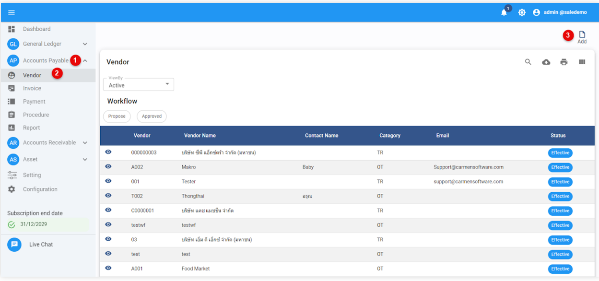
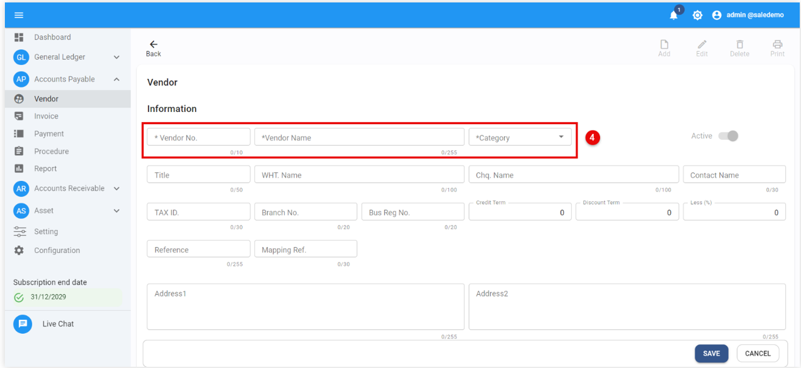
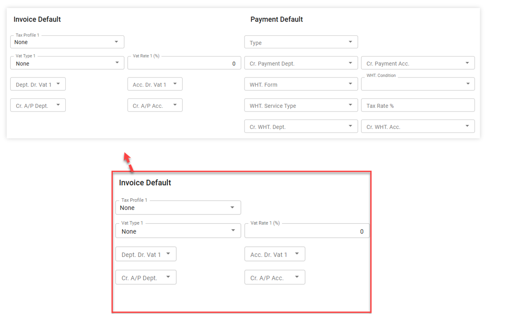
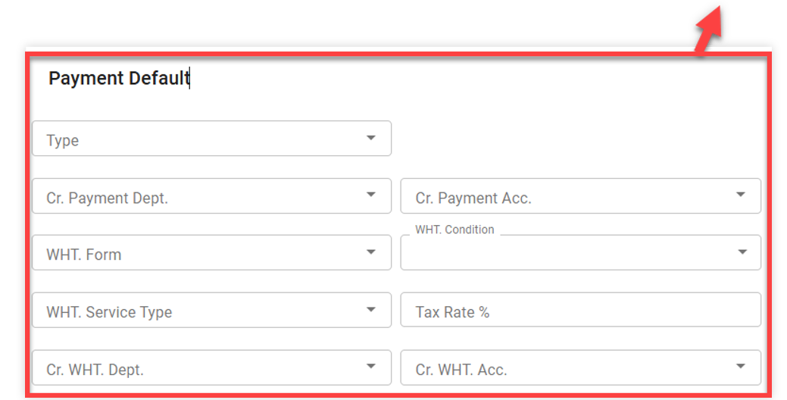
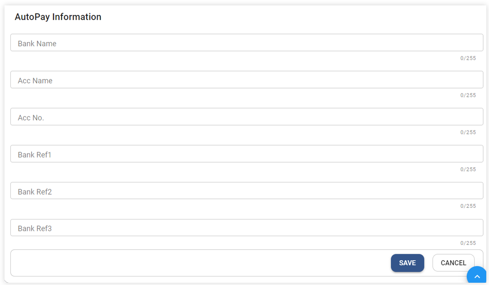
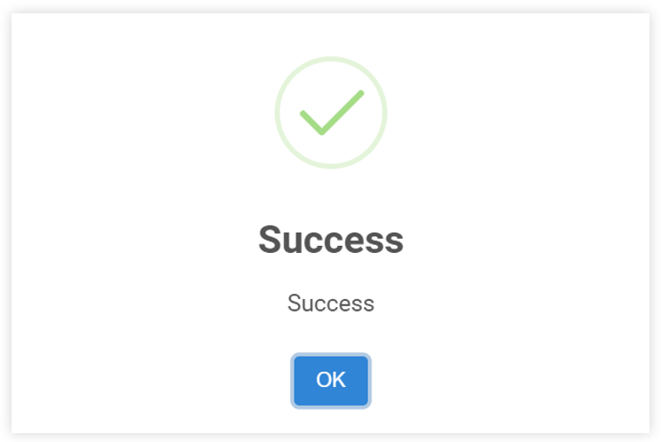

# ขั้นตอนการสร้างข้อมูลร้านค้า หรือ ผู้ขายในระบบ (Create Vendor)

1. คลิกเข้าสู่ Account Payable Module
2. กดปุ่ม Vendor เพื่อเข้าใช้งานการสร้าง Vendor
3. กดปุ่ม Add เพื่อสร้างเอกสาร

4. ให้ใส่ข้อมูลของร้านค้า หรือ ผู้ขายในระบบ (Vendor Profile) ดังต่อไปนี้
หมายเหตุ   เครื่องหมาย * ช่องที่จำเป็นต้องระบุ

•	 Vendor No. กำหนดรหัสร้านค้า

•	 Vendor Name ระบุชื่อร้านค้า หรือ ชื่อผู้ขาย (สามารถระบุข้อมูลได้ทั้งภาษาไทยและภาษาอังกฤษ)

•	 Vendor Category) ระบุหมวดหมู่สินค้าสำหรับร้านค้า

•	Status Active เปิดใช้งาน

•	In-active ปิดไม่ให้ใช้งาน

•	Title ระบุคำนำหน้าชื่อ กรณีในนามของบุคคลเช่น นาย นางสาว ยศ(ถ้ามี)

•	WHT. Name ชื่อที่ใช้แสดงบนรายงาน หรือ แบบฟอร์ม Withholding Tax(ถ้ามี)

•	Cheque. Name ชื่อที่ใช้ในการprint เช็คผ่านระบบ (ถ้ามี)

•	Attn ระบุชื่อข้อมูล ของผู้ที่ติดต่อ หรือ บุคคลอ้างอิง (ถ้ามี)

•	Tax ID ระบุหมายเลขประจ าตัวผู้เสียภาษีอากร

•	Branch No. ระบุรหัสสาขา เช่น 00000 (รหัสสาขาของส านักงานใหญ่)

•	Bus. Reg. No. ระบุหมายเลขจดทะเบียนการค้า

•	Credit Term ระบุจำนวนวัน ที่ได้รับสินเชื่อจากร้านค้า หรือ ผู้ขาย

•	Discount Term ระบุจำนวนวัน จะได้รับส่วนลด หากชำระหนี้ก่อนกา หนด

•	Less (%) เปอร์เซ็นต์ที่ได้รับส่วนลด

•	Address1 ระบุที่อยู่ของร้านค้า หรือ ผู้ขาย (ใช้เป็นที่อยู่หลักในการแสดงรายงาน)

•	Tel: หมายเลขโทรศัพท์

•	Email ระบุ Email ของร้านค้า หรือ ผู้ขาย

•	Address2 ระบุที่อยู่ของร้านค้า หรือ ผู้ขาย(ถ้ามี)

•	Tel: หมายเลขโทรศัพท์(ถ้ามี)

•	Email ระบุ Email ของร้านค้า หรือ ผู้ขาย(ถ้ามี)

Invoice & Payment Default

Invoice Default

•	Tax Profile > การกำหนด Tax Profile จะช่วยให้การคำนวณภาษีที่มีหลายประเภทภาษีที่มีกำหนด Tax Rate ต่างกันให้เกิดความถูกต้องและแม่นยำมากขึ้นต่างกัน

•	Vat Type 1 > กำหนดประเภทภาษีมูลค่าเพิ่มในรายการสินค้า / บริการของร้านค้า ในระบบจะมีให้
เลือก 3 ประเภท ได้แก่

a)	None ไม่มีภาษีมูลค่าเพิ่มในราคาสินค้า หรือ บริการ

b)	Add บวกภาษีมูลค่าเพิ่ม ในราคาสินค้า หรือ บริการ

c)	Include มีภาษีมูลค่าเพิ่มรวมอยู่ในนราคาสินค้า หรือ บริการแล้ว

Vat Rate 1 ระบุเปอร์เซ็นต์ร้อยละของฐานภาษีมูลค่าเพิ่ม

-	Dept. Dr. Vat 1 ระบุรหัสแผนกในส่วนของรหัสบัญชีภาษีซื้อ เช่น GEN
-	Acc. Dr. Vat 1 ระบุรหัสบัญชีในส่วนของภาษีซื้อ (Input Tax or Input Tax Undue)

Payment Default
    2.1 Type ให้ระบุPayment Type ประเภทการจ่ายเงิน
-	Cr. Payment Dept. ให้ระบุ Department Code ในการบันทึกบัญชีการจ่ายเช่น GEN
-	Cr. Acc Code ให้ระบุ Account Code ในการบันทึกบัญชีการจ่าย
    2.2 WHT. Form กำหนดประเภท ภงด. ภาษีหัก ณ ที่จ่าย เช่น ภงด. 3/ ภงด. 53
-	WHT. Condition สามารถเลือกเงื่อนไขการหัก ณ ที่จ่าย ได้ 3 แบบ คือ
A. หัก ณ ที่จ่าย
B. ออกให้ตลอดไป
C. ออกให้ครั้งเดียว
-	WHT. Service Type เลือกประเภทการหัก ณ ที่จ่าย
-	กำหนดสัดส่วนที่นำหักภาษี ให้ระบุเป็นปอร์เซ็นต์
-	WHT. Dept ให้ระบุ Department Code ในการบันทึกบัญชีภาษีหัก ณ ที่จ่ายเช่น GEN
-	Cr. Acc Code ให้ระบุ Account Code ในการบันทึกบัญชีภาษีหัก ณ ที่จ่ายเช่น GEN

AutoPay Information
-	Bank Name: ชื่อธนาคารของ Supplier
-	Acc Name: ชื่อบัญชีธนาคารของ Supplier
-	Acc No.: รหัสบัญชีนาคารของ Supplier
-	Bank Ref3: ระบุ Bank Code (รหัสธนาคาร)
5. กดปุ่ม Save เพื่อบันทึกข้อมูล

6. เมื่อระบบทำการบันทึกข้อมูลเรียบร้อยแล้ว ระบบจะแสดงข้อความ Success และให้กดปุ่ม OK

Video ประกอบ

<h3 style="margin: 0;">Vendor Profile | การสร้างทะเบียนเจ้าหนี้</h3>

<iframe width="560" height="315" src="https://www.youtube.com/embed/UxqNS-B6QjA?si=RZeQQv4RsmboU2_B" title="YouTube video player" frameborder="0" allow="accelerometer; autoplay; clipboard-write; encrypted-media; gyroscope; picture-in-picture; web-share" referrerpolicy="strict-origin-when-cross-origin" allowfullscreen></iframe>

<iframe width="560" height="315" src="https://www.youtube.com/embed/ehsdGhm58D0?si=mcZR8p_srYOkAJ4j" title="YouTube video player" frameborder="0" allow="accelerometer; autoplay; clipboard-write; encrypted-media; gyroscope; picture-in-picture; web-share" referrerpolicy="strict-origin-when-cross-origin" allowfullscreen></iframe>