# Withholding Tax Reconciliation

ขั้นตอนการกระทบยอดหรือยันยันยอดภาษีหัก ณ ที่จ่าย

Function นี้ใช้สำหรับตรวจสอบรายการภาษีหัก ณ ที่จ่าย จากเอกสาร Payment และใช้ในกรณีที่ต้องการเพิ่มรายการภาษีหัก ณ ที่จ่าย ที่เกิดจากการซื้อด้วย Petty Cash (เงินสดย่อย) และการบันทึกจาก module อื่น ๆ ในระบบ สามารถนำมาบันทึกเพื่อนำส่ง และ ออกรายงานภาษีหัก ณ ที่จ่าย เป็นชุดเดียวกัน

Withholding Tax Reconciliation จะประกอบด้วย function การทำงาน 4 ส่วน

A การตรวจสอบรายการภาษีหัก ณ ที่จ่าย (1-6)

B การบันทึกรายการภาษีหัก ณ ที่จ่ายจาก module อื่นๆ ในระบบ (7)

C ขั้นตอนการ Print รายงานภาษีหัก ณ ที่จ่าย (BIR FORM 1604E - SCHEDULE 3)

D ขั้นตอนการ Print “Certificate of Creditable Tax Withheld at Source” (BIR FORM 2307 01/18ENCS)

## A การตรวจสอบรายการภาษีหัก ณ ที่จ่าย จากระบบมีวิธี ดังต่อไปนี้ (1-6)

1.	คลิกเข้าสู่ Account Payable Module
2.	เลือกฟังก์ชัน Procedure ส่วนของ Withholding Tax Reconciliation
3.	ไปที่เมนูคำสั่ง Withholding Tax Reconciliation
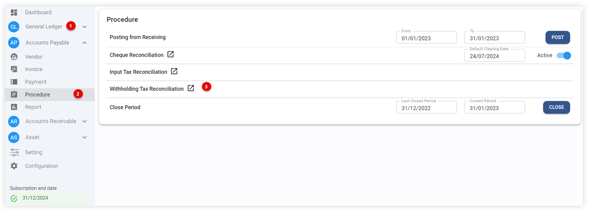
ระบบจะเข้าสู่หน้าจอ  Withholding Tax Reconciliation

4.	ให้ระบุ เดือน และปี ในช่อง Month และ Year เพื่อดูข้อมูลภาษีหัก ณ ที่จ่ายของเดือนและปีที่ต้องการ
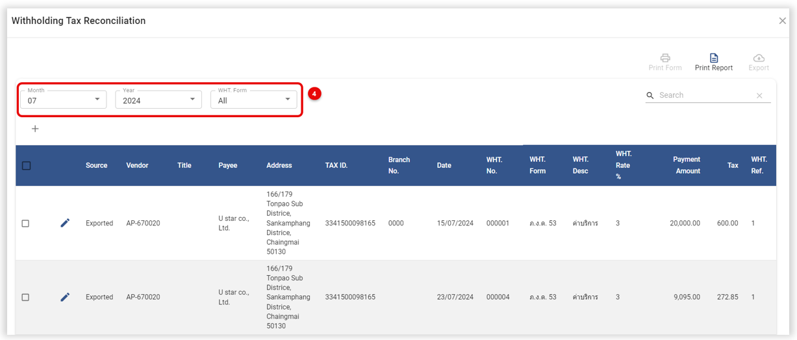
5.	ระบบจะนำรายการ ภาษีหัก ณ ที่จ่าย จากการทำ Payment มาแสดง ตามตัวอย่างจากภาพด้านล่าง
หมายเหตุ * รายการภาษีหัก ณ ที่จ่าย จะแสดงวันที่ ตาม Payment Date หรือ Cheque Date ขึ้นอยู่กับการตั้งค่า
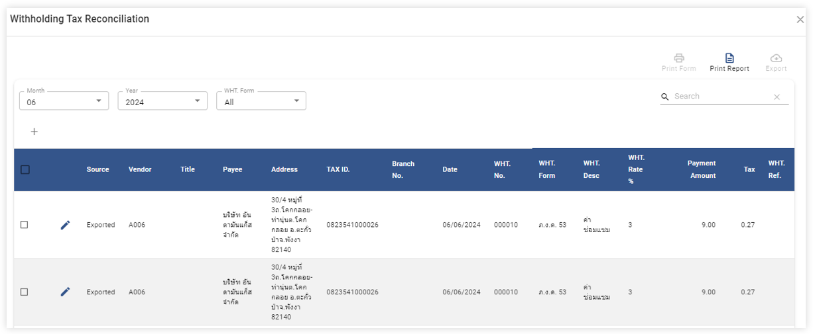
6.	ในระบบจะแบ่งข้อมูลออกเป็น 2 Source โดยแต่ละ Source จะมีที่มาและรายละเอียดดังนี้
หมายเหตุ * Source ใช้ในการระบุแหล่งที่มาของรายการภาษีหัก ณ ที่จ่าย แต่ละใบโดยแบ่งเป็น 2 ประเภทดังนี้

6.1	Exported คือ รายการที่ Export มาจาก AP Payment ไม่สามารถลบรายการออกไปได้ แต่สามารถแก้ไขข้อมูลได้บางส่วน ได้แก่ Payee, 
Address, Tax ID, Branch No โดยวิธีการแก้ไข ดังนี้

-	กดปุ่ม หน้ารายการที่ต้องการแก้ไข 
-	ระบบจะแสดงหน้าต่าง ให้แก้ไขข้อมูลได้บางส่วน ได้แก่ Payee ,Address, Tax ID, Branch No
-	กดปุ่มเพื่อบันทึกรายการ
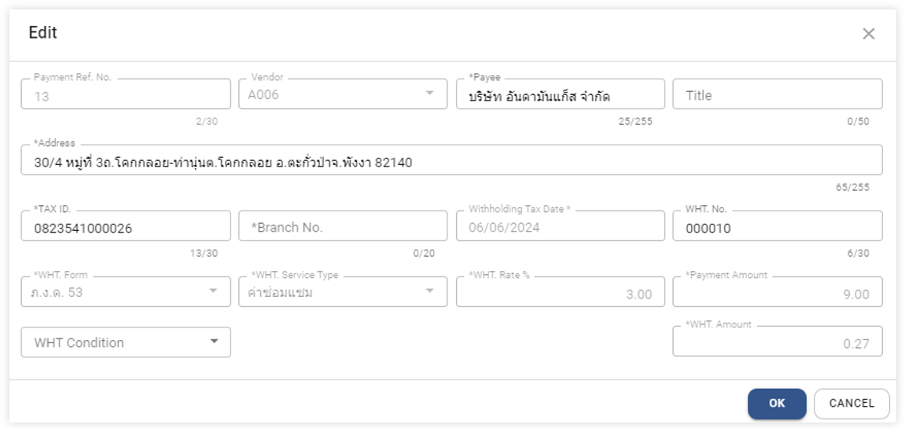

6.2	User คือ รายการที่ ผู้ใช้งาน ทำการเพิ่มเองในระบบ 

## B การบันทึกรายการภาษีหัก ณ ที่จ่ายจาก module อื่นๆ ในระบบ (7) (สำหรับ Philippines)

ใช้สำหรับการบันทึกรายการภาษีหัก ณ ที่จ่าย ที่เกิดจากการซื้อด้วย Petty Cash (เงินสดย่อย) และการบันทึกจาก module อื่น ๆ ในระบบ สามารถนำมาบันทึกเพื่อนำส่ง และ ออกรายงานภาษีหัก ณ ที่จ่าย เป็นชุดเดียวกัน

7.	ขั้นตอนการบันทึกรายการภาษีหัก ณ ที่จ่ายเพิ่มเติมมีดังนี้

7.1	กดปุ่ม + เพื่อเพิ่มรายการ
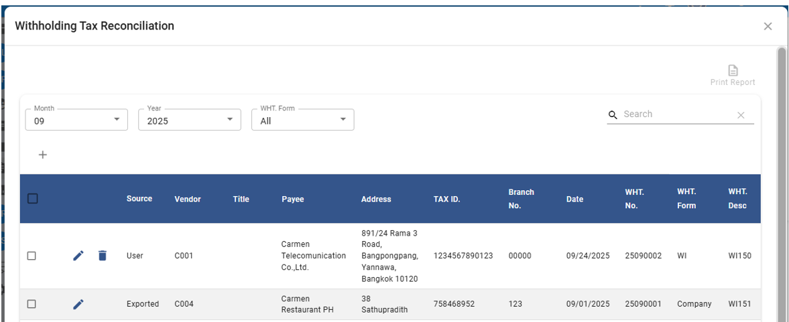
7.2	ระบบจะแสดงหน้าต่างให้ระบุข้อมูล ดังต่อไปนี้

หมายเหตุ : เครื่องหมาย *  คือช่องที่จำเป็นต้องกรอกข้อมูล 
-	Payment Ref. No > เลขที่ Payment หรือเลขที่ถูกระบุด้วยตนเอง หรือเลขที่ที่เกิดจากระบบสร้างอัตโนมัติ
-	Vendor	> ระบุ Vendor Code 
-	*Payee > ชื่อผู้ถูกหักภาษีตามรหัส Vendor ที่ถูกเลือก
-	Address > ที่อยู่ผู้ถูกหักภาษีตามรหัส Vendor ที่ถูกเลือก
-	Tax ID	 > Tin No ตามรหัส Vendor ที่ถูกเลือก
-	*Branch No. > Tin No ตามรหัส Vendor ที่ถูกเลือก
-	*Withholding Tax Date	> ระบุวันที่ หัก ณ ที่จ่าย
-	WHT. No > ระบุเลขที่ หัก ณ ที่จ่าย โดยระบุจะคำนวณให้อัตโนมัติ
-	*WHT. Form > ระบุประเภท หัก ณ ที่จ่าย เช่น WI หรือ WC
-	*WHT Service Type	ระบุประเภทค่าบริการที่ถูกหักภาษี ณ ที่จ่าย
-	*WHT Rate %		ระบุจำนวนร้อยละที่หัก (เปอร์เซ็นต์) (ระบบจะแสดง % ตามที่ตั้งค่าใน WHT Service Type)
-	WHT Condition		ระบุเงื่อนไขในการหักภาษี (สามารถเว้นว่างไว้ได้)
-	*Payment Amount	ระบุจำนวนเงินที่จะนำมาคำนวณภาษี หัก ณ ที่จ่าย
-	*WHT. Amount		ระบบคำนวนให้อัตโนมัติ (ผู้ใช้งานสามารถคีย์ยอดที่หัก ได้เอง)

เมื่อใส่ข้อมูลครบถ้วน ถูกต้อง เรียบร้อยแล้ว กดที่ปุ่มเพื่อบันทึกรายการ หรือกด “Cancel” เพื่อยกเลิก โดยรายการที่เพิ่มด้วยตนเองจะแสดง Source = “User”
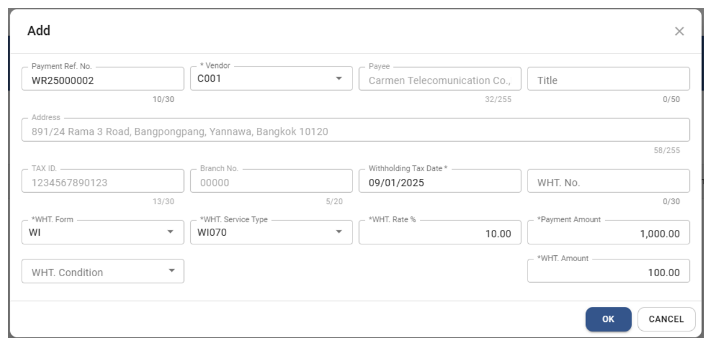

## C ขั้นตอนการ Print รายงานภาษีหัก ณ ที่จ่าย (BIR FORM 1604E - SCHEDULE 3) “Philippines Version”

1.	Click “Account Payable”
2.	Click “Procedure”
3.	Click “Withholding Tax Reconciliation”
 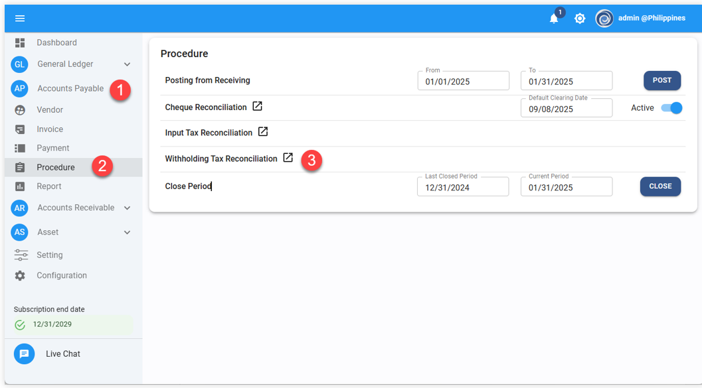

4.	ขั้นตอนการเลือกข้อมูลก่อนเรียกรายงาน

4.1.	Month กำหนดเดือนที่ต้องการ

4.2.	Year กำหนดปีที่ต้องการ

4.3.	WHT Form เลือกแบบการหัก ณ ที่จ่าย ประกอบด้วย

•	WI = Withholding Tax – Individual (หัก ณ ที่จ่ายประเภทบุคคลธรรมดา)

•	WC = Withholding Tax – Corporate (หัก ณ ที่จ่ายประเภทนิติบุคคล)

5.	Click เครื่องหมาย☑️ในเอกสารที่ต้องการ Print Report
6.	Click “Print Report”
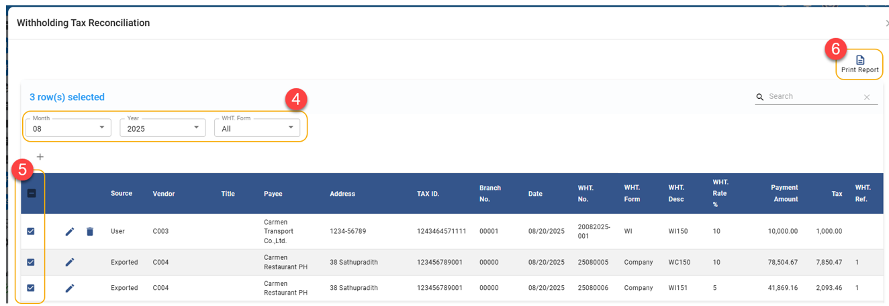
7.	ตัวอย่างรายงาน BIR FORM 1604E - SCHEDULE 3
 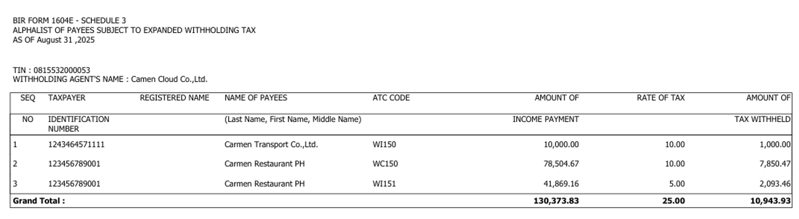
 
## D ขั้นตอนการ Print “Certificate of Creditable Tax Withheld at Source” (BIR FORM 2307 01/18ENCS) “Philippines Version”
1.	Click “Account Payable”
2.	Click “Report”
3.	Click “Withholding Tax Certificate”

4.	กำหนด Parameter ก่อนเรียกรายงาน

4.1.	Date Type > กำหนดประเภทวันที่เช่น “Payment Date” หรือ “Cheque Date”

4.2.	Year > กำหนดปีที่ต้องการ

4.3.	Quarter > กำหนด Quarter ที่ต้องการ

4.4.	Tax Type > กำหนดประเภทภาษีหัก ณ ที่จ่าย เช่น “WI” หรือ “WC”
และกดปุ่ม “Preview” เพื่อดูรายงาน
 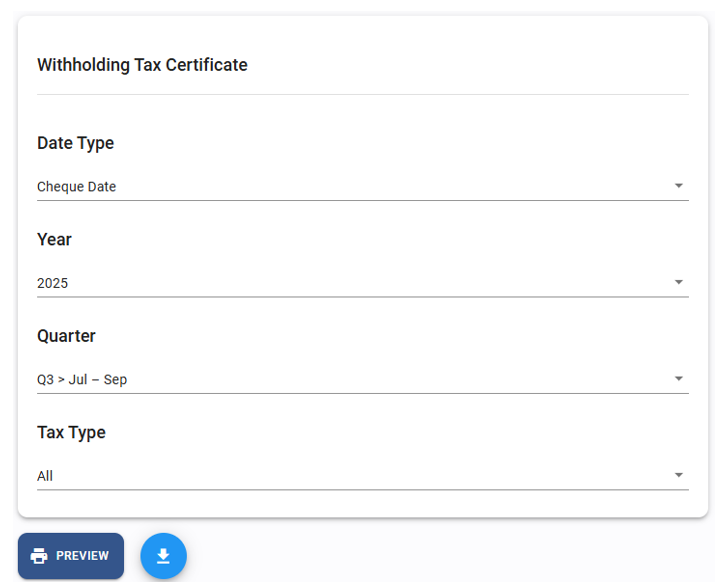

5.	ตัวอย่างรายงาน “Certificate of Creditable Tax Withheld at Source”
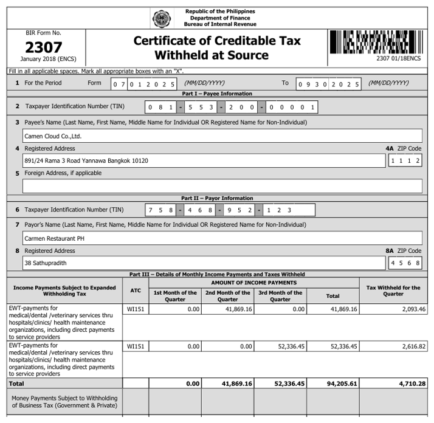
 

