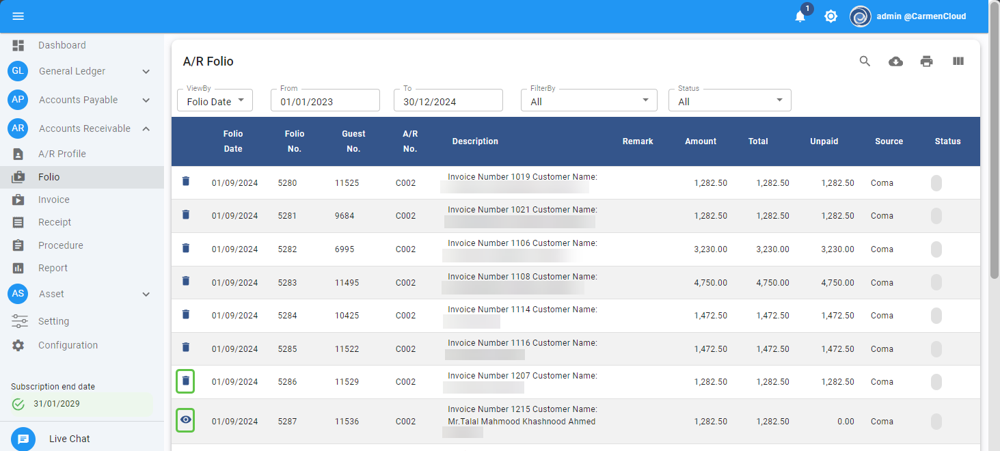

# Folio

Function นี้ใช้สำหรับดู Transaction ที่มาจากการ post (PMS Interface) ข้อมูล City Ledger และ Credit Card จากระบบ PMS

## การดูข้อมูล Folio ที่มาจาก PMS

1. Click เข้าสู่ Account Receivable Module

2. กด Folio เพื่อแสดงข้อมูล Folio

   สำหรับ Folio ที่มีสัญลักษณ์ อยู่ข้างหน้า แสดงว่า Folio นี้ยังไม่มีการสร้างใบแจ้งหนี้ Invoice ดังนั้น
   สามารถ Void Folio ใบดังกล่าวได้ เพื่อใช้ในกรณีที่มีการ post folio ผิด หรือ Folio ที่ใช้ในการปรับปรุงจากระบบ PMS จึงไม่ต้องการออกใบแจ้งหนี้

   สำหรับ Folio ที่มีสัญลักษณ์  อยู่ข้างหน้า แสดงว่าได้มีการนำไปสร้างเป็นใบแจ้งหนี้ Invoice แล้ว

3.	เมื่อกด  ระบบจะแสดงเลขที่ Invoice ที่ได้นำ Folio ใบนี้ไปใช้

4.	ให้กด X เพื่อปิดหน้าต่าง

