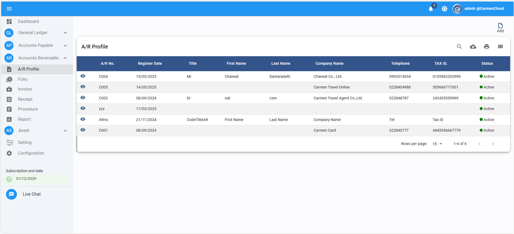
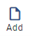
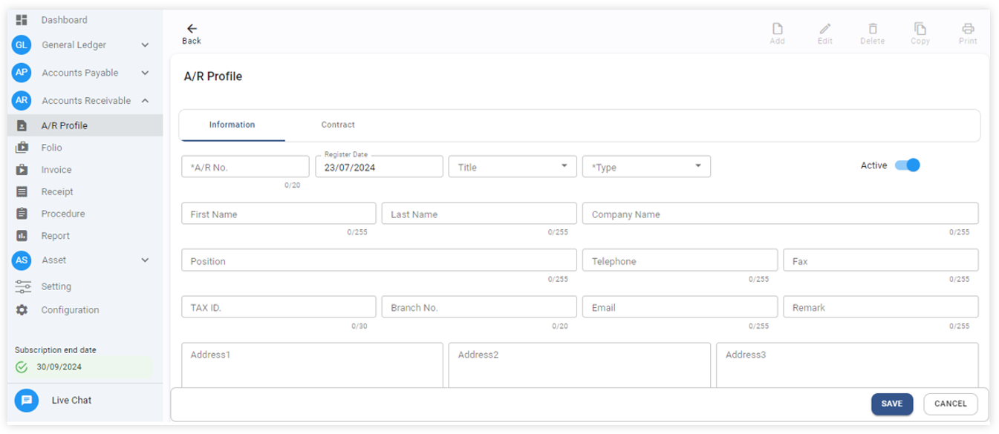
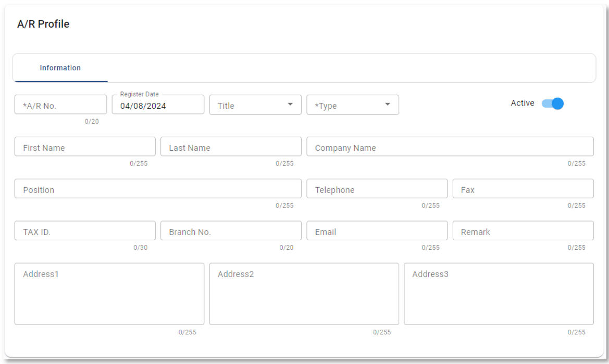
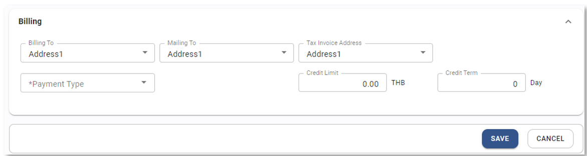
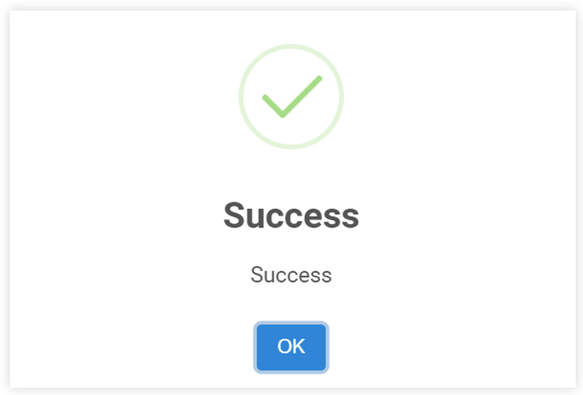

# A/R Profile

A/R คือตัวย่อของคำว่า Account Receivable หรือลูกหนี้
Function นี้ใช้สำหรับบันทึกข้อมูลลูกหนี้ของบริษัท 

การสร้างลูกหนี้ในระบบ
1.	Click เข้าสู่ Account Receivable Module
2.	กดปุ่ม A/R Profile และระบบจะแสดงรายชื่อลูกหนี้ที่บันทึกอยู่ในระบบแล้ว

3.	กดปุ่มระบบจะแสดงหน้า A/R Profile ตัวอย่างตามภาพด้านล่าง บนหน้าจอจะประกอบด้วยข้อมูล 2 tab

4.	Tab: Information
ให้ใส่ข้อมูลของลูกหนี้ในระบบ ดังต่อไปนี้
หมายเหตุ * ช่องที่จำเป็นต้องระบุ
-	A/R No		กำหนดรหัสลูกหนี้ (ตัวอักษรภาษาอังกฤษหรือตัวเลข)
-	Register Date		วันที่บันทึกข้อมูลลูกหนี้เข้าระบบ
-	Title			ระบุคํานําหน้าชื่อ (ในกรณีที่เป็นลูกหนี้บุคคล เช่น นาย นาง นางสาว ฯลฯ)
-	 Type			กำหนดประเภทของลูกหนี้ เช่น ลูกหนี้การค้า ลูกหนี้อื่น ๆ หากยังไม่มีข้อมูล ให้
ดำเนินการเพิ่มที่ setting
-	Status			Active เปิดใช้งาน 
In Active ปิดไม่ให้ใช้งาน
-	First Name		ระบุชื่อ (ในกรณีที่เป็นลูกหนี้บุคคล)
-	Last Name		ระบุใส่นามกุล (ในกรณีที่เป็นลูกหนี้บุคคล)
-	Company Name	ระบุชื่อบริษัท
-	Position		ตำแหน่งของลูกหนี้ (ในกรณีที่เป็นลูกหนี้บุคคล)
-	Tel			เบอร์โทรศัพท์ของลูกหนี้
-	Fax			เบอร์โทรสารของลูกหนี้
-	Tax ID.			ระบุหมายเลขประจำตัวผู้เสียภาษีอากรของลูกหนี้ (ตัวเลข 13 หลัก)
-	Branch No.		รหัสสาขา (ตัวเลข 5 หลัก) ในกรณีสำนักงานใหญ่ให้ใส่ข้อมูลเป็น 00000
-	Email			ระบุ Email Address ของลูกหนี้
-	Remark		ระบุข้อมูลอื่น ๆ เพิ่มเติม (ถ้ามี)
-	Address 1		ระบุที่อยู่ หลักในการออกเอกสาร ใบแจ้งหนี้ ใบกำกับภาษี
-	Address 2		ระบุที่อื่น ๆ (หากมี)
-	Address 3		ระบุที่อื่น ๆ (หากมี)

Billing
-	Billing To		ระบุ Address (1,2 หรือ 3) เพื่อใช้ในการออกใบแจ้งหนี้ ใบเสร็จ ของลูกหนี้
-	Mailing To		ระบุ Address (1,2 หรือ 3) เพื่อใช้ในการส่งเอกสาร (พิมพ์จดหมาย) ของลูกหนี้
-	Tax Invoice Address	ระบุ Address (1,2 หรือ 3) เพื่อใช้ในการออกใบกำกับภาษี
-	*Payment Type		ระบุ Default ประเภทของการรับชำระ
-	Credit Limit		ระบุวงเงินจำกัดของลูกหนี้รายนี้ (Base Currency)
-	Credit Term		ระบุการให้ Credit ลูกหนี้จำนวนกี่วัน (Day)
5.	กดปุ่ม Saveเพื่อบันทึกข้อมูล 

 
6.	กด OK เพื่อเสร็จสิ้นขั้นตอน

Video ประกอบ

<h3 style="margin: 0;">Customer (AR) Profile | การสร้างทะเบียนลูกหนี้</h3>

<iframe width="560" height="315" src="https://www.youtube.com/embed/sHaW5EHWZNg?si=qG6V9c-aAW6k-SY3" title="YouTube video player" frameborder="0" allow="accelerometer; autoplay; clipboard-write; encrypted-media; gyroscope; picture-in-picture; web-share" referrerpolicy="strict-origin-when-cross-origin" allowfullscreen></iframe>

<iframe width="560" height="315" src="https://www.youtube.com/embed/DQHOzBpd7Tk?si=tS4tHSFiwil7pPmY" title="YouTube video player" frameborder="0" allow="accelerometer; autoplay; clipboard-write; encrypted-media; gyroscope; picture-in-picture; web-share" referrerpolicy="strict-origin-when-cross-origin" allowfullscreen></iframe>