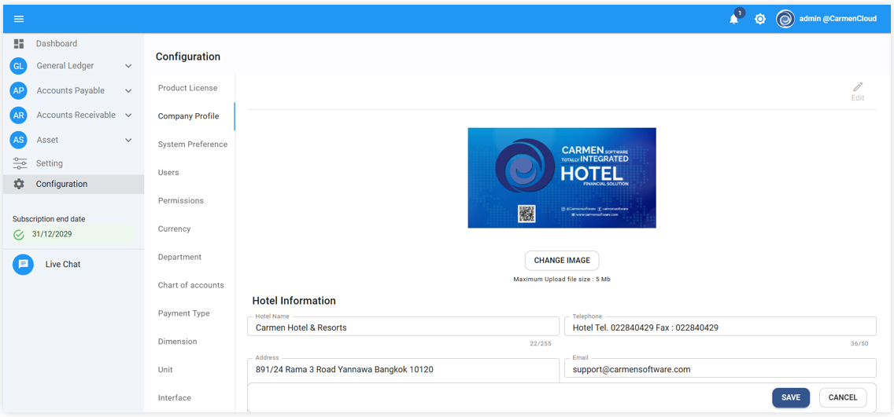
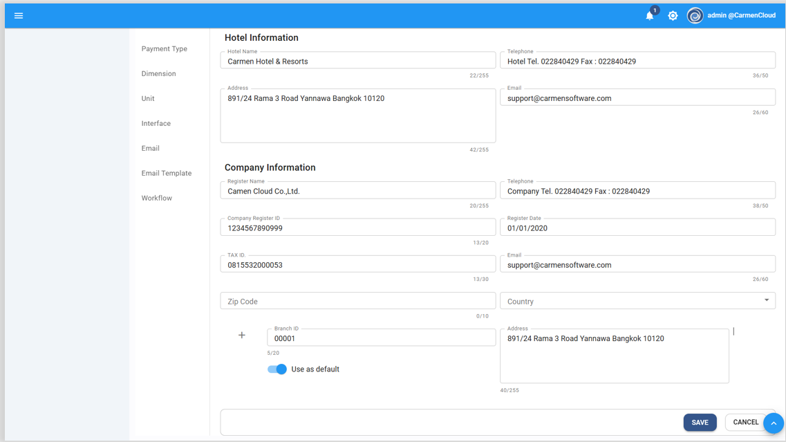
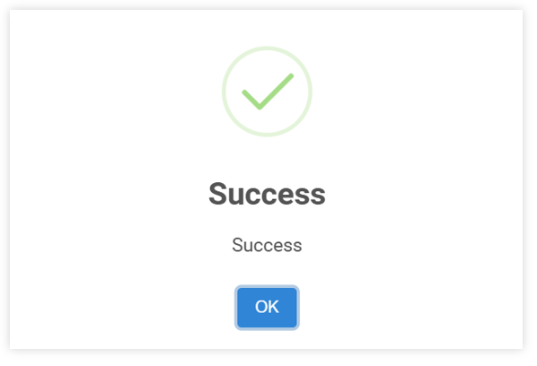

# Company Profile

การบันทึกข้อมูลบริษัท Company Profile

Function นี้ใช้สำหรับกำหนดข้อมูลบริษัทและโรงแรมของลูกค้า

1. Click เข้าสู่ Configuration

2. เลือก Company Profile

3. กดปุ่ม  ด้านบนขวามือ

4. ระบบจะเปิดให้กรอก หรือ แก้ไขข้อมูลบริษัท

5. ให้ผู้ใช้งานทำการ เพิ่มเติม หรือ แก้ไขข้อมูล โดยแต่ละช่องมีรายละเอียด ดังต่อไปนี้

- Logo > สามารถเพิ่ม หรือ แก้ไข Logo โดย กดปุ่ม  ตรงกลางด้านบนเพื่อเลือกรูปภาพ

  **Hotel Information**

- Hotel Name > ชื่อ โรงแรม รีสอร์ท
- Address > ที่อยู่ โรงแรม รีสอร์ท
- Tel > เบอร์โทรศัพท์ของ โรงแรม รีสอร์ท
- Email > อีเมลของโรงแรม รีสอร์ท

  **Company Information**

- \* Reg. Name ชื่อและที่อยู่ของบริษัทที่จดทะเบียนไว้กับกระทรวงพาณิชย์และกรมสรรพากร
  (ไม่สามารถแก้ไขได้เอง เนื่องจากมีผลกับ License)
- Tel. > หมายเลขโทรศัพท์
- Email > อีเมล
-	Company Reg. ID	หมายเลขจดทะเบียนบริษัท
-	Reg. Date	วันที่จดทะเบียนบริษัท
-	*Tax ID		หมายเลขประจำตัวผู้เสียภาษีอากร
-	Email		ระบุ Email Address
-	Branch No	หมายเลขสาขา (กรอกเป็นตัวเลข 5 ตำแหน่ง เช่นสำนักงานใหญ่ให้กรอก 00000)
-	Zip Code	รหัสไปรษณีย์
-	Country	ประเทศ
-	Branch ID	เลขที่สาขา
-	Address	ที่อยู่ของบริษัทที่จดทะเบียนไว้กับกระทรวงพาณิชย์และกรมสรรพากร

6. ตรวจสอบความถูกต้อง เรียบร้อยแล้วกดปุ่ม **SAVE** เพื่อบันทึกข้อมูล
7. ระบบจะขึ้นหน้าต่าง ตามภาพด้านล่าง กด OK เพื่อจบกระบวนการ
