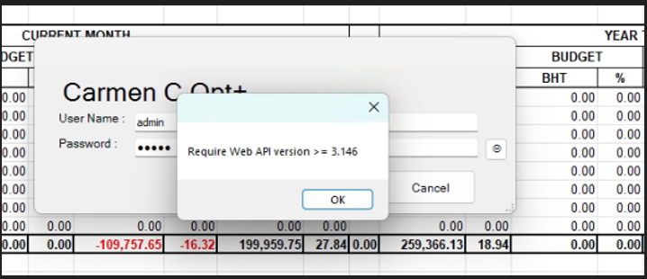
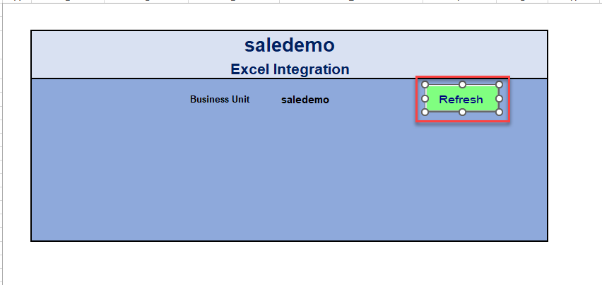
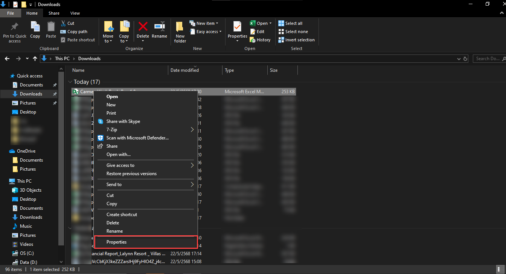
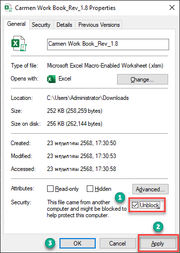
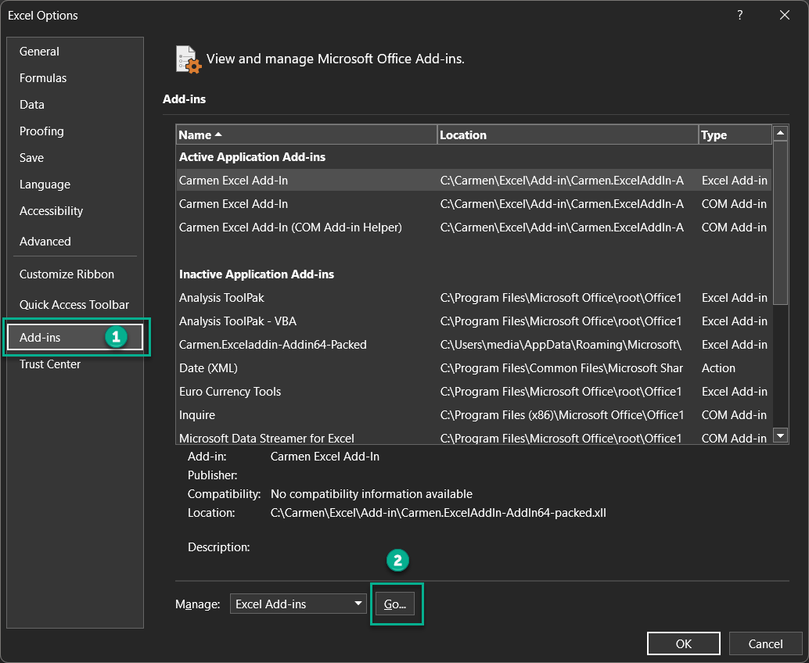
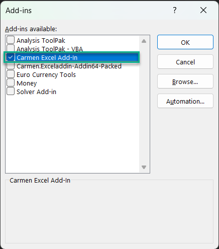

## Require web api version
Require Web API version >=3.146

    

สาเหตุที่เกิดขึ้น

Antivirus ไป Block Add In Version ใหม่ที่ติดตั้งไป (อาจจะมองว่าเป็นความเสี่ยง) ทำให้ Workbook ยังถามหา Add In Version เก่าอยู่ครับ 

วิธีแก้ไขปัญหาเบื้องต้น

ปิดAntivirus ในส่วนที่ Block File Add In ออก

## ปุ่มกดไม่ได้

วิธีแก้ไข
เปิด ที่อยู่ของFile Woorbook และทำการคลิกขวาเลือกProperties

1. ทำการติ๊กช่อง Unblock
2. กดApply
3. กด OK

## ถอดการติดตั้งAddin 
เปิดExcel แล้วไปที่ File>Excel Options>Add-ins 
1. กดไปที่หัวข้อ Add-ins
2. หัวข้อManage กด GO

3. เลือกAdd in ที่ลูกค้าจะใช้งานนำ Carmen Add in ออก

4. กด OK