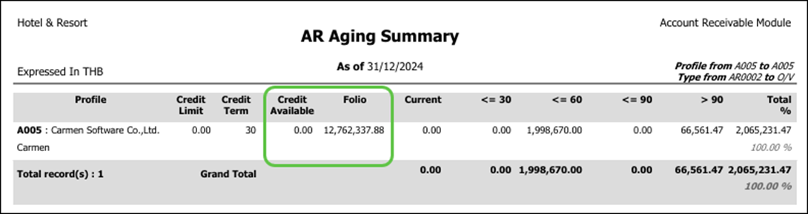
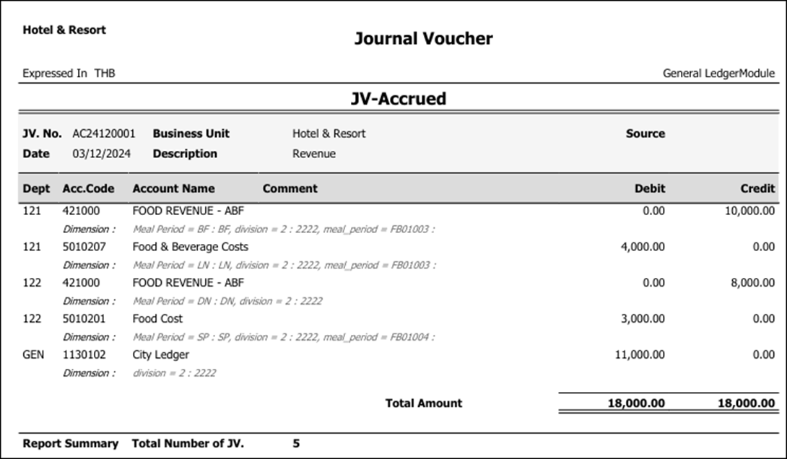
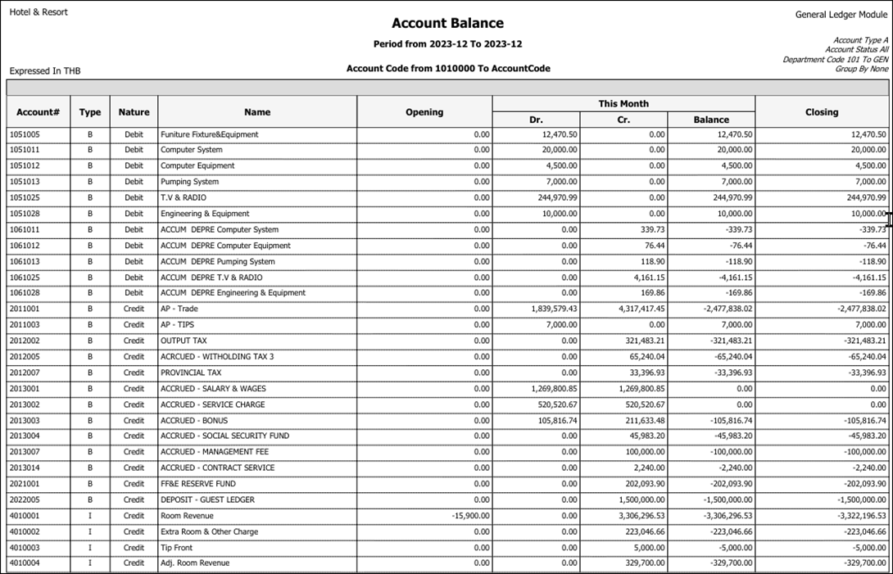

# January 2025 Relaese Infomation

## Accounts Payable Module

### Account Payable - Report - Aging Summary and Detail - Fix to show invoice age > 90 days in correct section

- Note : Revise report to show correct amount
- From : Accounts Payable Module -> Report – Aging Summary and Detail

### Account Payable - Report - Aging Summary and Detail - Fix to show invoice = 90 days in report

- Note : Revise report to show correct amount
- From : Accounts Payable Module -> Report – Aging Summary and Detail

## Account Receivable

### Account Receivable - Invoice - Fix to not delete detail when add description in header

- Note : when add invoice detail before description, system will delete detail
- From : Account Receivable -> Invoice

### Account Receivable - Invoice - Fix to not allow change AR No after select the Folio

- Note : When select folio to Invoice, system allow to change AR No
- From : Account Receivable -> Invoice

### Account Receivable - Report - Aging Summary - Add field Credit Available and Folio amount

- Note : Add more field to Aging summary report
- From : Account Receivable -> Report -> Aging Summary

    

## General Ledger

### General Ledger - Journal voucher - Add Dimension to JV Form

- Note : Show Dimension in JV Form
- From : General Ledger -> Journal Voucher -> Print

    

### General Ledger - Report - Account Balance - New Report to show Credit amount as Negative

- Note : New Report to show Credit amount as Negative and Debit as Positive
- From : General Ledger -> Report -> Account Balance

    

## Workbook

### Workbook - JV Import - Not allow to import with COA type Header

- Note : Not allow to import JV with account code which type as header
  - Solve by install new Add In
- From : Carmen Workbook
