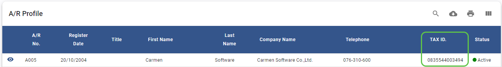
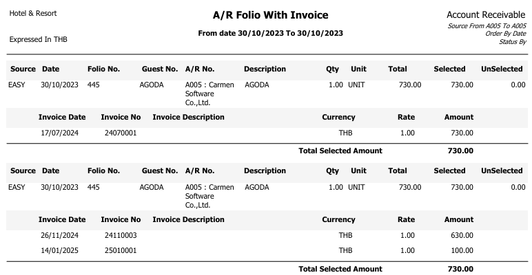
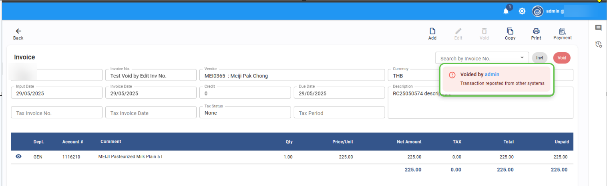
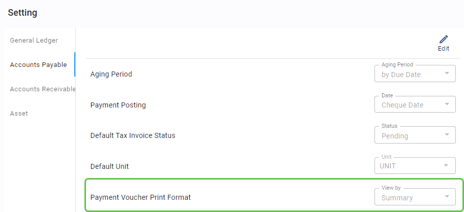
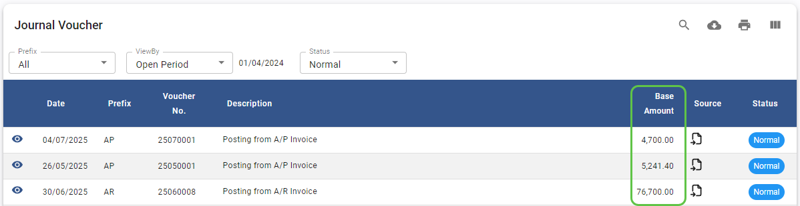
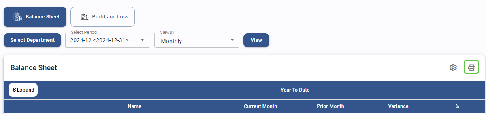

# Released Jul2025

## Account Receivable

- **Account Receivable - Receipt – Tax Invoice Number – Automatic running**

  - **Note :** updated for automatic tax invoice number sequencing after setup “Auto” changes.

  - **From :** Account Receivable \> Invoice

- **Account Receivable - AR Profile - Show Tax ID in AR profile list screen**

  - **Note :** Add field "Tax ID" to AR Profile list screen

  - **From :** Account Receivable \> AR Profile

- **Account Receivable - Report - New Report for Folio / Invoice**

  - **Note :** New Report showing Folio and the associated Invoice Number.

  - **From :** Account Receivable \> Report

## Account Payable

- **Account Payable - Invoice - Add void comment if void by posting from Receiving**

  - **Note :** When invoice voided by system, System will shows void reason

  - **From :** Account Payable \> Invoice

- **Account Payable - Invoice - Add log in Activity when posting from Receiving**

  - **Note :** Record an activity log entry upon reposting data from receiving

  - **From :** Account Payable \> Invoice

- **Account Payable - Payment - posts only approved AP transactions to the GL**

  - **Note :** A new control now posts only approved AP transactions to the GLd

  - **From :** Account Payable \> Payment

- **Account Payable - Payment - Add option to print payment voucher as summary or detail**

  - **Note :** customer can set to print Payment voucher by summary or detail

  - **From :** Account Payable \> Payment

## Asset

- **Asset - Report - Name List Report will shows as filter**

  - **Note :** Report will shows list of Asset follow the filter that user selected

  - **From :** Asset \> Report \> Name List

## General Ledger

- **General Ledger - Journal Voucher - Show JV total Base amount in JV List screen**

  - **Note :** Add field "Base Amount" to Journal voucher List Screen

  - **From :** General Ledger \> Journal Voucher

- **General Ledger - Report - Fix bug for Chart of account report**

  - **Note :** Fix bug: System displays all Account code even when
    filtered by \'Active\' status.

  - **From :** General Ledger \> Report \> Chart of Account

- **General Ledger - Financial Report - Add print function**

  - **Note :** Add function to print Financial report

  - **From :** General Ledger \> Financial Report

