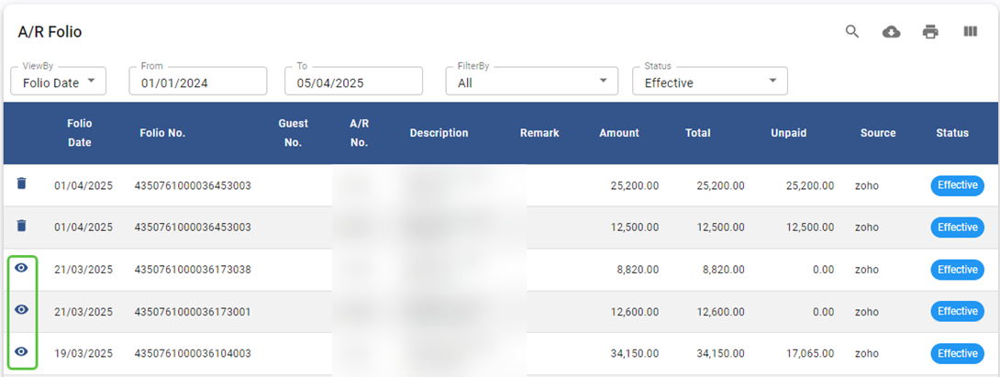
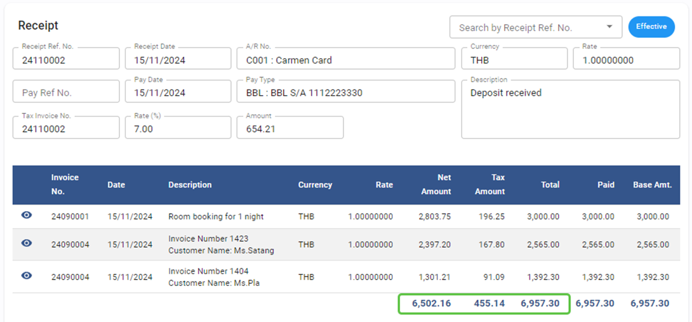
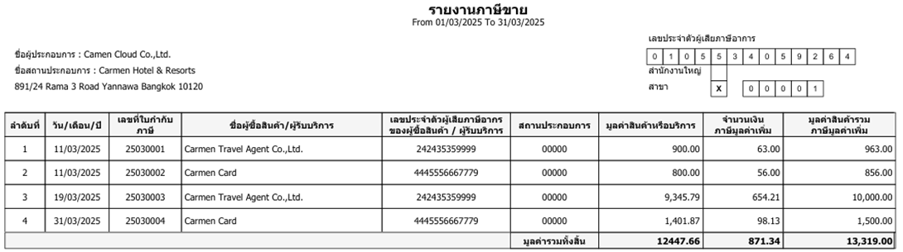
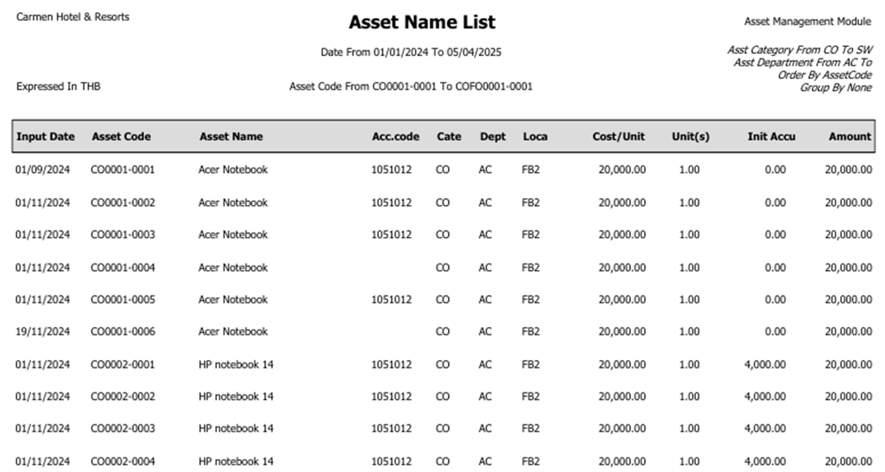
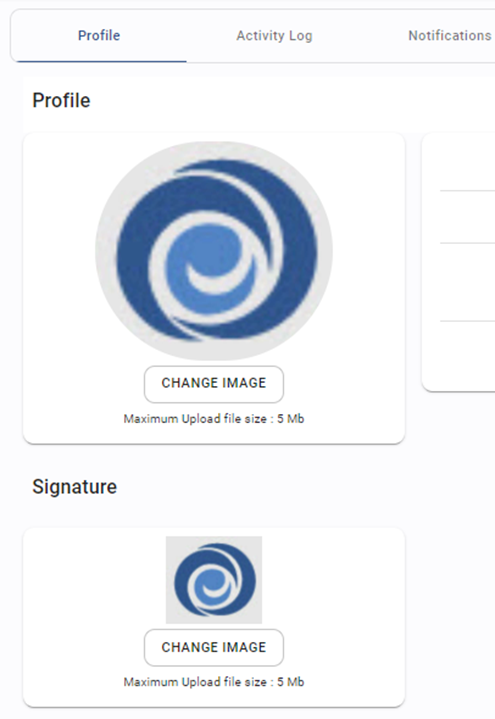

# March 2025 Relaese Infomation

## Accounts Payable Module

### Account Payable - Input Tax Reconciliation - Fix to shows Net Amount by Taxable item only

- Note : Revise Net amount show only taxable amount
- From : Accounts Payable Module > Procedure > Input Tax Reconciliation

## Account Receivable

### Account Receivable - Folio - Fix to not allow Void Folio which already invoiced

- Note : Folio will not show void button if it was selected to invoice
- From : Account Receivable > Folio > Void

    

### Account Receivable - Receipt - Fix to show Tax amount Invoice Tax 1 and Tax 2

- Note : When select invoice to receipt, Tax amount column will combine from Tax 1 and Tax 2
- From : Account Receivable > Receipt

### Account Receivable - Receipt - Shows Total for Net Amount, Tax and Total Amount

- Note : Add Total for Net Amount, Tax and Total Amount
- From : Account Receivable > Receipt

    

### - Account Receivable - Report - Vat Sale - Revise layout follow Revenue Department

- Note : Revise layout for Vat sale report
- From : Account Receivable > Report > Vat Sale

    

## General Ledger

### General Ledger - Report - Default Current Period

- Note : All report will default by current month
- From : General Ledger > Report > All report

## Asset

### Asset - Report - Name List - Show Initial Accu. Depre.

- Note : Add column “initial Accu. Depre” to Asset Name List report
- From : Asset > Report > Name list

    

## Profile

### Profile - Compress picture of Profile and Signature when size more than 5 MB.

- Note : Automatic compress picture when user upload picture
- From : Profile > Signature

    

