# May 2025 Relaese Infomation

## Account Receivable

### Account Receivable - Folio – Folio Detail - Add list of invoice which use the folio

- Note : show reference list of invoice for each folio
- From : Account Receivable > Folio

    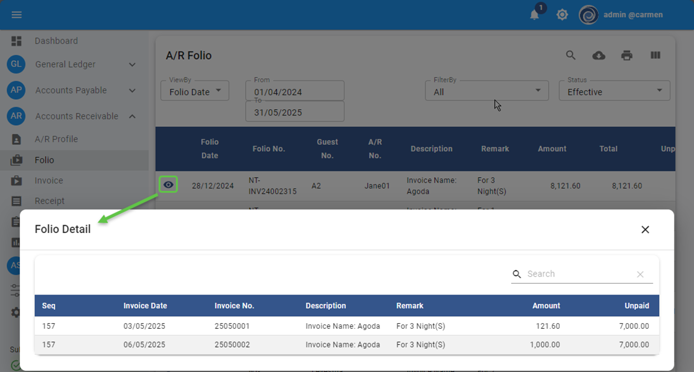

### Account Receivable - Report - Folio - Revise information

- Note : Revise report layout for folio
- From : Account Receivable &gt; Report

    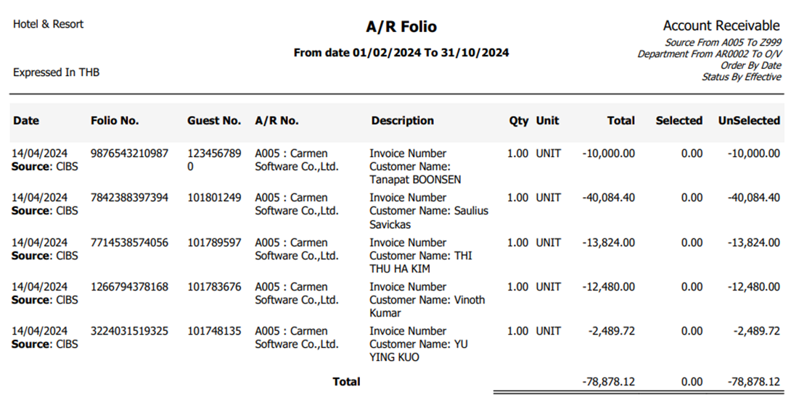

## Account Payable

### Account Payable - Invoice - Fix bug for tax status not update after edit and save

- Note : When edit invoice and save, System will update tax status properly
- From : Account Payable &gt; Invoice

### Account Payable - Invoice - Add status to Invoice form

- Note : Show Invoice status and currency information in Account payable voucher
- From : Account Payable &gt; Invoice &gt; Print

    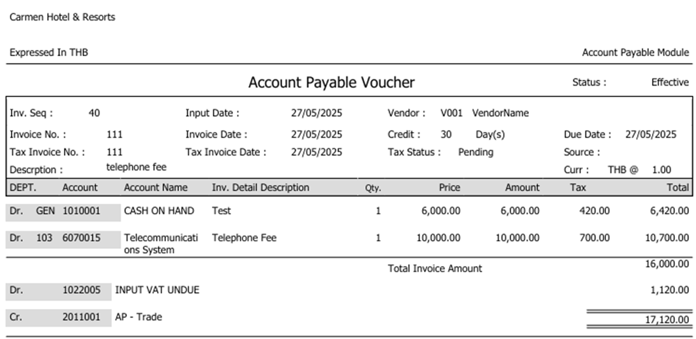

### Account Payable - Payment - Add total amount for Invoice selection process

- Note : Show total amount for selected invoice
- From : Account Payable &gt; Payment

    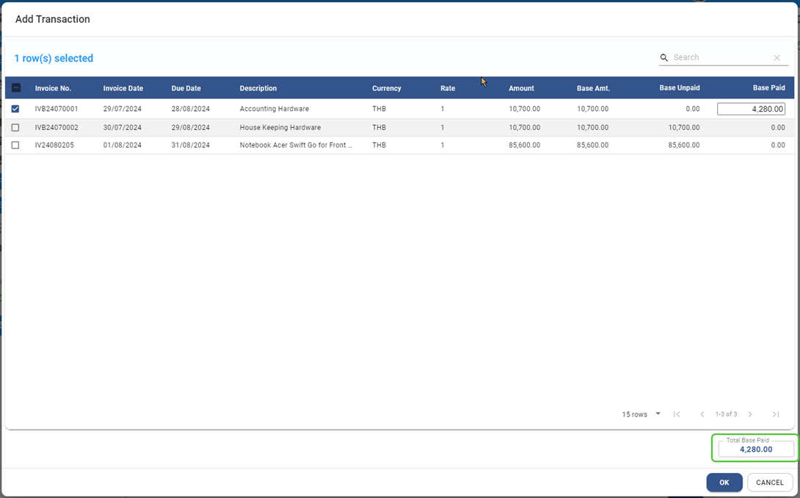

### Account Payable - Procedure - Input Tax Reconciliation for Japan Tax

- Note : Add process to grouping transactions by tax rate, allow to input or filter tax invoice with tax rate and allow to print input tax report by tax rate
- From : Account Payable > Procedure > Input Tax Reconciliation

    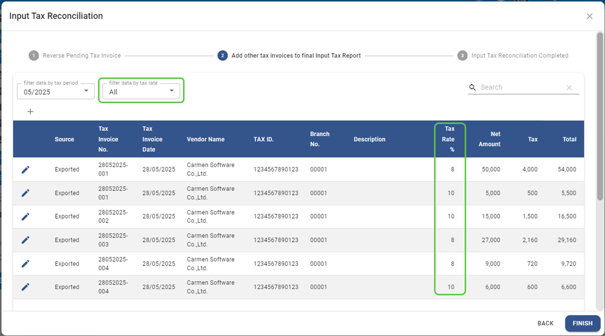

### Account Payable - Invoice - Revise AP Voucher form

- Note : Revise layout and add currency and status to AP voucher form
- From : Account Payable > Invoice > Print

    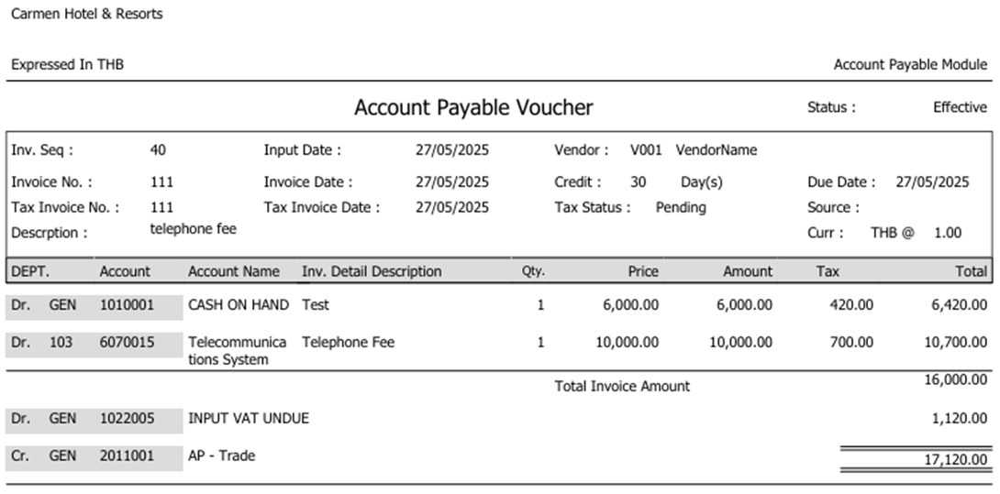

## Asset

### Asset - Asset Register - revise column in list screen

- Note : Revise column for list of asset register screen
- From : Asset > Register

### Asset - Asset Register - Add date range for search or filter

- Note : Add date range parameter for list of asset register screen
- From : Asset > Register

    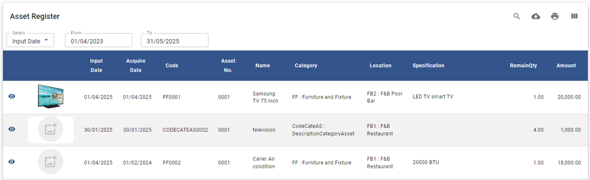

### Asset - Asset Register - Allow to edit account code mapping after close period

- Note : Allow to edit some asset information after close period
- From : Asset > Register

    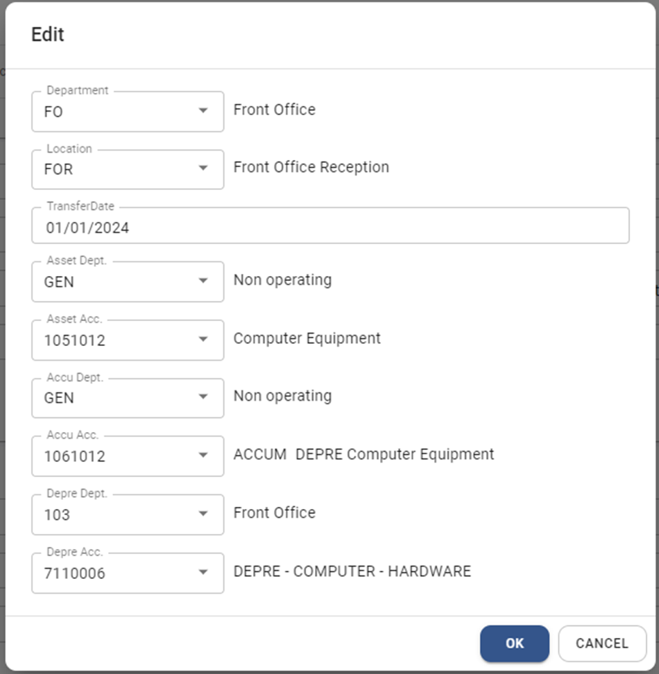

### Asset - Report - Register - Add option to export excel and filter by status

- Note : Allow to filter report by status and export to excel file
- From : Asset > Report > Register

    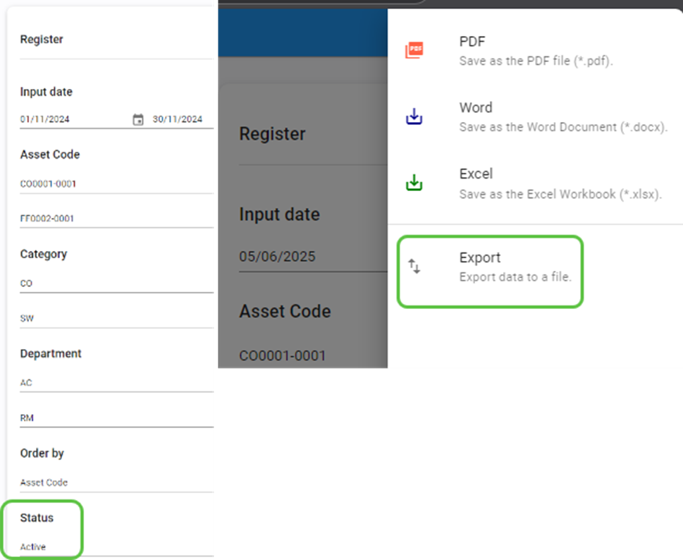

## General Ledger

### General Ledger – Journal Voucher - Add AR name in comment for transaction which post from AR

- Note : Add AR name in comment for transaction from AR
- From : General Ledger > Journal Voucher > Journal Voucher Detail

    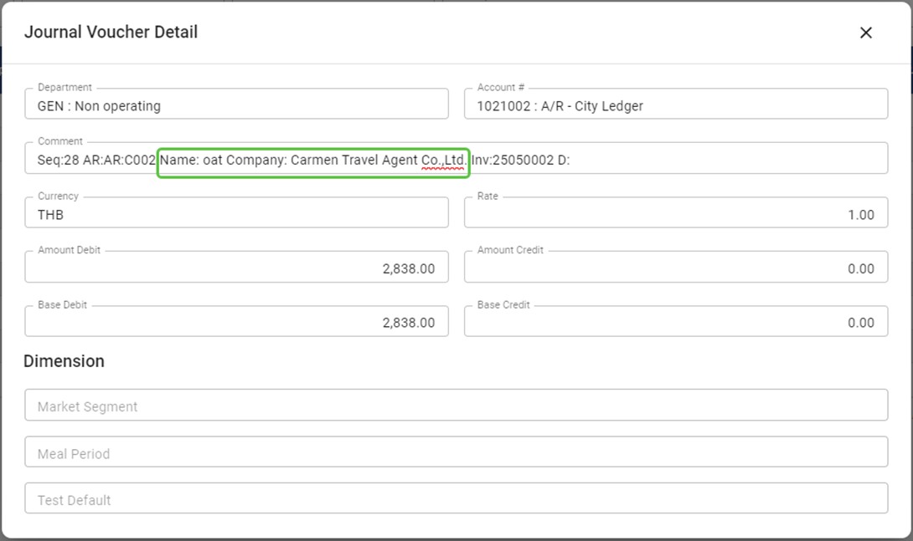

### General Ledger - Jounal Voucher - Add transaction amount in JV Voucher form

- Note : Add transaction amount to Journal voucher form
- From : General Ledger > Journal Voucher > Print

    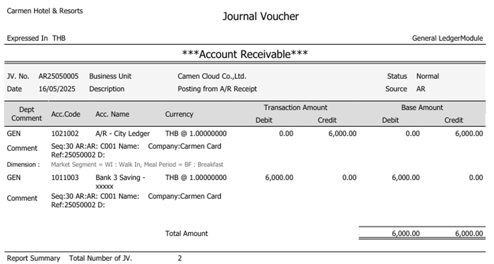

### General Ledger - Report - Account detail - add JV Prefix in report

- Note : Add Prefix code in Account detail report
- From : General Ledger > Report > Account Detail and Account detail by department

### General Ledger - Budget - Add function to search by account name

- Note : Add function to search budget by account name.
- From : General Ledger > Budget

    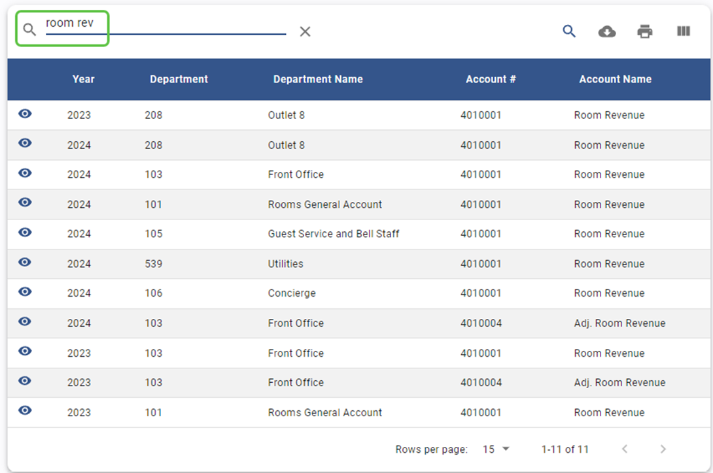

## Workbook

### Workbook - Budget - Add process to check duplicate department and Account code before import

- Note : Add process to check duplicate value. \*need to download new workbook version
- From : Workbook > Budget Import

    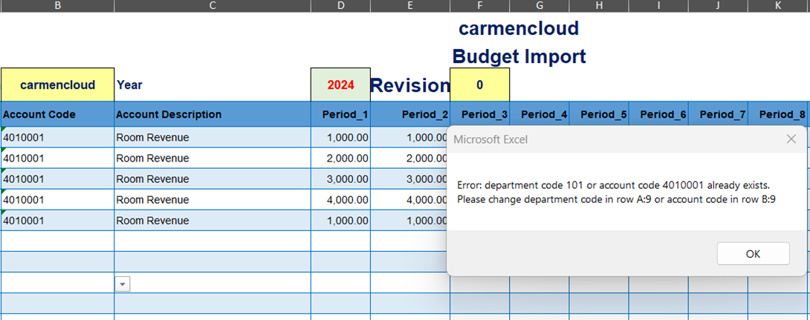

