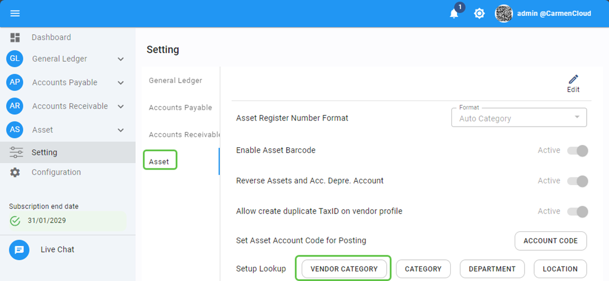
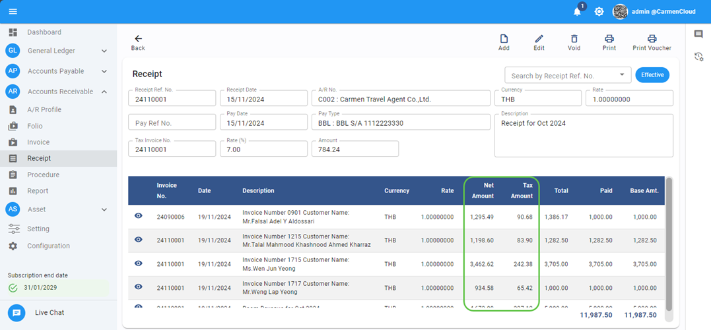
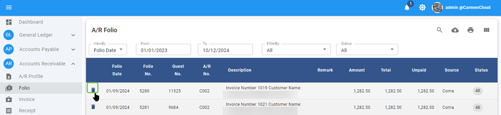
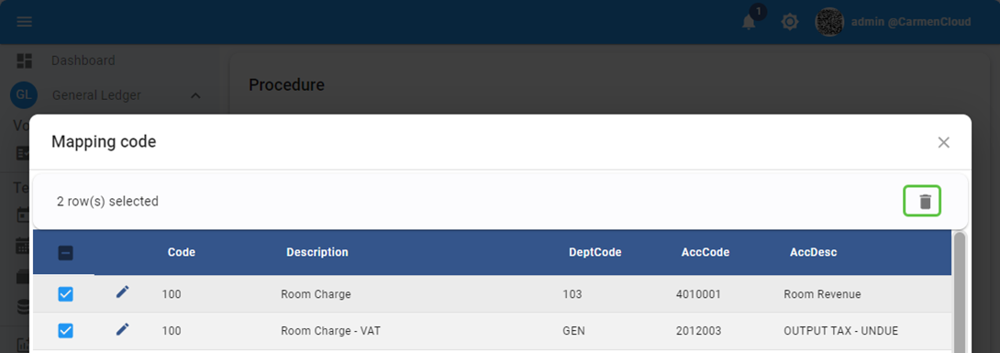
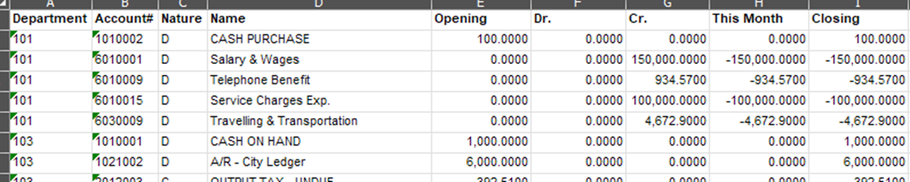

# November 2024 Relaese Infomation

## Accounts Payable Module

### Account Payable - Invoice - Remove Tax invoice no and date if tax status is none

- Note : revise save process for invoice base on tax status
- From : Accounts Payable Module 🡪 Invoice

### Account Payable - Report – Aging summary and detail report will show base on input date

- Note : revise report for solve case that invoice date is before input date
- From : Accounts Payable Module 🡪 Report 🡪 Aging summary and Detail

### Account Payable - Report - Expense Analysis and Monthly memorandum will shows only effective transactions

- Note : in case user not set up default account code and department code for vendor, system will not shows error message but will use default value from interface configuration instead
- From : Accounts Payable Module 🡪 Report 🡪 Expense Analysis and Monthly memorandum

## Asset Module

### Asset - Asset Register - fix remain value as of close period

- Note : revise value for remain value data
- From : Asset Module 🡪 Asset Register

### Setting - Asset - Allow to setup vendor category

- Note : allow user to maintain vendor category through Asset setting
- From : Setting 🡪 Asset

    

## Asset Checker Module

### Asset Checker - Shows asset name for manual search

- Note : when use “Find” button, solve issue to show asset name after select asset
- From : Asset checker -> Find function

## Account Receivable

### Account Receivable - Receipt – shows invoice net amount and tax amount

- Note : show invoice net amount and tax amount in settlement detail
- From : Account Receivable -> Receipt

    

### Account Receivable - Folio - allow to void/delete folio which not use

- Note : add function to void folio which not use
- From : Account Receivable 🡪 Folio

    

### Account Receivable - Invoice - not allow to save duplicate invoice number

- Note : Cannot save invoice with existing invoice number
- From : Account Receivable 🡪 Invoice

## General Ledger

### General Ledger - Procedure - allow to delete Interface mapping

- Note : allow to delete wrong mapping for PMS interface
- From : General Ledger 🡪 Procedure 🡪 PMS Interface

    

### General Ledger - Report - Trial balance - show department code when export

- Note : Add department code field for export to excel
- From : General Ledger 🡪 Report 🡪 Trial Balance by department

    

