# Carmen Cloud: November 2025 Release Highlights

We are excited to announce new features and enhancements in the latest Carmen Cloud update, focusing on improved efficiency, flexibility, and data integrity across key financial modules.

## Account Receivable

### Title: Enhanced Invoice Detail Preview

- **Note**: Get instant context! Hover over Department Code, Account Code, and Comment fields in the Invoice screen to view more comprehensive details without leaving your current view.
- **Path**: Account Receivable > Invoice

    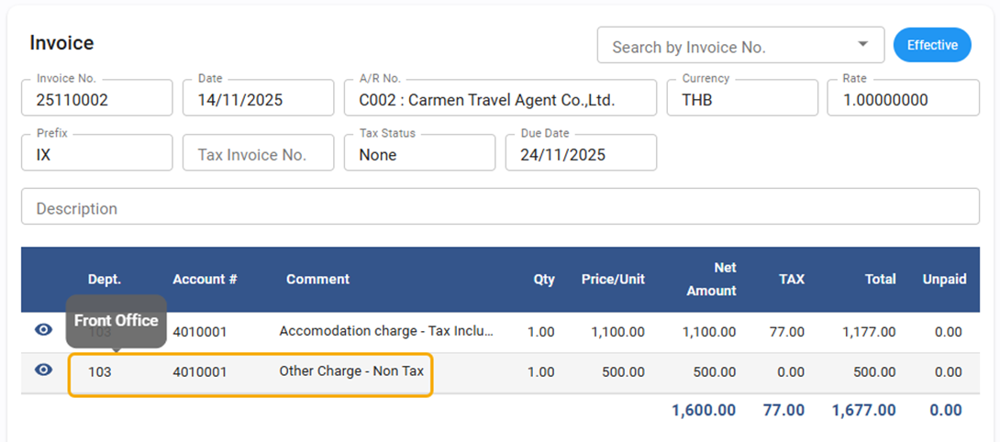

### Title: Flexible Deposit Receipt Editing (Even in Close Periods)

- **Note**: We've added flexibility, allowing you to edit and save Deposit Receipts even when the accounting period is officially closed. Maintain data accuracy with greater ease.
- **Path**: Account Receivable > Receipt

## Account Payable

### Title: Quick-View Tax ID in Vendor List

- **Note**: For faster referencing and verification, the Vendor Tax ID is now directly displayed on the Vendor List screen.
- **Path**: Account Payable > Vendor

    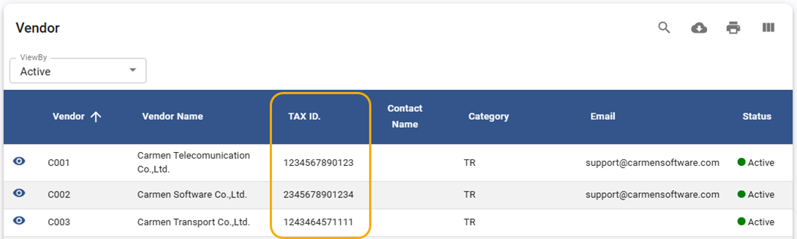

### Title: New Excel Import for Input Tax Invoices

- **Note**: Streamline your reconciliation process! Easily prepare your Input Tax information using a dedicated Excel template and import it directly into the system.
- **Path**: Account Payable > Procedure > Input Tax Reconciliation

    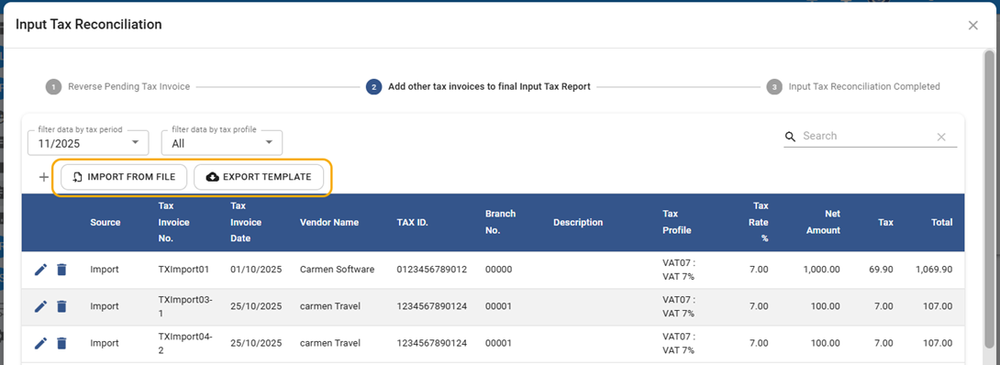

### Title: Compatible Excel Export for Tax Invoices

- **Note**: Export your tax invoices in a format that is perfectly aligned and compatible with standard Excel columns, simplifying external data analysis and reporting.
- **Path**: Account Payable > Procedure > Input Tax Reconciliation

    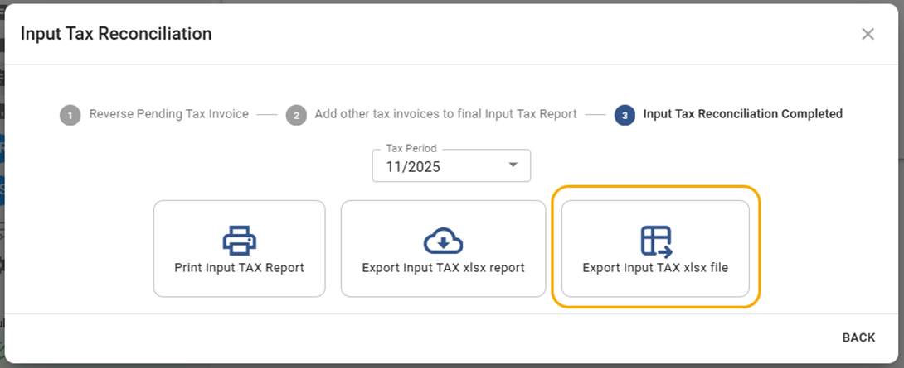

    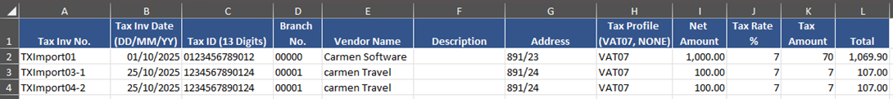

### Title: Enhanced Cheque Reconciliation Verification

- **Note**: We've boosted data integrity by adding an increased verification process before saving, ensuring correct conditions and preventing errors in your cheque reconciliation.
- **Path**: Account Payable > Procedure > Cheque Reconciliation

### Title: Excel-Compatible Aging Detail Report Export

- **Note**: Generate your Aging Detail report and export it to Excel with perfectly aligned columns for effortless viewing and integration with other spreadsheets.
- **Path**: Account Payable > Report > Aging Detail

    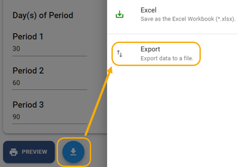

    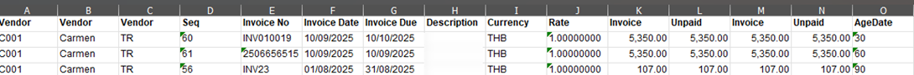

## General Ledger

### Title: Multi-Dimension Budget Analysis View

- **Note**: The Budget screen has an updated view to clearly display and facilitate analysis across multiple financial dimensions, offering deeper budgeting insights.
- **Path**: General Ledger > Budget

    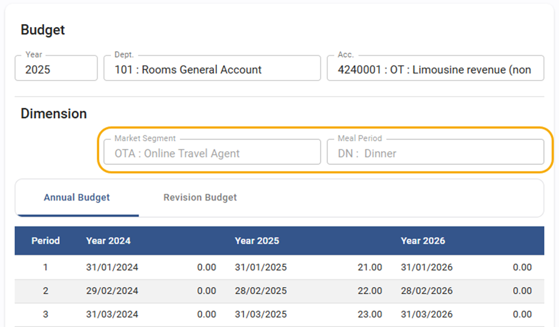

### Title: Account Detail Report Export with Parameters

- **Note**: When exporting the Account Detail report, the file now includes the report parameters used to generate the data, providing better context and traceability for your reports.
- **Path**: General Ledger > Report > Account Detail and Account Detail with department

    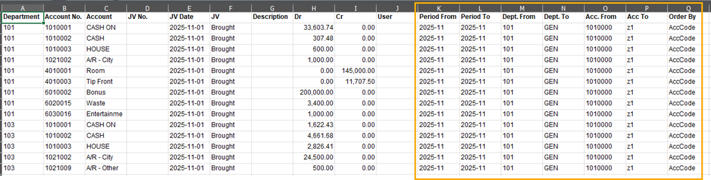

## Asset

### Title: Void and Un-Void Functionality for Pre-Register Assets

- **Note**: Full control over your asset registration! You can now Void unused Pre-Register Assets and, in case of a mistake, Un-void them for maximum flexibility.
- **Path**: Asset > Pre-Register Asset

    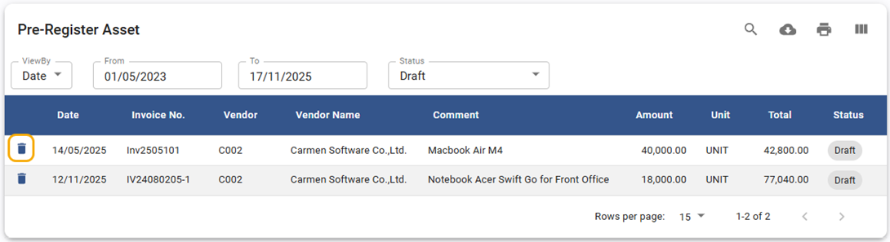

    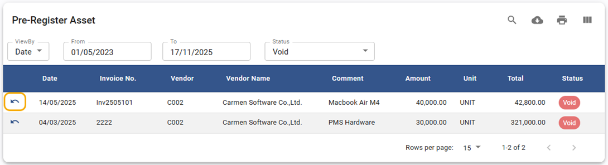

## Report

### Title: Intelligent Default Date Parameters for All Reports

- **Note**: All report date parameters now intelligently default to the current date or current month, speeding up report generation and analysis.
- **Path**: All Report

## Carmen AddIn

### Title: Performance Boost for Financial Report

- **Note**:  We've significantly improved the performance of the Data calculation process for transactions involving dimensions, drastically reducing processing time for smoother operations.
- **Path**: Carmen AddIn

