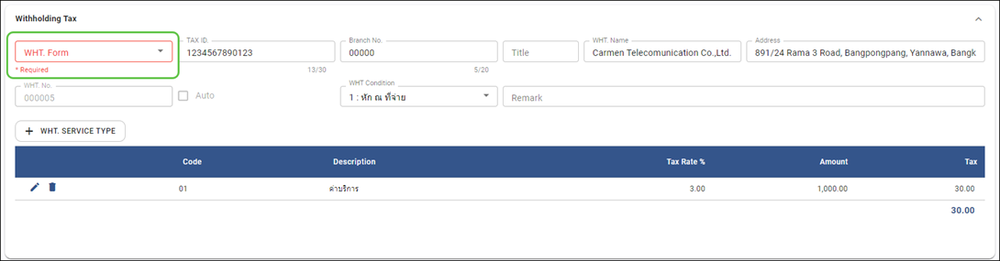
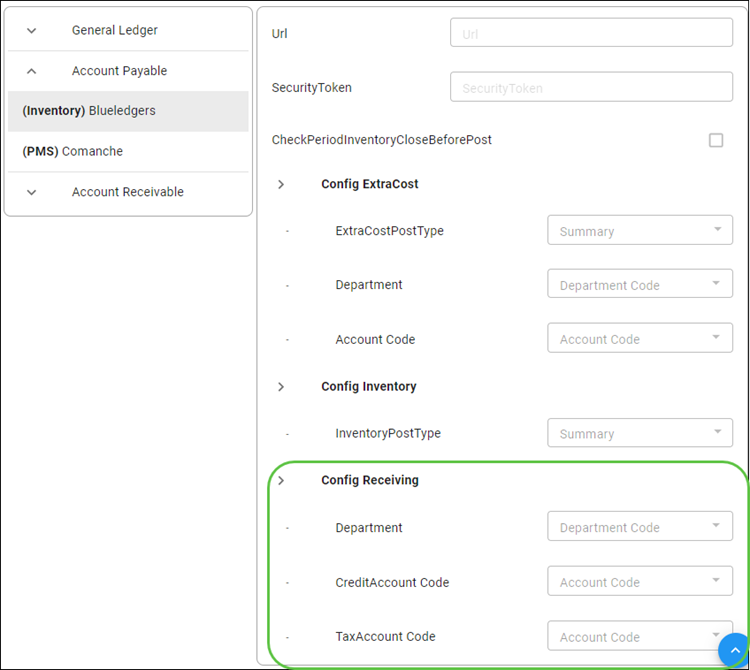
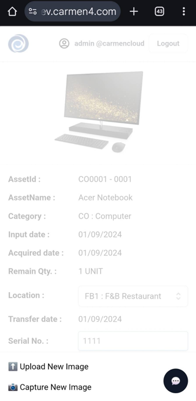
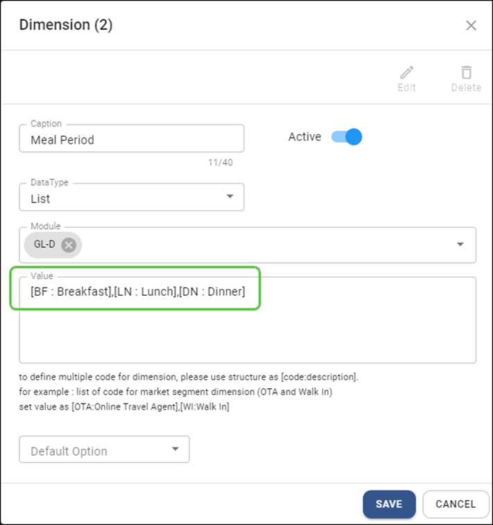
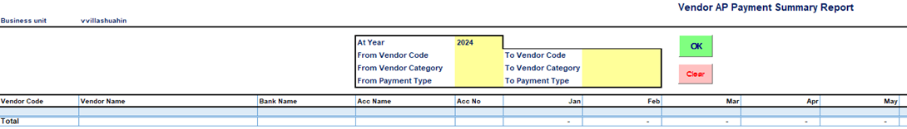

# September 2024 Relaese Infomation

## Accounts Payable Module

### Account Payable - Payment - Not allow to save payment if field "WHT Form" is blank

- Note : revise invoice screen to show detail comment information
- From : Accounts Payable Module -> Payment

    

### Account Payable - Payment - Not allow to use same invoice when user make payment from multiple tab

- Note : revise save process to check invoice number before save
- From : Accounts Payable Module -> Payment

### Account Payable - Receiving Interface - if Vendor not set default invoice value then system will use value from Interface configuration

- Note : in case user not set up default account code and department code for vendor, system will not shows error message but will use default value from interface configuration instead
- From : Accounts Payable Module  Procedure  posting from Receiving

    

## Asset Module

### Asset - Asset Register - Extend length of field "Specification" to 255 digits

- Note : revise field in Asset Register
- From : Asset Module -> Asset Register

### Asset - Disposal - Disposal Report - Revise formular for field "Asset Value" in Grand Total

- Note : revise formular in report
- From : Asset Module -> Report -> Disposal

## Asset Checker Module

### Asset Checker – Upload asset photo

- Note : add new feature to allow upload asset photo through asset checker app when click at asset photo
- From : Asset checker -> asset photo

    

## Configuration

### Configuration - Dimension can maintain description and code

- Note : New configuration to maintain dimensions code and description
- From : Configuration  Dimension

    

## Carmen Add in

### Carmen Add In – Carmen workbook 1.8 – New report name “Vendor Payment Summary”

- Note : New report to view summary payment by vendor as yearly
- From : Carmen workbook 1.8

    

