# September 2025 Relaese Infomation

## Account Receivable

### Account Receivable - Setting - Default Value - Add field "Department" for Revenue, Tax, Payment and AR separately

- Note : Default value Allow to set department code for each account code separately for both invoice and receipt
- From : Account Receivable -> Invoice

    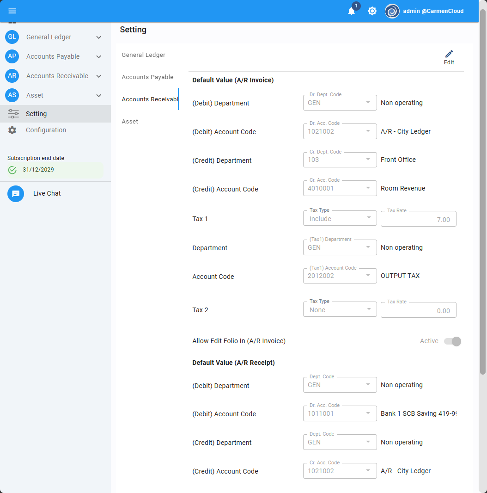

### Account Receivable - Invoice - Add field "Department" for Revenue, Tax and AR separately

- Note : Allow to set department code for each account code
- From : Account Receivable -> Invoice

    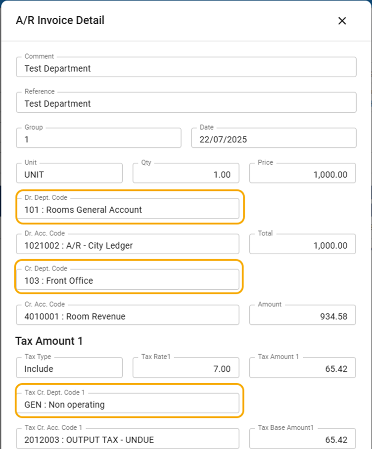

### Account Receivable - Invoice - Print Voucher - Add information for Department and Account Nature

- Note : Invoice voucher layout shows department code and account nature
- From : Account Receivable -> Invoice > Print Voucher

    

### Account Receivable - Receipt - Add field "Department" for Receipt , Gain/Loss, WHT and AR separately

- Note : Allow to set department code for each account code
- From : Account Receivable -> Receipt

    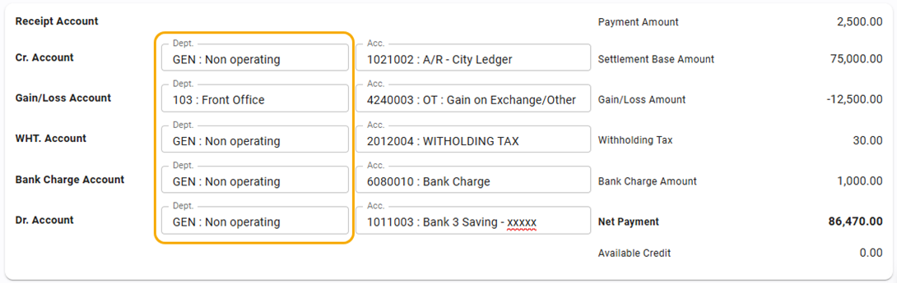

## Account Payable

### Account Payable - Implementing "Tax Profile" for categorize Input Tax. Tax Profile will apply to Vendor, Invoice and Input Tax Reconciliation

- Note : Add Master data for “Tax Profile” to categorize tax and tax rate.
- From : Account Payable -> Setting, Invoice, Input Tax reconciliation

    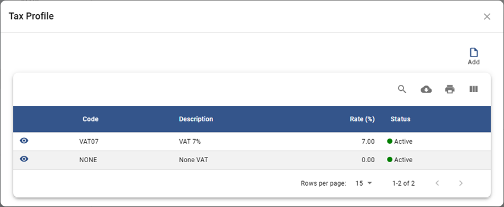

    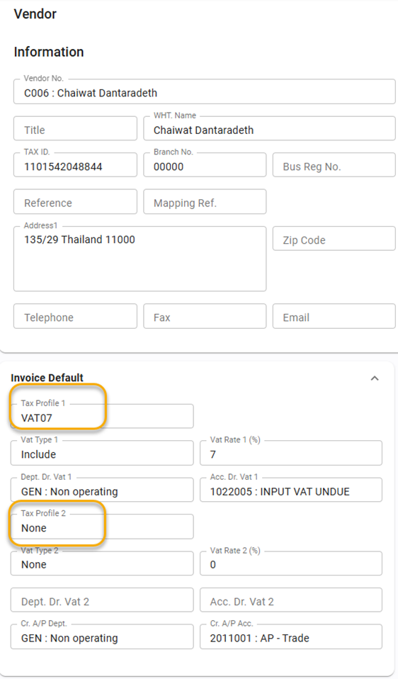

    

    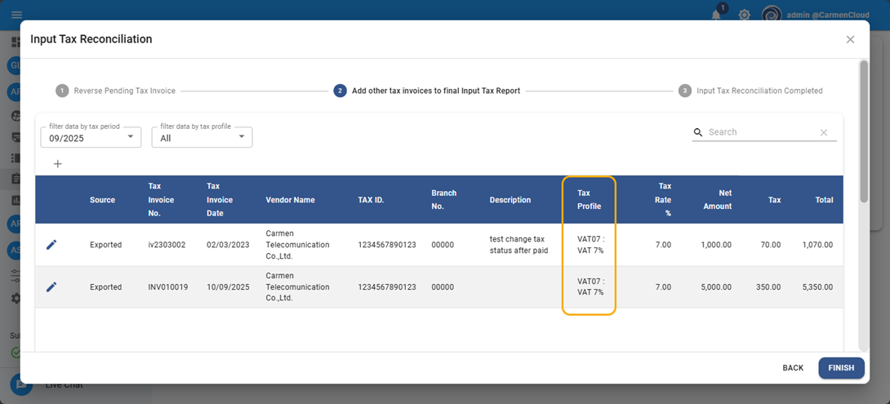

### Account Payable - Vendor - Add default value for WHT condition

- Note : Allow to set WHT condition to vendor and apply to payment
- From : Account Payable -> Vendor -> Payment Default

    

### Account Payable - Payment - Default value for WHT Condition

- Note : Payment will use WHT condition from vendor profile
- From : Account Payable -> Payment -> WHT Condition

    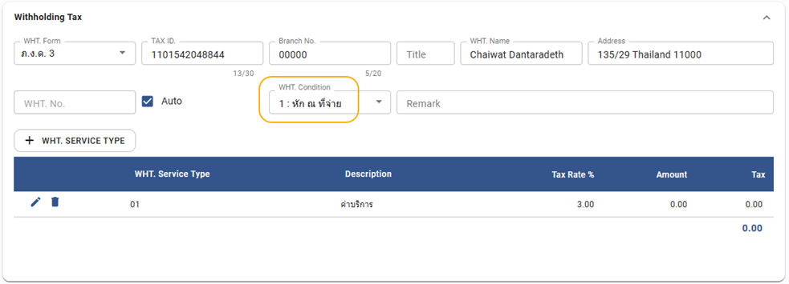

### Account Payable - Input Tax Reconciliation - Add more information before confirm reverse

- Note : User can review Tax Period before confirm the reversal process
- From : Account Payable > Input Tax Reconciliation

    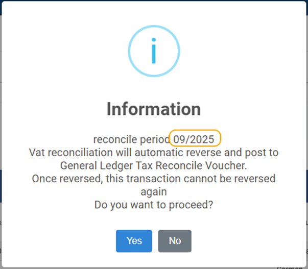

### Account Payable - Revise calculation for aging report when set type as Due Date

- Note : Revise calculation for aging report
- From : Account Payable -> Report -> Aging

### Account Payable - Report - Invoice Report - show Department code

- Note : Revise layout to show department and account code for each detail
- From : Account Payable > Invoice -> Invoice summary

    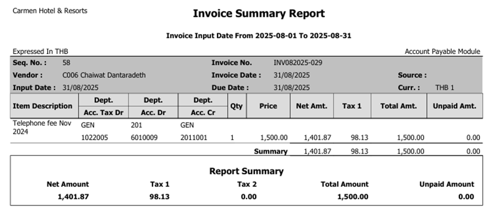

## General Ledger

### General Ledger - Posting from FA - Update information for disposal JV

- Note : JV from asset disposal will shows Asset ID
- From : General Ledger > Journal Voucher

    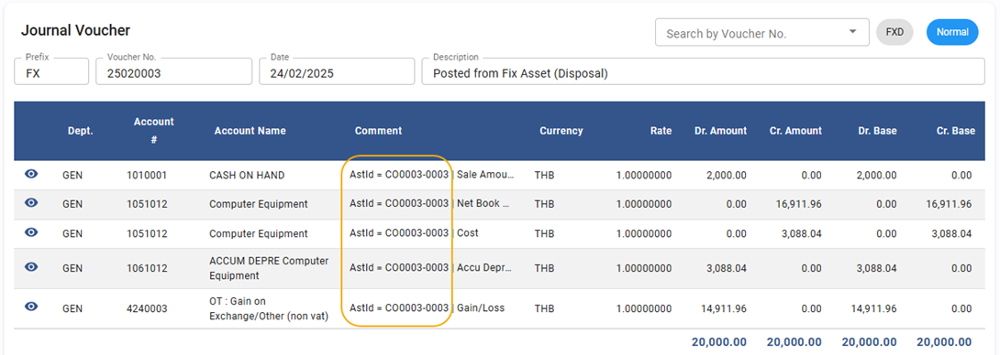

### General Ledger - Report - allow to select future period

- Note : Report will allow select future period
- From : General Ledger -> Report

    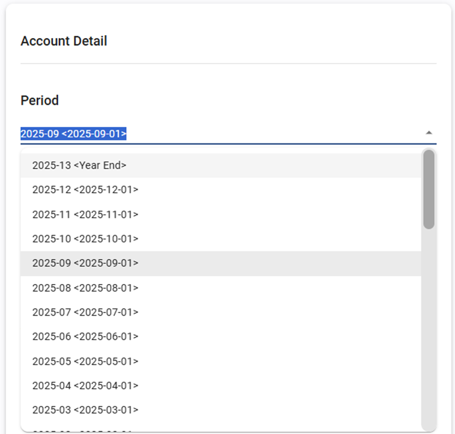

## Workbook

### Workbook - JV Import Sheet - add verify process for Currency code and Rate

- Note : Add process to verify information about currency code and rate and not allow to post if value is not accurate
- From : Workbook -> JV Import

    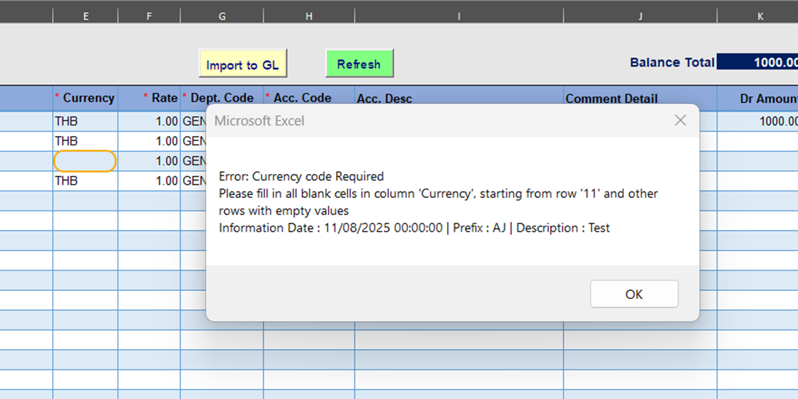

    

